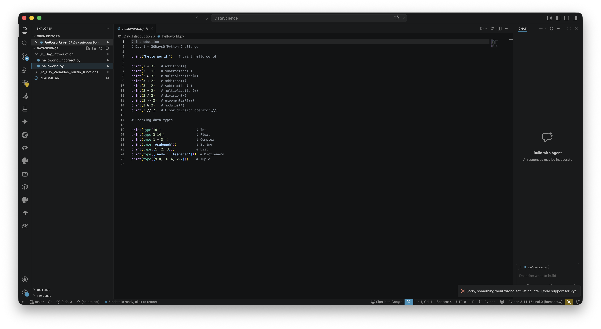
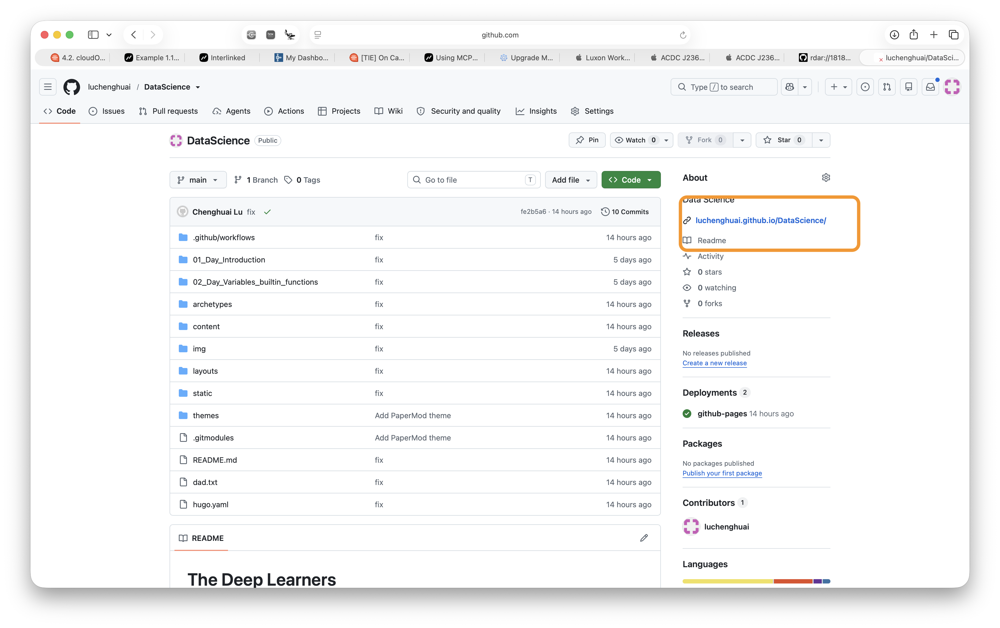
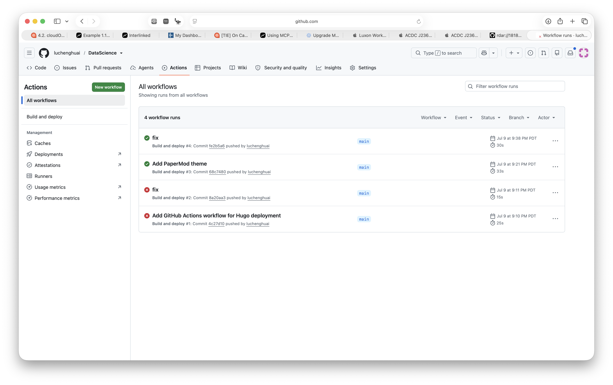

# DataScience

A day-by-day Python / data science learning log, published as a website with [Hugo](https://gohugo.io/).

🌐 **Live site:** https://luchenghuai.github.io/DataScience/

## Clone the repo

```bash
git clone git@github.com:luchenghuai/DataScience.git
```

## Contents


## How publishing works

1. This repo uses Hugo to build and publish the site at [luchenghuai.github.io/DataScience](https://luchenghuai.github.io/DataScience/).
2. You don't need to run Hugo yourself — a GitHub Actions workflow builds and deploys the site automatically.
3. Edit files and push your changes to `main`. GitHub Actions will build a new version of the site and update the link shown on the repo page:

   

4. To check whether the build succeeded, open the **Actions** tab and look for a green checkmark next to your commit:

   

5. If a build fails (red ❌), click into the run to see the error, fix the issue in your files, and push again.
