# 《分寸》Seedance 制作级对白分镜

共 32 个镜头；保留原镜头编号、时间码、说话人及对白。每句对白独立成镜。

## 全局连续性与视觉风格

- **风格**：电影感 2D 动漫，克制写实表演；夜间高层 KTV/休息室，暖琥珀室内灯与窗外冷蓝城市光形成稳定对比。
- **空间锁定**：柳如烟与伊藤诚相邻坐在画面左侧；闺蜜甲/乙/丙依次位于对面沙发左/中/右；季伯达在茶几右侧、朝向众人。所有镜头保持同一茶几、沙发、窗景、酒瓶与杯具关系，不换座、不越轴。
- **角色锁定**：以对应 JPG 和 `tmp/screenplay-shots-1-5/character-reference-sheet.jpg` 为身份参考；只使用参考图明确支持的发型、服装和肤色，不补造精确身份细节。背景客人只作次要轮廓，不新增有叙事功能的人物。
- **表演原则**：以眨眼、呼吸、轻微视线、嘴型和单一克制手势为主；冲突由停顿、目光和微表情升级，禁止夸张肢体喜剧。
- **字幕原则（强制）**：故事板中的镜头标签、字幕条、姓名和对白必须在 I2V 前先裁切/修复移除；Seedance 输出不得生成文字。精确中文字幕及结尾卡应在生成后由剪辑软件合成。

## 全局 Seedance 工作流

1. 复制对应 `jpg/shot_XXX.jpg`，先无损清除顶部镜头标签和底部字幕带；不得修改本目录原 JPG。必要时扩图恢复被字幕遮挡区域。
2. 将清洁图作为首帧/构图参考；使用本镜头英文 prompt 与 negative prompt，优先低到中低运动强度。
3. 默认 16:9、1080p、24 fps；按镜头标注时长生成，若平台只能生成更长片段，取稳定段并精确裁至时间码长度。
4. 逐镜检查脸、手、嘴型、服装、座位、视线、桌面道具与夜景；任何漂移都应重生，而不是靠后期掩盖。
5. 使用独立普通话录音做对白/嘴型指导；保留低音量室内底噪，避免模型自行增加可辨识台词。
6. 锁定画面后再合成原文对白、姓名、镜头标签与结尾主题卡；最终检查 32 镜总时长 100 秒。

## 全局默认负面约束

No new characters; no identity, wardrobe, seating, prop or background changes; no malformed anatomy, face/hand drift, extra limbs, camera shake, cuts, text, subtitles, logos, watermarks or UI. Each shot below repeats/adds the production-critical constraints needed to stand alone.

## 镜头 001｜00:00–00:03
- **文件：**`jpg/shot_001.jpg`
- **Staging/start image：**[Staging start image](jpg/shot_001.jpg)  
  [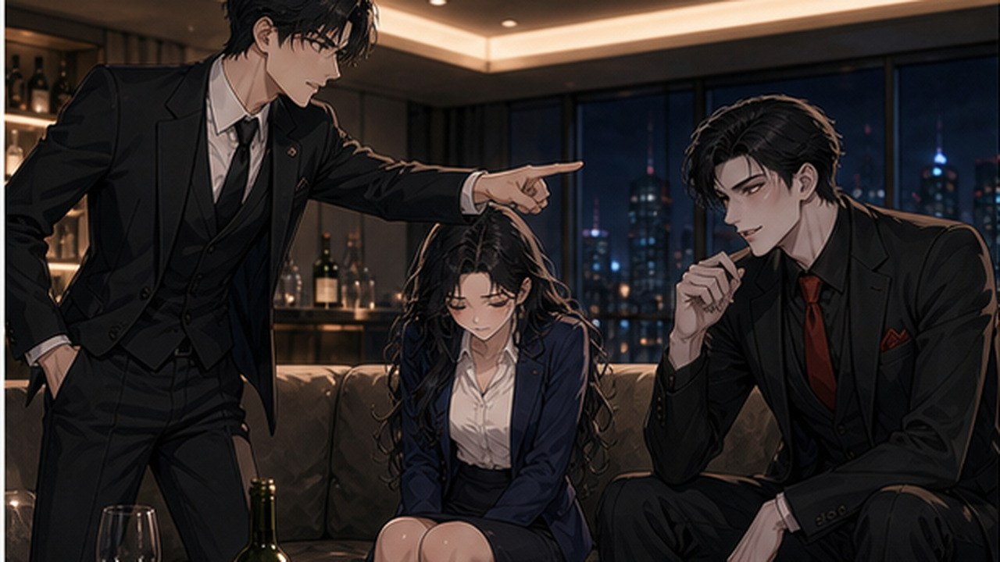](jpg/shot_001.jpg)
- **角色参考：**[柳如烟](../liuruyan.jpg)；[伊藤诚](../version1/screenplay/character_portraits/yitengcheng_user_reference.jpg)；[季伯达](../jiboda.jpg)；[闺蜜甲](../version1/screenplay/character_portraits/guimi1_v1.jpg)；[闺蜜乙](../version1/screenplay/character_portraits/guimi2_v1.jpg)；[闺蜜丙](../version1/screenplay/character_portraits/guimi3_v1.jpg)；[角色总参考表](references/character-reference-sheet.jpg)
- **场景/连续性参考：**[KTV continuity sheet](references/ktv-continuity-sheet.jpg)（当前素材中没有独立的 KTV 空景参考；此连续性表是可用场景依据，不以其他地点图片替代。）
- **画面/字幕：**聚会全景：众人喝酒并玩真心话大冒险。
- **目的/景别：**Establish the party geography and relaxed baseline before the conflict. Wide ensemble establishing shot, eye level, preserving the full seating geography and coffee table.
- **可见角色与精确调度：**Visible: 柳如烟 and 伊藤诚 together on the left seating; 闺蜜甲/乙/丙 across the central sofa; 季伯达 at the right side facing them; background guests stay secondary. Everyone remains around the same low coffee table.
- **场景/灯光：**Modern high-rise KTV/lounge at night: warm amber practical lamps and ceiling light, cool blue city windows, dark curtains, neutral sofa, low dark coffee table with bottles and glasses. Preserve source-JPG object placement and warm/cool contrast; do not invent a new location.
- **表演/神态/动作：**Natural pre-question party energy: small conversations, relaxed breathing, one restrained toast; no one dominates yet.
- **摄影机：**Very slow 3% push-in with subtle parallax across the coffee table.
- **Seedance I2V prompt (EN)：**Animate the supplied storyboard JPG as a restrained cinematic 2D anime dialogue shot. Wide ensemble establishing shot, eye level, preserving the full seating geography and coffee table. Visible: 柳如烟 and 伊藤诚 together on the left seating; 闺蜜甲/乙/丙 across the central sofa; 季伯达 at the right side facing them; background guests stay secondary. Everyone remains around the same low coffee table. Modern high-rise KTV/lounge at night: warm amber practical lamps and ceiling light, cool blue city windows, dark curtains, neutral sofa, low dark coffee table with bottles and glasses. Preserve source-JPG object placement and warm/cool contrast; do not invent a new location. Performance: Natural pre-question party energy: small conversations, relaxed breathing, one restrained toast; no one dominates yet. Camera: Very slow 3% push-in with subtle parallax across the coffee table. Preserve the exact source composition, character designs, wardrobe, seating, props, and night lighting. Natural breathing, blinks, subtle hair and fabric response only; coherent facial animation and stable hands. No rendered words in the generated video. No spoken dialogue in this shot. Do not invent speech or lip sync. Do not render any words on screen; add any required card or caption only in post-production. Timed dialogue and character action plan: 0.0–0.4s: hold the established composition and eyelines with natural breathing. 0.4–2.7s: perform the shot-specific silent action: Natural pre-question party energy: small conversations, relaxed breathing, one restrained toast; no one dominates yet. 2.7–3.0s: resolve the action and hold a stable final pose for the cut. No character speaks and no lip sync is generated. Supporting motion detail: {'start_sec': 0, 'end_sec': 1, 'beat': 'Hold the full seating geography; guests breathe and shift naturally around the coffee table.'} {'start_sec': 1, 'end_sec': 2, 'beat': 'A restrained toast and tiny glass movement create party life; bottles remain fixed.'} {'start_sec': 2, 'end_sec': 3, 'beat': 'Conversation settles and attention begins to gather toward the game, ready for the cut.'}
- **Negative prompt / constraints：**No new characters, no identity/wardrobe changes, no seat swaps, no duplicated or missing limbs, no warped hands/faces, no lip-sync gibberish, no sudden standing, walking, touching, drinking spill, prop teleportation, background morphing, camera shake, zoom pumping, cuts, transitions, added text, captions, logos, watermarks, or UI.
- **逐秒运动节拍：**0–1s Hold the full seating geography; guests breathe and shift naturally around the coffee table.；1–2s A restrained toast and tiny glass movement create party life; bottles remain fixed.；2–3s Conversation settles and attention begins to gather toward the game, ready for the cut.
- **对白与角色动作时间轴：**0.0–0.4s: hold the established composition and eyelines with natural breathing. 0.4–2.7s: perform the shot-specific silent action: Natural pre-question party energy: small conversations, relaxed breathing, one restrained toast; no one dominates yet. 2.7–3.0s: resolve the action and hold a stable final pose for the cut. No character speaks and no lip sync is generated. Supporting motion detail: {'start_sec': 0, 'end_sec': 1, 'beat': 'Hold the full seating geography; guests breathe and shift naturally around the coffee table.'} {'start_sec': 1, 'end_sec': 2, 'beat': 'A restrained toast and tiny glass movement create party life; bottles remain fixed.'} {'start_sec': 2, 'end_sec': 3, 'beat': 'Conversation settles and attention begins to gather toward the game, ready for the cut.'}
- **连续性锁定：**Use this shot’s JPG as the first-frame identity/composition reference.；Lock character faces, hair, wardrobe, body proportions, seating side, eyelines, table/bottle/glass positions, city-night background, and warm/cool lighting to the source JPG and adjacent shots.；Do not animate storyboard labels or subtitles: remove/crop/clean all labels and caption bands before image-to-video; composite exact Chinese dialogue or final card afterward in editing.
- **声音/对白指导：**Room tone only: subdued party murmur, glass ambience, no intelligible new dialogue.
- **推荐生成设置：**motion `low-medium`；`16:9`；`24 fps`；`1080p`；生成 `3s`，精确裁切为 `3s`；首帧使用去除全部文字/字幕后的对应 JPG。

## 镜头 002｜00:03–00:05
- **文件：**`jpg/shot_002.jpg`
- **Staging/start image：**[Staging start image](jpg/shot_002.jpg)  
  [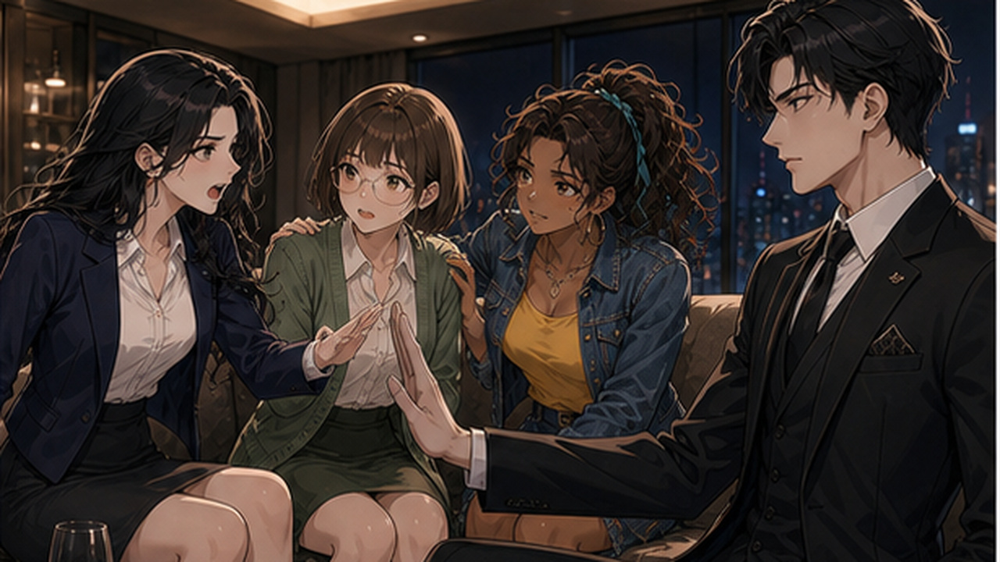](jpg/shot_002.jpg)
- **角色参考：**[柳如烟](../liuruyan.jpg)；[伊藤诚](../version1/screenplay/character_portraits/yitengcheng_user_reference.jpg)；[季伯达](../jiboda.jpg)；[闺蜜甲](../version1/screenplay/character_portraits/guimi1_v1.jpg)；[闺蜜乙](../version1/screenplay/character_portraits/guimi2_v1.jpg)；[闺蜜丙](../version1/screenplay/character_portraits/guimi3_v1.jpg)；[角色总参考表](references/character-reference-sheet.jpg)
- **场景/连续性参考：**[KTV continuity sheet](references/ktv-continuity-sheet.jpg)（当前素材中没有独立的 KTV 空景参考；此连续性表是可用场景依据，不以其他地点图片替代。）
- **闺蜜甲：**如烟输了！选真心话还是大冒险？
- **目的/景别：**Advance the dialogue beat while preserving the existing social geography and escalating the double-standard argument without adding story events. Medium three-shot of the three girlfriends across the sofa; 闺蜜甲 is the visual lead.
- **可见角色与精确调度：**Visible: 闺蜜甲 on sofa left, 闺蜜乙 center, 闺蜜丙 right. They remain seated behind the coffee table, shoulders angled toward 季伯达 off-camera/right; no seat swaps.
- **场景/灯光：**Modern high-rise KTV/lounge at night: warm amber practical lamps and ceiling light, cool blue city windows, dark curtains, neutral sofa, low dark coffee table with bottles and glasses. Preserve source-JPG object placement and warm/cool contrast; do not invent a new location.
- **表演/神态/动作：**闺蜜甲 leans forward, lifts one hand and asks with playful excitement; 闺蜜乙 turns to listen; 闺蜜丙 lounges with her drink.
- **摄影机：**Gentle 2% push-in toward 闺蜜甲; no pan.
- **Seedance I2V prompt (EN)：**Animate the supplied storyboard JPG as a restrained cinematic 2D anime dialogue shot. Medium three-shot of the three girlfriends across the sofa; 闺蜜甲 is the visual lead. Visible: 闺蜜甲 on sofa left, 闺蜜乙 center, 闺蜜丙 right. They remain seated behind the coffee table, shoulders angled toward 季伯达 off-camera/right; no seat swaps. Modern high-rise KTV/lounge at night: warm amber practical lamps and ceiling light, cool blue city windows, dark curtains, neutral sofa, low dark coffee table with bottles and glasses. Preserve source-JPG object placement and warm/cool contrast; do not invent a new location. Performance: 闺蜜甲 leans forward, lifts one hand and asks with playful excitement; 闺蜜乙 turns to listen; 闺蜜丙 lounges with her drink. Camera: Gentle 2% push-in toward 闺蜜甲; no pan. Preserve the exact source composition, character designs, wardrobe, seating, props, and night lighting. Natural breathing, blinks, subtle hair and fabric response only; coherent facial animation and stable hands. No rendered words in the generated video. Spoken Mandarin dialogue, exact wording: “如烟输了！选真心话还是大冒险？” Perform natural, restrained lip sync precisely to this line. The spoken wording must not be paraphrased, shortened, expanded, or replaced. Do not render the dialogue as on-screen text; add exact subtitles only in post-production. Timed dialogue and character action plan: 0.0–0.2s: hold the established composition; 闺蜜甲 takes a subtle breath and acquires the established eyeline while listeners remain attentive. 0.2–1.8s: 闺蜜甲 speaks the exact Mandarin line “如烟输了！选真心话还是大冒险？” once, with natural restrained lip sync and the shot-specific performance: 闺蜜甲 leans forward, lifts one hand and asks with playful excitement; 闺蜜乙 turns to listen; 闺蜜丙 lounges with her drink. 1.8–2.0s: the speaker closes the mouth and resolves the gesture; listeners give only the restrained reaction described by the shot, then everyone holds their positions for the cut. Do not overlap, repeat, paraphrase, shorten, or extend the line. Supporting motion detail: {'start_sec': 0, 'end_sec': 1, 'beat': '闺蜜甲 acquires the established eyeline, inhales subtly, and begins the exact Mandarin line; 闺蜜甲 leans forward, lifts one hand and asks with playful excitement; 闺蜜乙 turns to listen; 闺蜜丙 lounges with her drink.'} {'start_sec': 1, 'end_sec': 2, 'beat': '闺蜜甲 completes the exact line and final shot-specific gesture; listeners register a restrained reaction, then hold for the cut.'}
- **Negative prompt / constraints：**No new characters, no identity/wardrobe changes, no seat swaps, no duplicated or missing limbs, no warped hands/faces, no lip-sync gibberish, no sudden standing, walking, touching, drinking spill, prop teleportation, background morphing, camera shake, zoom pumping, cuts, transitions, added text, captions, logos, watermarks, or UI.
- **逐秒运动节拍：**0–1s 闺蜜甲 acquires the established eyeline, inhales subtly, and begins the exact Mandarin line; 闺蜜甲 leans forward, lifts one hand and asks with playful excitement; 闺蜜乙 turns to listen; 闺蜜丙 lounges with her drink.；1–2s 闺蜜甲 completes the exact line and final shot-specific gesture; listeners register a restrained reaction, then hold for the cut.
- **对白与角色动作时间轴：**0.0–0.2s: hold the established composition; 闺蜜甲 takes a subtle breath and acquires the established eyeline while listeners remain attentive. 0.2–1.8s: 闺蜜甲 speaks the exact Mandarin line “如烟输了！选真心话还是大冒险？” once, with natural restrained lip sync and the shot-specific performance: 闺蜜甲 leans forward, lifts one hand and asks with playful excitement; 闺蜜乙 turns to listen; 闺蜜丙 lounges with her drink. 1.8–2.0s: the speaker closes the mouth and resolves the gesture; listeners give only the restrained reaction described by the shot, then everyone holds their positions for the cut. Do not overlap, repeat, paraphrase, shorten, or extend the line. Supporting motion detail: {'start_sec': 0, 'end_sec': 1, 'beat': '闺蜜甲 acquires the established eyeline, inhales subtly, and begins the exact Mandarin line; 闺蜜甲 leans forward, lifts one hand and asks with playful excitement; 闺蜜乙 turns to listen; 闺蜜丙 lounges with her drink.'} {'start_sec': 1, 'end_sec': 2, 'beat': '闺蜜甲 completes the exact line and final shot-specific gesture; listeners register a restrained reaction, then hold for the cut.'}
- **连续性锁定：**Use this shot’s JPG as the first-frame identity/composition reference.；Lock character faces, hair, wardrobe, body proportions, seating side, eyelines, table/bottle/glass positions, city-night background, and warm/cool lighting to the source JPG and adjacent shots.；Do not animate storyboard labels or subtitles: remove/crop/clean all labels and caption bands before image-to-video; composite exact Chinese dialogue or final card afterward in editing.
- **声音/对白指导：**Use clean Mandarin dialogue by 闺蜜甲; preserve the exact line and natural phrasing. Keep KTV room tone low, avoid music masking consonants, and use post-recorded dialogue/lip sync rather than generated text.
- **推荐生成设置：**motion `low`；`16:9`；`24 fps`；`1080p`；生成 `2s`，精确裁切为 `2s`；首帧使用去除全部文字/字幕后的对应 JPG。

## 镜头 003｜00:05–00:06
- **文件：**`jpg/shot_003.jpg`
- **Staging/start image：**[Staging start image](jpg/shot_003.jpg)  
  [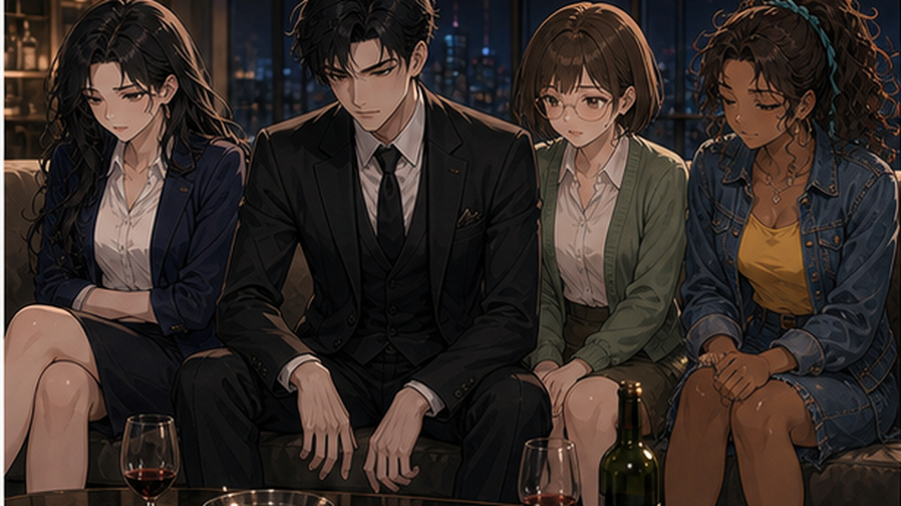](jpg/shot_003.jpg)
- **角色参考：**[柳如烟](../liuruyan.jpg)；[伊藤诚](../version1/screenplay/character_portraits/yitengcheng_user_reference.jpg)；[季伯达](../jiboda.jpg)；[闺蜜甲](../version1/screenplay/character_portraits/guimi1_v1.jpg)；[闺蜜乙](../version1/screenplay/character_portraits/guimi2_v1.jpg)；[闺蜜丙](../version1/screenplay/character_portraits/guimi3_v1.jpg)；[角色总参考表](references/character-reference-sheet.jpg)
- **场景/连续性参考：**[KTV continuity sheet](references/ktv-continuity-sheet.jpg)（当前素材中没有独立的 KTV 空景参考；此连续性表是可用场景依据，不以其他地点图片替代。）
- **柳如烟：**真心话。
- **目的/景别：**Advance the dialogue beat while preserving the existing social geography and escalating the double-standard argument without adding story events. Tight medium close-up on 柳如烟 at frame left; 伊藤诚 remains partially visible beside/behind her.
- **可见角色与精确调度：**Visible: 柳如烟 seated at frame left with 伊藤诚 immediately to her right; one or more sofa friends may remain soft in the background exactly as in the source JPG. 柳如烟 does not stand or cross the room.
- **场景/灯光：**Modern high-rise KTV/lounge at night: warm amber practical lamps and ceiling light, cool blue city windows, dark curtains, neutral sofa, low dark coffee table with bottles and glasses. Preserve source-JPG object placement and warm/cool contrast; do not invent a new location.
- **表演/神态/动作：**柳如烟 answers promptly and evenly, a tiny nod and confident eye contact.
- **摄影机：**Near-locked shot with a tiny 1% push-in.
- **Seedance I2V prompt (EN)：**Animate the supplied storyboard JPG as a restrained cinematic 2D anime dialogue shot. Tight medium close-up on 柳如烟 at frame left; 伊藤诚 remains partially visible beside/behind her. Visible: 柳如烟 seated at frame left with 伊藤诚 immediately to her right; one or more sofa friends may remain soft in the background exactly as in the source JPG. 柳如烟 does not stand or cross the room. Modern high-rise KTV/lounge at night: warm amber practical lamps and ceiling light, cool blue city windows, dark curtains, neutral sofa, low dark coffee table with bottles and glasses. Preserve source-JPG object placement and warm/cool contrast; do not invent a new location. Performance: 柳如烟 answers promptly and evenly, a tiny nod and confident eye contact. Camera: Near-locked shot with a tiny 1% push-in. Preserve the exact source composition, character designs, wardrobe, seating, props, and night lighting. Natural breathing, blinks, subtle hair and fabric response only; coherent facial animation and stable hands. No rendered words in the generated video. Spoken Mandarin dialogue, exact wording: “真心话。” Perform natural, restrained lip sync precisely to this line. The spoken wording must not be paraphrased, shortened, expanded, or replaced. Do not render the dialogue as on-screen text; add exact subtitles only in post-production. Timed dialogue and character action plan: 0.0–0.1s: hold the established composition; 柳如烟 takes a subtle breath and acquires the established eyeline while listeners remain attentive. 0.1–0.9s: 柳如烟 speaks the exact Mandarin line “真心话。” once, with natural restrained lip sync and the shot-specific performance: 柳如烟 answers promptly and evenly, a tiny nod and confident eye contact. 0.9–1.0s: the speaker closes the mouth and resolves the gesture; listeners give only the restrained reaction described by the shot, then everyone holds their positions for the cut. Do not overlap, repeat, paraphrase, shorten, or extend the line. Supporting motion detail: {'start_sec': 0, 'end_sec': 1, 'beat': '柳如烟 acquires the established eyeline, inhales subtly, and begins the exact Mandarin line; 柳如烟 answers promptly and evenly, a tiny nod and confident eye contact.'}
- **Negative prompt / constraints：**No new characters, no identity/wardrobe changes, no seat swaps, no duplicated or missing limbs, no warped hands/faces, no lip-sync gibberish, no sudden standing, walking, touching, drinking spill, prop teleportation, background morphing, camera shake, zoom pumping, cuts, transitions, added text, captions, logos, watermarks, or UI.
- **逐秒运动节拍：**0–1s 柳如烟 acquires the established eyeline, inhales subtly, and begins the exact Mandarin line; 柳如烟 answers promptly and evenly, a tiny nod and confident eye contact.
- **对白与角色动作时间轴：**0.0–0.1s: hold the established composition; 柳如烟 takes a subtle breath and acquires the established eyeline while listeners remain attentive. 0.1–0.9s: 柳如烟 speaks the exact Mandarin line “真心话。” once, with natural restrained lip sync and the shot-specific performance: 柳如烟 answers promptly and evenly, a tiny nod and confident eye contact. 0.9–1.0s: the speaker closes the mouth and resolves the gesture; listeners give only the restrained reaction described by the shot, then everyone holds their positions for the cut. Do not overlap, repeat, paraphrase, shorten, or extend the line. Supporting motion detail: {'start_sec': 0, 'end_sec': 1, 'beat': '柳如烟 acquires the established eyeline, inhales subtly, and begins the exact Mandarin line; 柳如烟 answers promptly and evenly, a tiny nod and confident eye contact.'}
- **连续性锁定：**Use this shot’s JPG as the first-frame identity/composition reference.；Lock character faces, hair, wardrobe, body proportions, seating side, eyelines, table/bottle/glass positions, city-night background, and warm/cool lighting to the source JPG and adjacent shots.；Do not animate storyboard labels or subtitles: remove/crop/clean all labels and caption bands before image-to-video; composite exact Chinese dialogue or final card afterward in editing.
- **声音/对白指导：**Use clean Mandarin dialogue by 柳如烟; preserve the exact line and natural phrasing. Keep KTV room tone low, avoid music masking consonants, and use post-recorded dialogue/lip sync rather than generated text.
- **推荐生成设置：**motion `low`；`16:9`；`24 fps`；`1080p`；生成 `1s`，精确裁切为 `1s`；首帧使用去除全部文字/字幕后的对应 JPG。

## 镜头 004｜00:06–00:09
- **文件：**`jpg/shot_004.jpg`
- **Staging/start image：**[Staging start image](jpg/shot_004.jpg)  
  [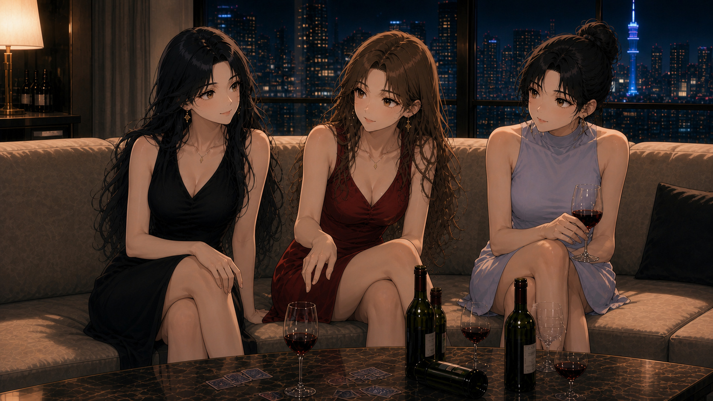](jpg/shot_004.jpg)
- **角色参考：**[柳如烟](../liuruyan.jpg)；[伊藤诚](../version1/screenplay/character_portraits/yitengcheng_user_reference.jpg)；[季伯达](../jiboda.jpg)；[闺蜜甲](../version1/screenplay/character_portraits/guimi1_v1.jpg)；[闺蜜乙](../version1/screenplay/character_portraits/guimi2_v1.jpg)；[闺蜜丙](../version1/screenplay/character_portraits/guimi3_v1.jpg)；[角色总参考表](references/character-reference-sheet.jpg)
- **场景/连续性参考：**[KTV continuity sheet](references/ktv-continuity-sheet.jpg)（当前素材中没有独立的 KTV 空景参考；此连续性表是可用场景依据，不以其他地点图片替代。）
- **闺蜜乙：**那就说说，你今天穿的内裤是什么颜色？
- **目的/景别：**Advance the dialogue beat while preserving the existing social geography and escalating the double-standard argument without adding story events. Medium three-shot of the girlfriends; center emphasis on 闺蜜乙.
- **可见角色与精确调度：**Visible: 闺蜜甲 on sofa left, 闺蜜乙 center, 闺蜜丙 right. They remain seated behind the coffee table, shoulders angled toward 季伯达 off-camera/right; no seat swaps.
- **场景/灯光：**Modern high-rise KTV/lounge at night: warm amber practical lamps and ceiling light, cool blue city windows, dark curtains, neutral sofa, low dark coffee table with bottles and glasses. Preserve source-JPG object placement and warm/cool contrast; do not invent a new location.
- **表演/神态/动作：**闺蜜乙 taps/indicates the table lightly and teases; 闺蜜甲 turns toward her; 闺蜜丙 watches 柳如烟.
- **摄影机：**Slow 3% push toward 闺蜜乙; keep all three faces stable.
- **Seedance I2V prompt (EN)：**Animate the supplied storyboard JPG as a restrained cinematic 2D anime dialogue shot. Medium three-shot of the girlfriends; center emphasis on 闺蜜乙. Visible: 闺蜜甲 on sofa left, 闺蜜乙 center, 闺蜜丙 right. They remain seated behind the coffee table, shoulders angled toward 季伯达 off-camera/right; no seat swaps. Modern high-rise KTV/lounge at night: warm amber practical lamps and ceiling light, cool blue city windows, dark curtains, neutral sofa, low dark coffee table with bottles and glasses. Preserve source-JPG object placement and warm/cool contrast; do not invent a new location. Performance: 闺蜜乙 taps/indicates the table lightly and teases; 闺蜜甲 turns toward her; 闺蜜丙 watches 柳如烟. Camera: Slow 3% push toward 闺蜜乙; keep all three faces stable. Preserve the exact source composition, character designs, wardrobe, seating, props, and night lighting. Natural breathing, blinks, subtle hair and fabric response only; coherent facial animation and stable hands. No rendered words in the generated video. Spoken Mandarin dialogue, exact wording: “那就说说，你今天穿的内裤是什么颜色？” Perform natural, restrained lip sync precisely to this line. The spoken wording must not be paraphrased, shortened, expanded, or replaced. Do not render the dialogue as on-screen text; add exact subtitles only in post-production. Timed dialogue and character action plan: 0.0–0.4s: hold the established composition; 闺蜜乙 takes a subtle breath and acquires the established eyeline while listeners remain attentive. 0.4–2.7s: 闺蜜乙 speaks the exact Mandarin line “那就说说，你今天穿的内裤是什么颜色？” once, with natural restrained lip sync and the shot-specific performance: 闺蜜乙 taps/indicates the table lightly and teases; 闺蜜甲 turns toward her; 闺蜜丙 watches 柳如烟. 2.7–3.0s: the speaker closes the mouth and resolves the gesture; listeners give only the restrained reaction described by the shot, then everyone holds their positions for the cut. Do not overlap, repeat, paraphrase, shorten, or extend the line. Supporting motion detail: {'start_sec': 0, 'end_sec': 1, 'beat': '闺蜜乙 acquires the established eyeline, inhales subtly, and begins the exact Mandarin line; 闺蜜乙 taps/indicates the table lightly and teases; 闺蜜甲 turns toward her; 闺蜜丙 watches 柳如烟.'} {'start_sec': 1, 'end_sec': 2, 'beat': '闺蜜乙 continues the line with coherent restrained lip sync; the primary expression/gesture develops without changing seat or props.'} {'start_sec': 2, 'end_sec': 3, 'beat': '闺蜜乙 completes the exact line and final shot-specific gesture; listeners register a restrained reaction, then hold for the cut.'}
- **Negative prompt / constraints：**No new characters, no identity/wardrobe changes, no seat swaps, no duplicated or missing limbs, no warped hands/faces, no lip-sync gibberish, no sudden standing, walking, touching, drinking spill, prop teleportation, background morphing, camera shake, zoom pumping, cuts, transitions, added text, captions, logos, watermarks, or UI.
- **逐秒运动节拍：**0–1s 闺蜜乙 acquires the established eyeline, inhales subtly, and begins the exact Mandarin line; 闺蜜乙 taps/indicates the table lightly and teases; 闺蜜甲 turns toward her; 闺蜜丙 watches 柳如烟.；1–2s 闺蜜乙 continues the line with coherent restrained lip sync; the primary expression/gesture develops without changing seat or props.；2–3s 闺蜜乙 completes the exact line and final shot-specific gesture; listeners register a restrained reaction, then hold for the cut.
- **对白与角色动作时间轴：**0.0–0.4s: hold the established composition; 闺蜜乙 takes a subtle breath and acquires the established eyeline while listeners remain attentive. 0.4–2.7s: 闺蜜乙 speaks the exact Mandarin line “那就说说，你今天穿的内裤是什么颜色？” once, with natural restrained lip sync and the shot-specific performance: 闺蜜乙 taps/indicates the table lightly and teases; 闺蜜甲 turns toward her; 闺蜜丙 watches 柳如烟. 2.7–3.0s: the speaker closes the mouth and resolves the gesture; listeners give only the restrained reaction described by the shot, then everyone holds their positions for the cut. Do not overlap, repeat, paraphrase, shorten, or extend the line. Supporting motion detail: {'start_sec': 0, 'end_sec': 1, 'beat': '闺蜜乙 acquires the established eyeline, inhales subtly, and begins the exact Mandarin line; 闺蜜乙 taps/indicates the table lightly and teases; 闺蜜甲 turns toward her; 闺蜜丙 watches 柳如烟.'} {'start_sec': 1, 'end_sec': 2, 'beat': '闺蜜乙 continues the line with coherent restrained lip sync; the primary expression/gesture develops without changing seat or props.'} {'start_sec': 2, 'end_sec': 3, 'beat': '闺蜜乙 completes the exact line and final shot-specific gesture; listeners register a restrained reaction, then hold for the cut.'}
- **连续性锁定：**Use this shot’s JPG as the first-frame identity/composition reference.；Lock character faces, hair, wardrobe, body proportions, seating side, eyelines, table/bottle/glass positions, city-night background, and warm/cool lighting to the source JPG and adjacent shots.；Do not animate storyboard labels or subtitles: remove/crop/clean all labels and caption bands before image-to-video; composite exact Chinese dialogue or final card afterward in editing.
- **声音/对白指导：**Use clean Mandarin dialogue by 闺蜜乙; preserve the exact line and natural phrasing. Keep KTV room tone low, avoid music masking consonants, and use post-recorded dialogue/lip sync rather than generated text.
- **推荐生成设置：**motion `low-medium`；`16:9`；`24 fps`；`1080p`；生成 `3s`，精确裁切为 `3s`；首帧使用去除全部文字/字幕后的对应 JPG。

## 镜头 005｜00:09–00:10
- **文件：**`jpg/shot_005.jpg`
- **Staging/start image：**[Staging start image](jpg/shot_005.jpg)  
  [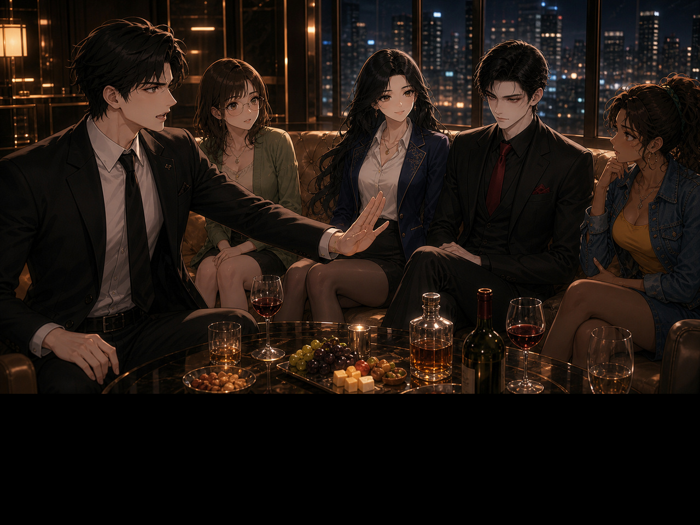](jpg/shot_005.jpg)
- **角色参考：**[柳如烟](../liuruyan.jpg)；[伊藤诚](../version1/screenplay/character_portraits/yitengcheng_user_reference.jpg)；[季伯达](../jiboda.jpg)；[闺蜜甲](../version1/screenplay/character_portraits/guimi1_v1.jpg)；[闺蜜乙](../version1/screenplay/character_portraits/guimi2_v1.jpg)；[闺蜜丙](../version1/screenplay/character_portraits/guimi3_v1.jpg)；[角色总参考表](references/character-reference-sheet.jpg)
- **场景/连续性参考：**[KTV continuity sheet](references/ktv-continuity-sheet.jpg)（当前素材中没有独立的 KTV 空景参考；此连续性表是可用场景依据，不以其他地点图片替代。）
- **伊藤诚：**粉红色。
- **目的/景别：**Advance the dialogue beat while preserving the existing social geography and escalating the double-standard argument without adding story events. Tight two-shot favoring 伊藤诚 beside 柳如烟; keep 柳如烟 visible for reaction.
- **可见角色与精确调度：**Visible: 伊藤诚 seated immediately right of 柳如烟; 柳如烟 remains at frame left and a sofa friend may appear behind. Preserve their close seated spacing without adding contact.
- **场景/灯光：**Modern high-rise KTV/lounge at night: warm amber practical lamps and ceiling light, cool blue city windows, dark curtains, neutral sofa, low dark coffee table with bottles and glasses. Preserve source-JPG object placement and warm/cool contrast; do not invent a new location.
- **表演/神态/动作：**伊藤诚 answers too quickly with casual certainty; 柳如烟 registers immediate discomfort.
- **摄影机：**Near-locked 1% push-in for comic timing.
- **Seedance I2V prompt (EN)：**Animate the supplied storyboard JPG as a restrained cinematic 2D anime dialogue shot. Tight two-shot favoring 伊藤诚 beside 柳如烟; keep 柳如烟 visible for reaction. Visible: 伊藤诚 seated immediately right of 柳如烟; 柳如烟 remains at frame left and a sofa friend may appear behind. Preserve their close seated spacing without adding contact. Modern high-rise KTV/lounge at night: warm amber practical lamps and ceiling light, cool blue city windows, dark curtains, neutral sofa, low dark coffee table with bottles and glasses. Preserve source-JPG object placement and warm/cool contrast; do not invent a new location. Performance: 伊藤诚 answers too quickly with casual certainty; 柳如烟 registers immediate discomfort. Camera: Near-locked 1% push-in for comic timing. Preserve the exact source composition, character designs, wardrobe, seating, props, and night lighting. Natural breathing, blinks, subtle hair and fabric response only; coherent facial animation and stable hands. No rendered words in the generated video. Spoken Mandarin dialogue, exact wording: “粉红色。” Perform natural, restrained lip sync precisely to this line. The spoken wording must not be paraphrased, shortened, expanded, or replaced. Do not render the dialogue as on-screen text; add exact subtitles only in post-production. Timed dialogue and character action plan: 0.0–0.1s: hold the established composition; 伊藤诚 takes a subtle breath and acquires the established eyeline while listeners remain attentive. 0.1–0.9s: 伊藤诚 speaks the exact Mandarin line “粉红色。” once, with natural restrained lip sync and the shot-specific performance: 伊藤诚 answers too quickly with casual certainty; 柳如烟 registers immediate discomfort. 0.9–1.0s: the speaker closes the mouth and resolves the gesture; listeners give only the restrained reaction described by the shot, then everyone holds their positions for the cut. Do not overlap, repeat, paraphrase, shorten, or extend the line. Supporting motion detail: {'start_sec': 0, 'end_sec': 1, 'beat': '伊藤诚 acquires the established eyeline, inhales subtly, and begins the exact Mandarin line; 伊藤诚 answers too quickly with casual certainty; 柳如烟 registers immediate discomfort.'}
- **Negative prompt / constraints：**No new characters, no identity/wardrobe changes, no seat swaps, no duplicated or missing limbs, no warped hands/faces, no lip-sync gibberish, no sudden standing, walking, touching, drinking spill, prop teleportation, background morphing, camera shake, zoom pumping, cuts, transitions, added text, captions, logos, watermarks, or UI.
- **逐秒运动节拍：**0–1s 伊藤诚 acquires the established eyeline, inhales subtly, and begins the exact Mandarin line; 伊藤诚 answers too quickly with casual certainty; 柳如烟 registers immediate discomfort.
- **对白与角色动作时间轴：**0.0–0.1s: hold the established composition; 伊藤诚 takes a subtle breath and acquires the established eyeline while listeners remain attentive. 0.1–0.9s: 伊藤诚 speaks the exact Mandarin line “粉红色。” once, with natural restrained lip sync and the shot-specific performance: 伊藤诚 answers too quickly with casual certainty; 柳如烟 registers immediate discomfort. 0.9–1.0s: the speaker closes the mouth and resolves the gesture; listeners give only the restrained reaction described by the shot, then everyone holds their positions for the cut. Do not overlap, repeat, paraphrase, shorten, or extend the line. Supporting motion detail: {'start_sec': 0, 'end_sec': 1, 'beat': '伊藤诚 acquires the established eyeline, inhales subtly, and begins the exact Mandarin line; 伊藤诚 answers too quickly with casual certainty; 柳如烟 registers immediate discomfort.'}
- **连续性锁定：**Use this shot’s JPG as the first-frame identity/composition reference.；Lock character faces, hair, wardrobe, body proportions, seating side, eyelines, table/bottle/glass positions, city-night background, and warm/cool lighting to the source JPG and adjacent shots.；Do not animate storyboard labels or subtitles: remove/crop/clean all labels and caption bands before image-to-video; composite exact Chinese dialogue or final card afterward in editing.
- **声音/对白指导：**Use clean Mandarin dialogue by 伊藤诚; preserve the exact line and natural phrasing. Keep KTV room tone low, avoid music masking consonants, and use post-recorded dialogue/lip sync rather than generated text.
- **推荐生成设置：**motion `low`；`16:9`；`24 fps`；`1080p`；生成 `1s`，精确裁切为 `1s`；首帧使用去除全部文字/字幕后的对应 JPG。

## 镜头 006｜00:10–00:14
- **文件：**`jpg/shot_006.jpg`
- **Staging/start image：**[Staging start image](jpg/shot_006.jpg)  
  [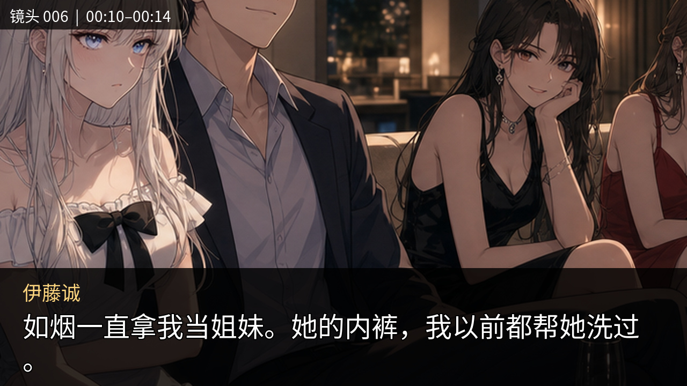](jpg/shot_006.jpg)
- **角色参考：**[柳如烟](../liuruyan.jpg)；[伊藤诚](../version1/screenplay/character_portraits/yitengcheng_user_reference.jpg)；[季伯达](../jiboda.jpg)；[闺蜜甲](../version1/screenplay/character_portraits/guimi1_v1.jpg)；[闺蜜乙](../version1/screenplay/character_portraits/guimi2_v1.jpg)；[闺蜜丙](../version1/screenplay/character_portraits/guimi3_v1.jpg)；[角色总参考表](references/character-reference-sheet.jpg)
- **场景/连续性参考：**[KTV continuity sheet](references/ktv-continuity-sheet.jpg)（当前素材中没有独立的 KTV 空景参考；此连续性表是可用场景依据，不以其他地点图片替代。）
- **伊藤诚：**如烟一直拿我当姐妹。她的内裤，我以前都帮她洗过。
- **目的/景别：**Advance the dialogue beat while preserving the existing social geography and escalating the double-standard argument without adding story events. Tight two-shot favoring 伊藤诚 beside 柳如烟, with a friend softly present in the background.
- **可见角色与精确调度：**Visible: 伊藤诚 seated immediately right of 柳如烟; 柳如烟 remains at frame left and a sofa friend may appear behind. Preserve their close seated spacing without adding contact.
- **场景/灯光：**Modern high-rise KTV/lounge at night: warm amber practical lamps and ceiling light, cool blue city windows, dark curtains, neutral sofa, low dark coffee table with bottles and glasses. Preserve source-JPG object placement and warm/cool contrast; do not invent a new location.
- **表演/神态/动作：**伊藤诚 continues matter-of-factly, small explanatory hand gesture; 柳如烟 stiffens while the background friend watches.
- **摄影机：**Slow 2% push-in, no reframing.
- **Seedance I2V prompt (EN)：**Animate the supplied storyboard JPG as a restrained cinematic 2D anime dialogue shot. Tight two-shot favoring 伊藤诚 beside 柳如烟, with a friend softly present in the background. Visible: 伊藤诚 seated immediately right of 柳如烟; 柳如烟 remains at frame left and a sofa friend may appear behind. Preserve their close seated spacing without adding contact. Modern high-rise KTV/lounge at night: warm amber practical lamps and ceiling light, cool blue city windows, dark curtains, neutral sofa, low dark coffee table with bottles and glasses. Preserve source-JPG object placement and warm/cool contrast; do not invent a new location. Performance: 伊藤诚 continues matter-of-factly, small explanatory hand gesture; 柳如烟 stiffens while the background friend watches. Camera: Slow 2% push-in, no reframing. Preserve the exact source composition, character designs, wardrobe, seating, props, and night lighting. Natural breathing, blinks, subtle hair and fabric response only; coherent facial animation and stable hands. No rendered words in the generated video. Spoken Mandarin dialogue, exact wording: “如烟一直拿我当姐妹。她的内裤，我以前都帮她洗过。” Perform natural, restrained lip sync precisely to this line. The spoken wording must not be paraphrased, shortened, expanded, or replaced. Do not render the dialogue as on-screen text; add exact subtitles only in post-production. Timed dialogue and character action plan: 0.0–0.5s: hold the established composition; 伊藤诚 takes a subtle breath and acquires the established eyeline while listeners remain attentive. 0.5–3.6s: 伊藤诚 speaks the exact Mandarin line “如烟一直拿我当姐妹。她的内裤，我以前都帮她洗过。” once, with natural restrained lip sync and the shot-specific performance: 伊藤诚 continues matter-of-factly, small explanatory hand gesture; 柳如烟 stiffens while the background friend watches. 3.6–4.0s: the speaker closes the mouth and resolves the gesture; listeners give only the restrained reaction described by the shot, then everyone holds their positions for the cut. Do not overlap, repeat, paraphrase, shorten, or extend the line. Supporting motion detail: {'start_sec': 0, 'end_sec': 1, 'beat': '伊藤诚 acquires the established eyeline, inhales subtly, and begins the exact Mandarin line; 伊藤诚 continues matter-of-factly, small explanatory hand gesture; 柳如烟 stiffens while the background friend watches.'} {'start_sec': 1, 'end_sec': 2, 'beat': '伊藤诚 continues the line with coherent restrained lip sync; the primary expression/gesture develops without changing seat or props.'} {'start_sec': 2, 'end_sec': 3, 'beat': '伊藤诚 sustains the next phrase at natural pace; gesture resolves incrementally while listeners respond only with blinks, breath, and micro-expressions.'} {'start_sec': 3, 'end_sec': 4, 'beat': '伊藤诚 completes the exact line and final shot-specific gesture; listeners register a restrained reaction, then hold for the cut.'}
- **Negative prompt / constraints：**No new characters, no identity/wardrobe changes, no seat swaps, no duplicated or missing limbs, no warped hands/faces, no lip-sync gibberish, no sudden standing, walking, touching, drinking spill, prop teleportation, background morphing, camera shake, zoom pumping, cuts, transitions, added text, captions, logos, watermarks, or UI.
- **逐秒运动节拍：**0–1s 伊藤诚 acquires the established eyeline, inhales subtly, and begins the exact Mandarin line; 伊藤诚 continues matter-of-factly, small explanatory hand gesture; 柳如烟 stiffens while the background friend watches.；1–2s 伊藤诚 continues the line with coherent restrained lip sync; the primary expression/gesture develops without changing seat or props.；2–3s 伊藤诚 sustains the next phrase at natural pace; gesture resolves incrementally while listeners respond only with blinks, breath, and micro-expressions.；3–4s 伊藤诚 completes the exact line and final shot-specific gesture; listeners register a restrained reaction, then hold for the cut.
- **对白与角色动作时间轴：**0.0–0.5s: hold the established composition; 伊藤诚 takes a subtle breath and acquires the established eyeline while listeners remain attentive. 0.5–3.6s: 伊藤诚 speaks the exact Mandarin line “如烟一直拿我当姐妹。她的内裤，我以前都帮她洗过。” once, with natural restrained lip sync and the shot-specific performance: 伊藤诚 continues matter-of-factly, small explanatory hand gesture; 柳如烟 stiffens while the background friend watches. 3.6–4.0s: the speaker closes the mouth and resolves the gesture; listeners give only the restrained reaction described by the shot, then everyone holds their positions for the cut. Do not overlap, repeat, paraphrase, shorten, or extend the line. Supporting motion detail: {'start_sec': 0, 'end_sec': 1, 'beat': '伊藤诚 acquires the established eyeline, inhales subtly, and begins the exact Mandarin line; 伊藤诚 continues matter-of-factly, small explanatory hand gesture; 柳如烟 stiffens while the background friend watches.'} {'start_sec': 1, 'end_sec': 2, 'beat': '伊藤诚 continues the line with coherent restrained lip sync; the primary expression/gesture develops without changing seat or props.'} {'start_sec': 2, 'end_sec': 3, 'beat': '伊藤诚 sustains the next phrase at natural pace; gesture resolves incrementally while listeners respond only with blinks, breath, and micro-expressions.'} {'start_sec': 3, 'end_sec': 4, 'beat': '伊藤诚 completes the exact line and final shot-specific gesture; listeners register a restrained reaction, then hold for the cut.'}
- **连续性锁定：**Use this shot’s JPG as the first-frame identity/composition reference.；Lock character faces, hair, wardrobe, body proportions, seating side, eyelines, table/bottle/glass positions, city-night background, and warm/cool lighting to the source JPG and adjacent shots.；Do not animate storyboard labels or subtitles: remove/crop/clean all labels and caption bands before image-to-video; composite exact Chinese dialogue or final card afterward in editing.
- **声音/对白指导：**Use clean Mandarin dialogue by 伊藤诚; preserve the exact line and natural phrasing. Keep KTV room tone low, avoid music masking consonants, and use post-recorded dialogue/lip sync rather than generated text.
- **推荐生成设置：**motion `low-medium`；`16:9`；`24 fps`；`1080p`；生成 `4s`，精确裁切为 `4s`；首帧使用去除全部文字/字幕后的对应 JPG。

## 镜头 007｜00:14–00:16
- **文件：**`jpg/shot_007.jpg`
- **Staging/start image：**[Staging start image](jpg/shot_007.jpg)  
  [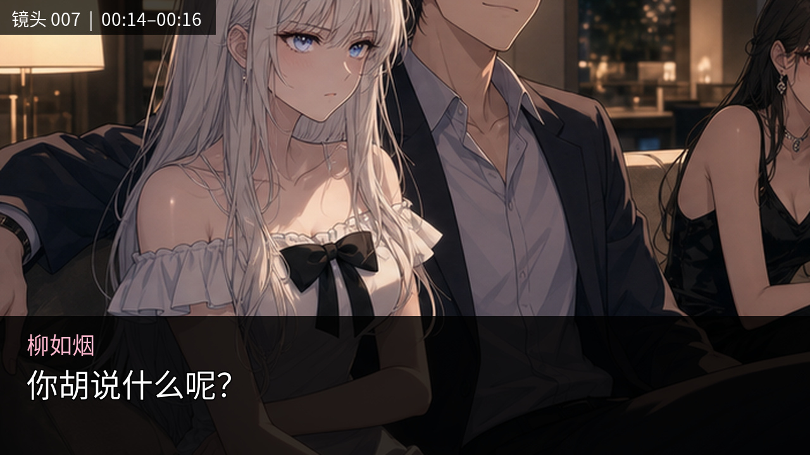](jpg/shot_007.jpg)
- **角色参考：**[柳如烟](../liuruyan.jpg)；[伊藤诚](../version1/screenplay/character_portraits/yitengcheng_user_reference.jpg)；[季伯达](../jiboda.jpg)；[闺蜜甲](../version1/screenplay/character_portraits/guimi1_v1.jpg)；[闺蜜乙](../version1/screenplay/character_portraits/guimi2_v1.jpg)；[闺蜜丙](../version1/screenplay/character_portraits/guimi3_v1.jpg)；[角色总参考表](references/character-reference-sheet.jpg)
- **场景/连续性参考：**[KTV continuity sheet](references/ktv-continuity-sheet.jpg)（当前素材中没有独立的 KTV 空景参考；此连续性表是可用场景依据，不以其他地点图片替代。）
- **柳如烟：**你胡说什么呢？
- **目的/景别：**Advance the dialogue beat while preserving the existing social geography and escalating the double-standard argument without adding story events. Tight medium close-up on 柳如烟, with 伊藤诚 partly visible beside her.
- **可见角色与精确调度：**Visible: 柳如烟 seated at frame left with 伊藤诚 immediately to her right; one or more sofa friends may remain soft in the background exactly as in the source JPG. 柳如烟 does not stand or cross the room.
- **场景/灯光：**Modern high-rise KTV/lounge at night: warm amber practical lamps and ceiling light, cool blue city windows, dark curtains, neutral sofa, low dark coffee table with bottles and glasses. Preserve source-JPG object placement and warm/cool contrast; do not invent a new location.
- **表演/神态/动作：**柳如烟 snaps her gaze toward 伊藤诚, brows tightening; brief embarrassed protest.
- **摄影机：**Brief 2% push-in synchronized to the protest.
- **Seedance I2V prompt (EN)：**Animate the supplied storyboard JPG as a restrained cinematic 2D anime dialogue shot. Tight medium close-up on 柳如烟, with 伊藤诚 partly visible beside her. Visible: 柳如烟 seated at frame left with 伊藤诚 immediately to her right; one or more sofa friends may remain soft in the background exactly as in the source JPG. 柳如烟 does not stand or cross the room. Modern high-rise KTV/lounge at night: warm amber practical lamps and ceiling light, cool blue city windows, dark curtains, neutral sofa, low dark coffee table with bottles and glasses. Preserve source-JPG object placement and warm/cool contrast; do not invent a new location. Performance: 柳如烟 snaps her gaze toward 伊藤诚, brows tightening; brief embarrassed protest. Camera: Brief 2% push-in synchronized to the protest. Preserve the exact source composition, character designs, wardrobe, seating, props, and night lighting. Natural breathing, blinks, subtle hair and fabric response only; coherent facial animation and stable hands. No rendered words in the generated video. Spoken Mandarin dialogue, exact wording: “你胡说什么呢？” Perform natural, restrained lip sync precisely to this line. The spoken wording must not be paraphrased, shortened, expanded, or replaced. Do not render the dialogue as on-screen text; add exact subtitles only in post-production. Timed dialogue and character action plan: 0.0–0.2s: hold the established composition; 柳如烟 takes a subtle breath and acquires the established eyeline while listeners remain attentive. 0.2–1.8s: 柳如烟 speaks the exact Mandarin line “你胡说什么呢？” once, with natural restrained lip sync and the shot-specific performance: 柳如烟 snaps her gaze toward 伊藤诚, brows tightening; brief embarrassed protest. 1.8–2.0s: the speaker closes the mouth and resolves the gesture; listeners give only the restrained reaction described by the shot, then everyone holds their positions for the cut. Do not overlap, repeat, paraphrase, shorten, or extend the line. Supporting motion detail: {'start_sec': 0, 'end_sec': 1, 'beat': '柳如烟 acquires the established eyeline, inhales subtly, and begins the exact Mandarin line; 柳如烟 snaps her gaze toward 伊藤诚, brows tightening; brief embarrassed protest.'} {'start_sec': 1, 'end_sec': 2, 'beat': '柳如烟 completes the exact line and final shot-specific gesture; listeners register a restrained reaction, then hold for the cut.'}
- **Negative prompt / constraints：**No new characters, no identity/wardrobe changes, no seat swaps, no duplicated or missing limbs, no warped hands/faces, no lip-sync gibberish, no sudden standing, walking, touching, drinking spill, prop teleportation, background morphing, camera shake, zoom pumping, cuts, transitions, added text, captions, logos, watermarks, or UI.
- **逐秒运动节拍：**0–1s 柳如烟 acquires the established eyeline, inhales subtly, and begins the exact Mandarin line; 柳如烟 snaps her gaze toward 伊藤诚, brows tightening; brief embarrassed protest.；1–2s 柳如烟 completes the exact line and final shot-specific gesture; listeners register a restrained reaction, then hold for the cut.
- **对白与角色动作时间轴：**0.0–0.2s: hold the established composition; 柳如烟 takes a subtle breath and acquires the established eyeline while listeners remain attentive. 0.2–1.8s: 柳如烟 speaks the exact Mandarin line “你胡说什么呢？” once, with natural restrained lip sync and the shot-specific performance: 柳如烟 snaps her gaze toward 伊藤诚, brows tightening; brief embarrassed protest. 1.8–2.0s: the speaker closes the mouth and resolves the gesture; listeners give only the restrained reaction described by the shot, then everyone holds their positions for the cut. Do not overlap, repeat, paraphrase, shorten, or extend the line. Supporting motion detail: {'start_sec': 0, 'end_sec': 1, 'beat': '柳如烟 acquires the established eyeline, inhales subtly, and begins the exact Mandarin line; 柳如烟 snaps her gaze toward 伊藤诚, brows tightening; brief embarrassed protest.'} {'start_sec': 1, 'end_sec': 2, 'beat': '柳如烟 completes the exact line and final shot-specific gesture; listeners register a restrained reaction, then hold for the cut.'}
- **连续性锁定：**Use this shot’s JPG as the first-frame identity/composition reference.；Lock character faces, hair, wardrobe, body proportions, seating side, eyelines, table/bottle/glass positions, city-night background, and warm/cool lighting to the source JPG and adjacent shots.；Do not animate storyboard labels or subtitles: remove/crop/clean all labels and caption bands before image-to-video; composite exact Chinese dialogue or final card afterward in editing.
- **声音/对白指导：**Use clean Mandarin dialogue by 柳如烟; preserve the exact line and natural phrasing. Keep KTV room tone low, avoid music masking consonants, and use post-recorded dialogue/lip sync rather than generated text.
- **推荐生成设置：**motion `low`；`16:9`；`24 fps`；`1080p`；生成 `2s`，精确裁切为 `2s`；首帧使用去除全部文字/字幕后的对应 JPG。

## 镜头 008｜00:16–00:18
- **文件：**`jpg/shot_008.jpg`
- **Staging/start image：**[Staging start image](jpg/shot_008.jpg)  
  [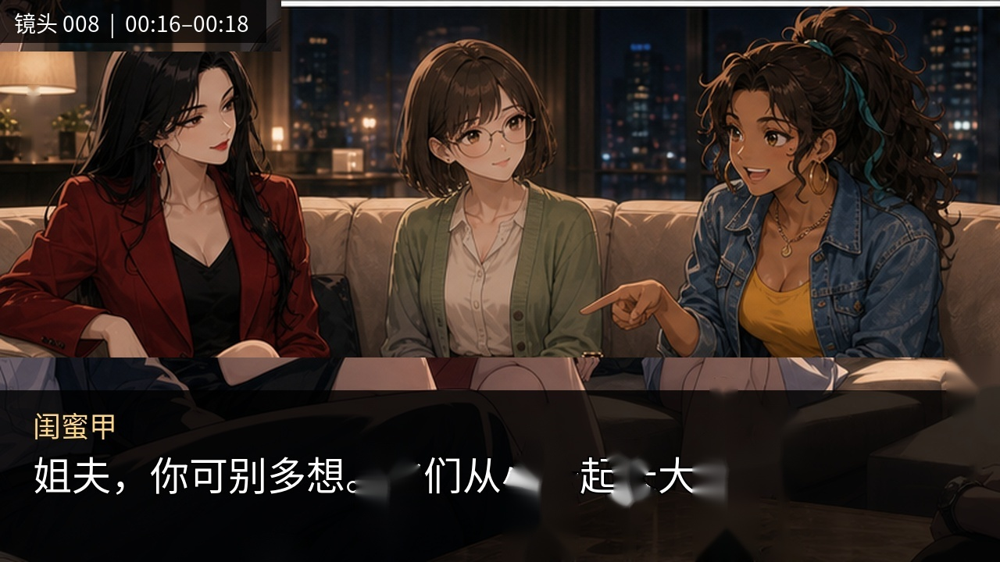](jpg/shot_008.jpg)
- **角色参考：**[柳如烟](../liuruyan.jpg)；[伊藤诚](../version1/screenplay/character_portraits/yitengcheng_user_reference.jpg)；[季伯达](../jiboda.jpg)；[闺蜜甲](../version1/screenplay/character_portraits/guimi1_v1.jpg)；[闺蜜乙](../version1/screenplay/character_portraits/guimi2_v1.jpg)；[闺蜜丙](../version1/screenplay/character_portraits/guimi3_v1.jpg)；[角色总参考表](references/character-reference-sheet.jpg)
- **场景/连续性参考：**[KTV continuity sheet](references/ktv-continuity-sheet.jpg)（当前素材中没有独立的 KTV 空景参考；此连续性表是可用场景依据，不以其他地点图片替代。）
- **闺蜜甲：**姐夫，你可别多想。他们从小一起长大。
- **目的/景别：**Advance the dialogue beat while preserving the existing social geography and escalating the double-standard argument without adding story events. Medium three-shot of the girlfriends; 闺蜜甲 leads from sofa left.
- **可见角色与精确调度：**Visible: 闺蜜甲 on sofa left, 闺蜜乙 center, 闺蜜丙 right. They remain seated behind the coffee table, shoulders angled toward 季伯达 off-camera/right; no seat swaps.
- **场景/灯光：**Modern high-rise KTV/lounge at night: warm amber practical lamps and ceiling light, cool blue city windows, dark curtains, neutral sofa, low dark coffee table with bottles and glasses. Preserve source-JPG object placement and warm/cool contrast; do not invent a new location.
- **表演/神态/动作：**闺蜜甲 raises a calming palm toward 季伯达 and explains earnestly; the other two listen.
- **摄影机：**Gentle 2% push toward 闺蜜甲.
- **Seedance I2V prompt (EN)：**Animate the supplied storyboard JPG as a restrained cinematic 2D anime dialogue shot. Medium three-shot of the girlfriends; 闺蜜甲 leads from sofa left. Visible: 闺蜜甲 on sofa left, 闺蜜乙 center, 闺蜜丙 right. They remain seated behind the coffee table, shoulders angled toward 季伯达 off-camera/right; no seat swaps. Modern high-rise KTV/lounge at night: warm amber practical lamps and ceiling light, cool blue city windows, dark curtains, neutral sofa, low dark coffee table with bottles and glasses. Preserve source-JPG object placement and warm/cool contrast; do not invent a new location. Performance: 闺蜜甲 raises a calming palm toward 季伯达 and explains earnestly; the other two listen. Camera: Gentle 2% push toward 闺蜜甲. Preserve the exact source composition, character designs, wardrobe, seating, props, and night lighting. Natural breathing, blinks, subtle hair and fabric response only; coherent facial animation and stable hands. No rendered words in the generated video. Spoken Mandarin dialogue, exact wording: “姐夫，你可别多想。他们从小一起长大。” Perform natural, restrained lip sync precisely to this line. The spoken wording must not be paraphrased, shortened, expanded, or replaced. Do not render the dialogue as on-screen text; add exact subtitles only in post-production. Timed dialogue and character action plan: 0.0–0.2s: hold the established composition; 闺蜜甲 takes a subtle breath and acquires the established eyeline while listeners remain attentive. 0.2–1.8s: 闺蜜甲 speaks the exact Mandarin line “姐夫，你可别多想。他们从小一起长大。” once, with natural restrained lip sync and the shot-specific performance: 闺蜜甲 raises a calming palm toward 季伯达 and explains earnestly; the other two listen. 1.8–2.0s: the speaker closes the mouth and resolves the gesture; listeners give only the restrained reaction described by the shot, then everyone holds their positions for the cut. Do not overlap, repeat, paraphrase, shorten, or extend the line. Supporting motion detail: {'start_sec': 0, 'end_sec': 1, 'beat': '闺蜜甲 acquires the established eyeline, inhales subtly, and begins the exact Mandarin line; 闺蜜甲 raises a calming palm toward 季伯达 and explains earnestly; the other two listen.'} {'start_sec': 1, 'end_sec': 2, 'beat': '闺蜜甲 completes the exact line and final shot-specific gesture; listeners register a restrained reaction, then hold for the cut.'}
- **Negative prompt / constraints：**No new characters, no identity/wardrobe changes, no seat swaps, no duplicated or missing limbs, no warped hands/faces, no lip-sync gibberish, no sudden standing, walking, touching, drinking spill, prop teleportation, background morphing, camera shake, zoom pumping, cuts, transitions, added text, captions, logos, watermarks, or UI.
- **逐秒运动节拍：**0–1s 闺蜜甲 acquires the established eyeline, inhales subtly, and begins the exact Mandarin line; 闺蜜甲 raises a calming palm toward 季伯达 and explains earnestly; the other two listen.；1–2s 闺蜜甲 completes the exact line and final shot-specific gesture; listeners register a restrained reaction, then hold for the cut.
- **对白与角色动作时间轴：**0.0–0.2s: hold the established composition; 闺蜜甲 takes a subtle breath and acquires the established eyeline while listeners remain attentive. 0.2–1.8s: 闺蜜甲 speaks the exact Mandarin line “姐夫，你可别多想。他们从小一起长大。” once, with natural restrained lip sync and the shot-specific performance: 闺蜜甲 raises a calming palm toward 季伯达 and explains earnestly; the other two listen. 1.8–2.0s: the speaker closes the mouth and resolves the gesture; listeners give only the restrained reaction described by the shot, then everyone holds their positions for the cut. Do not overlap, repeat, paraphrase, shorten, or extend the line. Supporting motion detail: {'start_sec': 0, 'end_sec': 1, 'beat': '闺蜜甲 acquires the established eyeline, inhales subtly, and begins the exact Mandarin line; 闺蜜甲 raises a calming palm toward 季伯达 and explains earnestly; the other two listen.'} {'start_sec': 1, 'end_sec': 2, 'beat': '闺蜜甲 completes the exact line and final shot-specific gesture; listeners register a restrained reaction, then hold for the cut.'}
- **连续性锁定：**Use this shot’s JPG as the first-frame identity/composition reference.；Lock character faces, hair, wardrobe, body proportions, seating side, eyelines, table/bottle/glass positions, city-night background, and warm/cool lighting to the source JPG and adjacent shots.；Do not animate storyboard labels or subtitles: remove/crop/clean all labels and caption bands before image-to-video; composite exact Chinese dialogue or final card afterward in editing.
- **声音/对白指导：**Use clean Mandarin dialogue by 闺蜜甲; preserve the exact line and natural phrasing. Keep KTV room tone low, avoid music masking consonants, and use post-recorded dialogue/lip sync rather than generated text.
- **推荐生成设置：**motion `low`；`16:9`；`24 fps`；`1080p`；生成 `2s`，精确裁切为 `2s`；首帧使用去除全部文字/字幕后的对应 JPG。

## 镜头 009｜00:18–00:20
- **文件：**`jpg/shot_009.jpg`
- **Staging/start image：**[Staging start image](jpg/shot_009.jpg)  
  [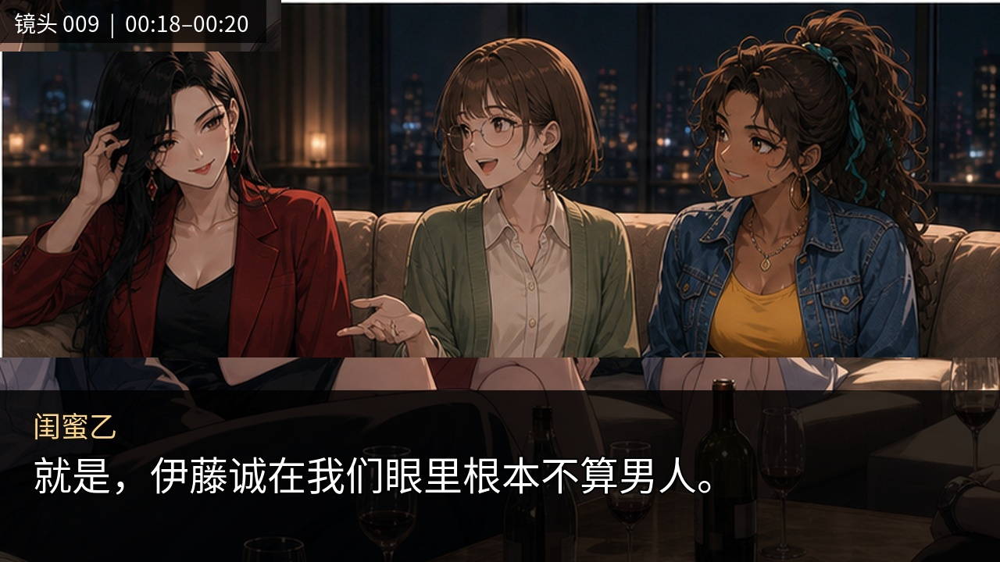](jpg/shot_009.jpg)
- **角色参考：**[柳如烟](../liuruyan.jpg)；[伊藤诚](../version1/screenplay/character_portraits/yitengcheng_user_reference.jpg)；[季伯达](../jiboda.jpg)；[闺蜜甲](../version1/screenplay/character_portraits/guimi1_v1.jpg)；[闺蜜乙](../version1/screenplay/character_portraits/guimi2_v1.jpg)；[闺蜜丙](../version1/screenplay/character_portraits/guimi3_v1.jpg)；[角色总参考表](references/character-reference-sheet.jpg)
- **场景/连续性参考：**[KTV continuity sheet](references/ktv-continuity-sheet.jpg)（当前素材中没有独立的 KTV 空景参考；此连续性表是可用场景依据，不以其他地点图片替代。）
- **闺蜜乙：**就是，伊藤诚在我们眼里根本不算男人。
- **目的/景别：**Advance the dialogue beat while preserving the existing social geography and escalating the double-standard argument without adding story events. Medium three-shot of the girlfriends; 闺蜜乙 leads from sofa center.
- **可见角色与精确调度：**Visible: 闺蜜甲 on sofa left, 闺蜜乙 center, 闺蜜丙 right. They remain seated behind the coffee table, shoulders angled toward 季伯达 off-camera/right; no seat swaps.
- **场景/灯光：**Modern high-rise KTV/lounge at night: warm amber practical lamps and ceiling light, cool blue city windows, dark curtains, neutral sofa, low dark coffee table with bottles and glasses. Preserve source-JPG object placement and warm/cool contrast; do not invent a new location.
- **表演/神态/动作：**闺蜜乙 turns toward 季伯达 and adds reassurance; 闺蜜甲 settles back; 闺蜜丙 takes a restrained sip.
- **摄影机：**Tiny lateral ease from left to center, ending on 闺蜜乙.
- **Seedance I2V prompt (EN)：**Animate the supplied storyboard JPG as a restrained cinematic 2D anime dialogue shot. Medium three-shot of the girlfriends; 闺蜜乙 leads from sofa center. Visible: 闺蜜甲 on sofa left, 闺蜜乙 center, 闺蜜丙 right. They remain seated behind the coffee table, shoulders angled toward 季伯达 off-camera/right; no seat swaps. Modern high-rise KTV/lounge at night: warm amber practical lamps and ceiling light, cool blue city windows, dark curtains, neutral sofa, low dark coffee table with bottles and glasses. Preserve source-JPG object placement and warm/cool contrast; do not invent a new location. Performance: 闺蜜乙 turns toward 季伯达 and adds reassurance; 闺蜜甲 settles back; 闺蜜丙 takes a restrained sip. Camera: Tiny lateral ease from left to center, ending on 闺蜜乙. Preserve the exact source composition, character designs, wardrobe, seating, props, and night lighting. Natural breathing, blinks, subtle hair and fabric response only; coherent facial animation and stable hands. No rendered words in the generated video. Spoken Mandarin dialogue, exact wording: “就是，伊藤诚在我们眼里根本不算男人。” Perform natural, restrained lip sync precisely to this line. The spoken wording must not be paraphrased, shortened, expanded, or replaced. Do not render the dialogue as on-screen text; add exact subtitles only in post-production. Timed dialogue and character action plan: 0.0–0.2s: hold the established composition; 闺蜜乙 takes a subtle breath and acquires the established eyeline while listeners remain attentive. 0.2–1.8s: 闺蜜乙 speaks the exact Mandarin line “就是，伊藤诚在我们眼里根本不算男人。” once, with natural restrained lip sync and the shot-specific performance: 闺蜜乙 turns toward 季伯达 and adds reassurance; 闺蜜甲 settles back; 闺蜜丙 takes a restrained sip. 1.8–2.0s: the speaker closes the mouth and resolves the gesture; listeners give only the restrained reaction described by the shot, then everyone holds their positions for the cut. Do not overlap, repeat, paraphrase, shorten, or extend the line. Supporting motion detail: {'start_sec': 0, 'end_sec': 1, 'beat': '闺蜜乙 acquires the established eyeline, inhales subtly, and begins the exact Mandarin line; 闺蜜乙 turns toward 季伯达 and adds reassurance; 闺蜜甲 settles back; 闺蜜丙 takes a restrained sip.'} {'start_sec': 1, 'end_sec': 2, 'beat': '闺蜜乙 completes the exact line and final shot-specific gesture; listeners register a restrained reaction, then hold for the cut.'}
- **Negative prompt / constraints：**No new characters, no identity/wardrobe changes, no seat swaps, no duplicated or missing limbs, no warped hands/faces, no lip-sync gibberish, no sudden standing, walking, touching, drinking spill, prop teleportation, background morphing, camera shake, zoom pumping, cuts, transitions, added text, captions, logos, watermarks, or UI.
- **逐秒运动节拍：**0–1s 闺蜜乙 acquires the established eyeline, inhales subtly, and begins the exact Mandarin line; 闺蜜乙 turns toward 季伯达 and adds reassurance; 闺蜜甲 settles back; 闺蜜丙 takes a restrained sip.；1–2s 闺蜜乙 completes the exact line and final shot-specific gesture; listeners register a restrained reaction, then hold for the cut.
- **对白与角色动作时间轴：**0.0–0.2s: hold the established composition; 闺蜜乙 takes a subtle breath and acquires the established eyeline while listeners remain attentive. 0.2–1.8s: 闺蜜乙 speaks the exact Mandarin line “就是，伊藤诚在我们眼里根本不算男人。” once, with natural restrained lip sync and the shot-specific performance: 闺蜜乙 turns toward 季伯达 and adds reassurance; 闺蜜甲 settles back; 闺蜜丙 takes a restrained sip. 1.8–2.0s: the speaker closes the mouth and resolves the gesture; listeners give only the restrained reaction described by the shot, then everyone holds their positions for the cut. Do not overlap, repeat, paraphrase, shorten, or extend the line. Supporting motion detail: {'start_sec': 0, 'end_sec': 1, 'beat': '闺蜜乙 acquires the established eyeline, inhales subtly, and begins the exact Mandarin line; 闺蜜乙 turns toward 季伯达 and adds reassurance; 闺蜜甲 settles back; 闺蜜丙 takes a restrained sip.'} {'start_sec': 1, 'end_sec': 2, 'beat': '闺蜜乙 completes the exact line and final shot-specific gesture; listeners register a restrained reaction, then hold for the cut.'}
- **连续性锁定：**Use this shot’s JPG as the first-frame identity/composition reference.；Lock character faces, hair, wardrobe, body proportions, seating side, eyelines, table/bottle/glass positions, city-night background, and warm/cool lighting to the source JPG and adjacent shots.；Do not animate storyboard labels or subtitles: remove/crop/clean all labels and caption bands before image-to-video; composite exact Chinese dialogue or final card afterward in editing.
- **声音/对白指导：**Use clean Mandarin dialogue by 闺蜜乙; preserve the exact line and natural phrasing. Keep KTV room tone low, avoid music masking consonants, and use post-recorded dialogue/lip sync rather than generated text.
- **推荐生成设置：**motion `low`；`16:9`；`24 fps`；`1080p`；生成 `2s`，精确裁切为 `2s`；首帧使用去除全部文字/字幕后的对应 JPG。

## 镜头 010｜00:20–00:22
- **文件：**`jpg/shot_010.jpg`
- **Staging/start image：**[Staging start image](jpg/shot_010.jpg)  
  [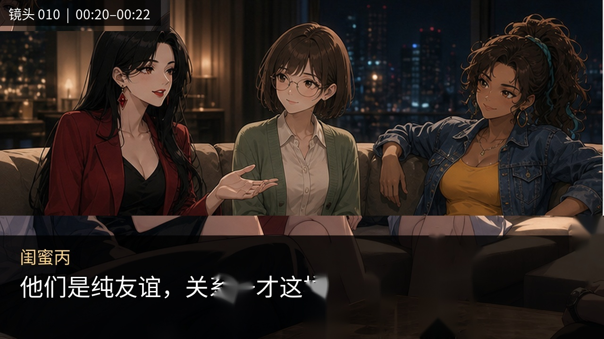](jpg/shot_010.jpg)
- **角色参考：**[柳如烟](../liuruyan.jpg)；[伊藤诚](../version1/screenplay/character_portraits/yitengcheng_user_reference.jpg)；[季伯达](../jiboda.jpg)；[闺蜜甲](../version1/screenplay/character_portraits/guimi1_v1.jpg)；[闺蜜乙](../version1/screenplay/character_portraits/guimi2_v1.jpg)；[闺蜜丙](../version1/screenplay/character_portraits/guimi3_v1.jpg)；[角色总参考表](references/character-reference-sheet.jpg)
- **场景/连续性参考：**[KTV continuity sheet](references/ktv-continuity-sheet.jpg)（当前素材中没有独立的 KTV 空景参考；此连续性表是可用场景依据，不以其他地点图片替代。）
- **闺蜜丙：**他们是纯友谊，关系好才这样。
- **目的/景别：**Advance the dialogue beat while preserving the existing social geography and escalating the double-standard argument without adding story events. Medium three-shot of the girlfriends; 闺蜜丙 leads from sofa right.
- **可见角色与精确调度：**Visible: 闺蜜甲 on sofa left, 闺蜜乙 center, 闺蜜丙 right. They remain seated behind the coffee table, shoulders angled toward 季伯达 off-camera/right; no seat swaps.
- **场景/灯光：**Modern high-rise KTV/lounge at night: warm amber practical lamps and ceiling light, cool blue city windows, dark curtains, neutral sofa, low dark coffee table with bottles and glasses. Preserve source-JPG object placement and warm/cool contrast; do not invent a new location.
- **表演/神态/动作：**闺蜜丙 lowers her drink and concludes calmly; the other two turn to her.
- **摄影机：**Tiny ease right to favor 闺蜜丙.
- **Seedance I2V prompt (EN)：**Animate the supplied storyboard JPG as a restrained cinematic 2D anime dialogue shot. Medium three-shot of the girlfriends; 闺蜜丙 leads from sofa right. Visible: 闺蜜甲 on sofa left, 闺蜜乙 center, 闺蜜丙 right. They remain seated behind the coffee table, shoulders angled toward 季伯达 off-camera/right; no seat swaps. Modern high-rise KTV/lounge at night: warm amber practical lamps and ceiling light, cool blue city windows, dark curtains, neutral sofa, low dark coffee table with bottles and glasses. Preserve source-JPG object placement and warm/cool contrast; do not invent a new location. Performance: 闺蜜丙 lowers her drink and concludes calmly; the other two turn to her. Camera: Tiny ease right to favor 闺蜜丙. Preserve the exact source composition, character designs, wardrobe, seating, props, and night lighting. Natural breathing, blinks, subtle hair and fabric response only; coherent facial animation and stable hands. No rendered words in the generated video. Spoken Mandarin dialogue, exact wording: “他们是纯友谊，关系好才这样。” Perform natural, restrained lip sync precisely to this line. The spoken wording must not be paraphrased, shortened, expanded, or replaced. Do not render the dialogue as on-screen text; add exact subtitles only in post-production. Timed dialogue and character action plan: 0.0–0.2s: hold the established composition; 闺蜜丙 takes a subtle breath and acquires the established eyeline while listeners remain attentive. 0.2–1.8s: 闺蜜丙 speaks the exact Mandarin line “他们是纯友谊，关系好才这样。” once, with natural restrained lip sync and the shot-specific performance: 闺蜜丙 lowers her drink and concludes calmly; the other two turn to her. 1.8–2.0s: the speaker closes the mouth and resolves the gesture; listeners give only the restrained reaction described by the shot, then everyone holds their positions for the cut. Do not overlap, repeat, paraphrase, shorten, or extend the line. Supporting motion detail: {'start_sec': 0, 'end_sec': 1, 'beat': '闺蜜丙 acquires the established eyeline, inhales subtly, and begins the exact Mandarin line; 闺蜜丙 lowers her drink and concludes calmly; the other two turn to her.'} {'start_sec': 1, 'end_sec': 2, 'beat': '闺蜜丙 completes the exact line and final shot-specific gesture; listeners register a restrained reaction, then hold for the cut.'}
- **Negative prompt / constraints：**No new characters, no identity/wardrobe changes, no seat swaps, no duplicated or missing limbs, no warped hands/faces, no lip-sync gibberish, no sudden standing, walking, touching, drinking spill, prop teleportation, background morphing, camera shake, zoom pumping, cuts, transitions, added text, captions, logos, watermarks, or UI.
- **逐秒运动节拍：**0–1s 闺蜜丙 acquires the established eyeline, inhales subtly, and begins the exact Mandarin line; 闺蜜丙 lowers her drink and concludes calmly; the other two turn to her.；1–2s 闺蜜丙 completes the exact line and final shot-specific gesture; listeners register a restrained reaction, then hold for the cut.
- **对白与角色动作时间轴：**0.0–0.2s: hold the established composition; 闺蜜丙 takes a subtle breath and acquires the established eyeline while listeners remain attentive. 0.2–1.8s: 闺蜜丙 speaks the exact Mandarin line “他们是纯友谊，关系好才这样。” once, with natural restrained lip sync and the shot-specific performance: 闺蜜丙 lowers her drink and concludes calmly; the other two turn to her. 1.8–2.0s: the speaker closes the mouth and resolves the gesture; listeners give only the restrained reaction described by the shot, then everyone holds their positions for the cut. Do not overlap, repeat, paraphrase, shorten, or extend the line. Supporting motion detail: {'start_sec': 0, 'end_sec': 1, 'beat': '闺蜜丙 acquires the established eyeline, inhales subtly, and begins the exact Mandarin line; 闺蜜丙 lowers her drink and concludes calmly; the other two turn to her.'} {'start_sec': 1, 'end_sec': 2, 'beat': '闺蜜丙 completes the exact line and final shot-specific gesture; listeners register a restrained reaction, then hold for the cut.'}
- **连续性锁定：**Use this shot’s JPG as the first-frame identity/composition reference.；Lock character faces, hair, wardrobe, body proportions, seating side, eyelines, table/bottle/glass positions, city-night background, and warm/cool lighting to the source JPG and adjacent shots.；Do not animate storyboard labels or subtitles: remove/crop/clean all labels and caption bands before image-to-video; composite exact Chinese dialogue or final card afterward in editing.
- **声音/对白指导：**Use clean Mandarin dialogue by 闺蜜丙; preserve the exact line and natural phrasing. Keep KTV room tone low, avoid music masking consonants, and use post-recorded dialogue/lip sync rather than generated text.
- **推荐生成设置：**motion `low`；`16:9`；`24 fps`；`1080p`；生成 `2s`，精确裁切为 `2s`；首帧使用去除全部文字/字幕后的对应 JPG。

## 镜头 011｜00:22–00:26
- **文件：**`jpg/shot_011.jpg`
- **Staging/start image：**[Staging start image](jpg/shot_011.jpg)  
  [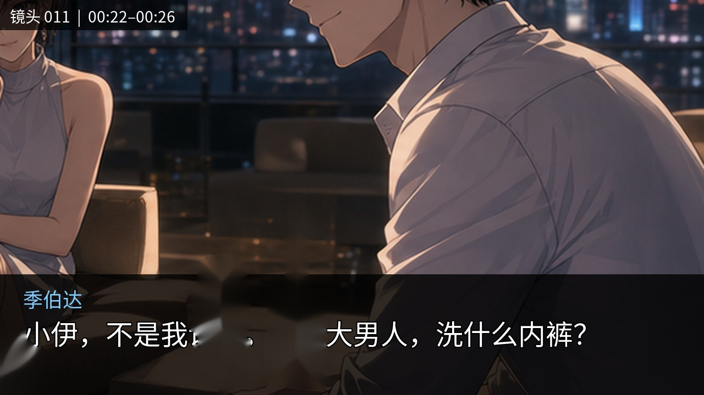](jpg/shot_011.jpg)
- **角色参考：**[柳如烟](../liuruyan.jpg)；[伊藤诚](../version1/screenplay/character_portraits/yitengcheng_user_reference.jpg)；[季伯达](../jiboda.jpg)；[闺蜜甲](../version1/screenplay/character_portraits/guimi1_v1.jpg)；[闺蜜乙](../version1/screenplay/character_portraits/guimi2_v1.jpg)；[闺蜜丙](../version1/screenplay/character_portraits/guimi3_v1.jpg)；[角色总参考表](references/character-reference-sheet.jpg)
- **场景/连续性参考：**[KTV continuity sheet](references/ktv-continuity-sheet.jpg)（当前素材中没有独立的 KTV 空景参考；此连续性表是可用场景依据，不以其他地点图片替代。）
- **季伯达：**小伊，不是我说你。一个大男人，洗什么内裤？
- **目的/景别：**Advance the dialogue beat while preserving the existing social geography and escalating the double-standard argument without adding story events. Over-shoulder/medium close-up favoring 季伯达 at the right foreground, facing left toward 伊藤诚.
- **可见角色与精确调度：**Visible: 季伯达 occupies the right foreground in a white shirt, torso turned left toward 柳如烟/伊藤诚 and the opposite sofa; a seated friend may remain soft behind him. He remains seated and does not change sides.
- **场景/灯光：**Modern high-rise KTV/lounge at night: warm amber practical lamps and ceiling light, cool blue city windows, dark curtains, neutral sofa, low dark coffee table with bottles and glasses. Preserve source-JPG object placement and warm/cool contrast; do not invent a new location.
- **表演/神态/动作：**季伯达 begins controlled and faintly incredulous, looking toward 伊藤诚; one restrained open-palm gesture.
- **摄影机：**Slow 3% push-in; stable eyeline.
- **Seedance I2V prompt (EN)：**Animate the supplied storyboard JPG as a restrained cinematic 2D anime dialogue shot. Over-shoulder/medium close-up favoring 季伯达 at the right foreground, facing left toward 伊藤诚. Visible: 季伯达 occupies the right foreground in a white shirt, torso turned left toward 柳如烟/伊藤诚 and the opposite sofa; a seated friend may remain soft behind him. He remains seated and does not change sides. Modern high-rise KTV/lounge at night: warm amber practical lamps and ceiling light, cool blue city windows, dark curtains, neutral sofa, low dark coffee table with bottles and glasses. Preserve source-JPG object placement and warm/cool contrast; do not invent a new location. Performance: 季伯达 begins controlled and faintly incredulous, looking toward 伊藤诚; one restrained open-palm gesture. Camera: Slow 3% push-in; stable eyeline. Preserve the exact source composition, character designs, wardrobe, seating, props, and night lighting. Natural breathing, blinks, subtle hair and fabric response only; coherent facial animation and stable hands. No rendered words in the generated video. Spoken Mandarin dialogue, exact wording: “小伊，不是我说你。一个大男人，洗什么内裤？” Perform natural, restrained lip sync precisely to this line. The spoken wording must not be paraphrased, shortened, expanded, or replaced. Do not render the dialogue as on-screen text; add exact subtitles only in post-production. Timed dialogue and character action plan: 0.0–0.5s: hold the established composition; 季伯达 takes a subtle breath and acquires the established eyeline while listeners remain attentive. 0.5–3.6s: 季伯达 speaks the exact Mandarin line “小伊，不是我说你。一个大男人，洗什么内裤？” once, with natural restrained lip sync and the shot-specific performance: 季伯达 begins controlled and faintly incredulous, looking toward 伊藤诚; one restrained open-palm gesture. 3.6–4.0s: the speaker closes the mouth and resolves the gesture; listeners give only the restrained reaction described by the shot, then everyone holds their positions for the cut. Do not overlap, repeat, paraphrase, shorten, or extend the line. Supporting motion detail: {'start_sec': 0, 'end_sec': 1, 'beat': '季伯达 acquires the established eyeline, inhales subtly, and begins the exact Mandarin line; 季伯达 begins controlled and faintly incredulous, looking toward 伊藤诚; one restrained open-palm gesture.'} {'start_sec': 1, 'end_sec': 2, 'beat': '季伯达 continues the line with coherent restrained lip sync; the primary expression/gesture develops without changing seat or props.'} {'start_sec': 2, 'end_sec': 3, 'beat': '季伯达 sustains the next phrase at natural pace; gesture resolves incrementally while listeners respond only with blinks, breath, and micro-expressions.'} {'start_sec': 3, 'end_sec': 4, 'beat': '季伯达 completes the exact line and final shot-specific gesture; listeners register a restrained reaction, then hold for the cut.'}
- **Negative prompt / constraints：**No new characters, no identity/wardrobe changes, no seat swaps, no duplicated or missing limbs, no warped hands/faces, no lip-sync gibberish, no sudden standing, walking, touching, drinking spill, prop teleportation, background morphing, camera shake, zoom pumping, cuts, transitions, added text, captions, logos, watermarks, or UI.
- **逐秒运动节拍：**0–1s 季伯达 acquires the established eyeline, inhales subtly, and begins the exact Mandarin line; 季伯达 begins controlled and faintly incredulous, looking toward 伊藤诚; one restrained open-palm gesture.；1–2s 季伯达 continues the line with coherent restrained lip sync; the primary expression/gesture develops without changing seat or props.；2–3s 季伯达 sustains the next phrase at natural pace; gesture resolves incrementally while listeners respond only with blinks, breath, and micro-expressions.；3–4s 季伯达 completes the exact line and final shot-specific gesture; listeners register a restrained reaction, then hold for the cut.
- **对白与角色动作时间轴：**0.0–0.5s: hold the established composition; 季伯达 takes a subtle breath and acquires the established eyeline while listeners remain attentive. 0.5–3.6s: 季伯达 speaks the exact Mandarin line “小伊，不是我说你。一个大男人，洗什么内裤？” once, with natural restrained lip sync and the shot-specific performance: 季伯达 begins controlled and faintly incredulous, looking toward 伊藤诚; one restrained open-palm gesture. 3.6–4.0s: the speaker closes the mouth and resolves the gesture; listeners give only the restrained reaction described by the shot, then everyone holds their positions for the cut. Do not overlap, repeat, paraphrase, shorten, or extend the line. Supporting motion detail: {'start_sec': 0, 'end_sec': 1, 'beat': '季伯达 acquires the established eyeline, inhales subtly, and begins the exact Mandarin line; 季伯达 begins controlled and faintly incredulous, looking toward 伊藤诚; one restrained open-palm gesture.'} {'start_sec': 1, 'end_sec': 2, 'beat': '季伯达 continues the line with coherent restrained lip sync; the primary expression/gesture develops without changing seat or props.'} {'start_sec': 2, 'end_sec': 3, 'beat': '季伯达 sustains the next phrase at natural pace; gesture resolves incrementally while listeners respond only with blinks, breath, and micro-expressions.'} {'start_sec': 3, 'end_sec': 4, 'beat': '季伯达 completes the exact line and final shot-specific gesture; listeners register a restrained reaction, then hold for the cut.'}
- **连续性锁定：**Use this shot’s JPG as the first-frame identity/composition reference.；Lock character faces, hair, wardrobe, body proportions, seating side, eyelines, table/bottle/glass positions, city-night background, and warm/cool lighting to the source JPG and adjacent shots.；Do not animate storyboard labels or subtitles: remove/crop/clean all labels and caption bands before image-to-video; composite exact Chinese dialogue or final card afterward in editing.
- **声音/对白指导：**Use clean Mandarin dialogue by 季伯达; preserve the exact line and natural phrasing. Keep KTV room tone low, avoid music masking consonants, and use post-recorded dialogue/lip sync rather than generated text.
- **推荐生成设置：**motion `low-medium`；`16:9`；`24 fps`；`1080p`；生成 `4s`，精确裁切为 `4s`；首帧使用去除全部文字/字幕后的对应 JPG。

## 镜头 012｜00:26–00:31
- **文件：**`jpg/shot_012.jpg`
- **Staging/start image：**[Staging start image](jpg/shot_012.jpg)  
  [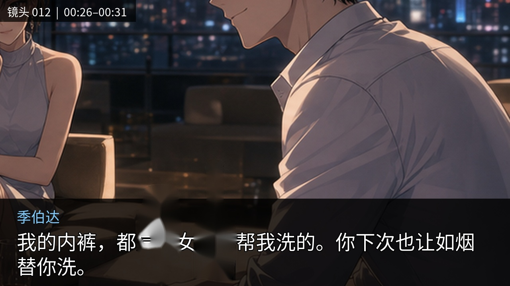](jpg/shot_012.jpg)
- **角色参考：**[柳如烟](../liuruyan.jpg)；[伊藤诚](../version1/screenplay/character_portraits/yitengcheng_user_reference.jpg)；[季伯达](../jiboda.jpg)；[闺蜜甲](../version1/screenplay/character_portraits/guimi1_v1.jpg)；[闺蜜乙](../version1/screenplay/character_portraits/guimi2_v1.jpg)；[闺蜜丙](../version1/screenplay/character_portraits/guimi3_v1.jpg)；[角色总参考表](references/character-reference-sheet.jpg)
- **场景/连续性参考：**[KTV continuity sheet](references/ktv-continuity-sheet.jpg)（当前素材中没有独立的 KTV 空景参考；此连续性表是可用场景依据，不以其他地点图片替代。）
- **季伯达：**我的内裤，都是我女闺蜜帮我洗的。你下次也让如烟替你洗。
- **目的/景别：**Advance the dialogue beat while preserving the existing social geography and escalating the double-standard argument without adding story events. Matching medium close-up on 季伯达 from the same axis.
- **可见角色与精确调度：**Visible: 季伯达 occupies the right foreground in a white shirt, torso turned left toward 柳如烟/伊藤诚 and the opposite sofa; a seated friend may remain soft behind him. He remains seated and does not change sides.
- **场景/灯光：**Modern high-rise KTV/lounge at night: warm amber practical lamps and ceiling light, cool blue city windows, dark curtains, neutral sofa, low dark coffee table with bottles and glasses. Preserve source-JPG object placement and warm/cool contrast; do not invent a new location.
- **表演/神态/动作：**季伯达 delivers the mirror example with deliberate calm, then subtly points the logic back toward 柳如烟.
- **摄影机：**Slow 3% push-in, matching shot 011 axis.
- **Seedance I2V prompt (EN)：**Animate the supplied storyboard JPG as a restrained cinematic 2D anime dialogue shot. Matching medium close-up on 季伯达 from the same axis. Visible: 季伯达 occupies the right foreground in a white shirt, torso turned left toward 柳如烟/伊藤诚 and the opposite sofa; a seated friend may remain soft behind him. He remains seated and does not change sides. Modern high-rise KTV/lounge at night: warm amber practical lamps and ceiling light, cool blue city windows, dark curtains, neutral sofa, low dark coffee table with bottles and glasses. Preserve source-JPG object placement and warm/cool contrast; do not invent a new location. Performance: 季伯达 delivers the mirror example with deliberate calm, then subtly points the logic back toward 柳如烟. Camera: Slow 3% push-in, matching shot 011 axis. Preserve the exact source composition, character designs, wardrobe, seating, props, and night lighting. Natural breathing, blinks, subtle hair and fabric response only; coherent facial animation and stable hands. No rendered words in the generated video. Spoken Mandarin dialogue, exact wording: “我的内裤，都是我女闺蜜帮我洗的。你下次也让如烟替你洗。” Perform natural, restrained lip sync precisely to this line. The spoken wording must not be paraphrased, shortened, expanded, or replaced. Do not render the dialogue as on-screen text; add exact subtitles only in post-production. Timed dialogue and character action plan: 0.0–0.5s: hold the established composition; 季伯达 takes a subtle breath and acquires the established eyeline while listeners remain attentive. 0.5–4.6s: 季伯达 speaks the exact Mandarin line “我的内裤，都是我女闺蜜帮我洗的。你下次也让如烟替你洗。” once, with natural restrained lip sync and the shot-specific performance: 季伯达 delivers the mirror example with deliberate calm, then subtly points the logic back toward 柳如烟. 4.6–5.0s: the speaker closes the mouth and resolves the gesture; listeners give only the restrained reaction described by the shot, then everyone holds their positions for the cut. Do not overlap, repeat, paraphrase, shorten, or extend the line. Supporting motion detail: {'start_sec': 0, 'end_sec': 1, 'beat': '季伯达 acquires the established eyeline, inhales subtly, and begins the exact Mandarin line; 季伯达 delivers the mirror example with deliberate calm, then subtly points the logic back toward 柳如烟.'} {'start_sec': 1, 'end_sec': 2, 'beat': '季伯达 continues the line with coherent restrained lip sync; the primary expression/gesture develops without changing seat or props.'} {'start_sec': 2, 'end_sec': 3, 'beat': '季伯达 sustains the next phrase at natural pace; gesture resolves incrementally while listeners respond only with blinks, breath, and micro-expressions.'} {'start_sec': 3, 'end_sec': 4, 'beat': '季伯达 sustains the next phrase at natural pace; gesture resolves incrementally while listeners respond only with blinks, breath, and micro-expressions.'} {'start_sec': 4, 'end_sec': 5, 'beat': '季伯达 completes the exact line and final shot-specific gesture; listeners register a restrained reaction, then hold for the cut.'}
- **Negative prompt / constraints：**No new characters, no identity/wardrobe changes, no seat swaps, no duplicated or missing limbs, no warped hands/faces, no lip-sync gibberish, no sudden standing, walking, touching, drinking spill, prop teleportation, background morphing, camera shake, zoom pumping, cuts, transitions, added text, captions, logos, watermarks, or UI.
- **逐秒运动节拍：**0–1s 季伯达 acquires the established eyeline, inhales subtly, and begins the exact Mandarin line; 季伯达 delivers the mirror example with deliberate calm, then subtly points the logic back toward 柳如烟.；1–2s 季伯达 continues the line with coherent restrained lip sync; the primary expression/gesture develops without changing seat or props.；2–3s 季伯达 sustains the next phrase at natural pace; gesture resolves incrementally while listeners respond only with blinks, breath, and micro-expressions.；3–4s 季伯达 sustains the next phrase at natural pace; gesture resolves incrementally while listeners respond only with blinks, breath, and micro-expressions.；4–5s 季伯达 completes the exact line and final shot-specific gesture; listeners register a restrained reaction, then hold for the cut.
- **对白与角色动作时间轴：**0.0–0.5s: hold the established composition; 季伯达 takes a subtle breath and acquires the established eyeline while listeners remain attentive. 0.5–4.6s: 季伯达 speaks the exact Mandarin line “我的内裤，都是我女闺蜜帮我洗的。你下次也让如烟替你洗。” once, with natural restrained lip sync and the shot-specific performance: 季伯达 delivers the mirror example with deliberate calm, then subtly points the logic back toward 柳如烟. 4.6–5.0s: the speaker closes the mouth and resolves the gesture; listeners give only the restrained reaction described by the shot, then everyone holds their positions for the cut. Do not overlap, repeat, paraphrase, shorten, or extend the line. Supporting motion detail: {'start_sec': 0, 'end_sec': 1, 'beat': '季伯达 acquires the established eyeline, inhales subtly, and begins the exact Mandarin line; 季伯达 delivers the mirror example with deliberate calm, then subtly points the logic back toward 柳如烟.'} {'start_sec': 1, 'end_sec': 2, 'beat': '季伯达 continues the line with coherent restrained lip sync; the primary expression/gesture develops without changing seat or props.'} {'start_sec': 2, 'end_sec': 3, 'beat': '季伯达 sustains the next phrase at natural pace; gesture resolves incrementally while listeners respond only with blinks, breath, and micro-expressions.'} {'start_sec': 3, 'end_sec': 4, 'beat': '季伯达 sustains the next phrase at natural pace; gesture resolves incrementally while listeners respond only with blinks, breath, and micro-expressions.'} {'start_sec': 4, 'end_sec': 5, 'beat': '季伯达 completes the exact line and final shot-specific gesture; listeners register a restrained reaction, then hold for the cut.'}
- **连续性锁定：**Use this shot’s JPG as the first-frame identity/composition reference.；Lock character faces, hair, wardrobe, body proportions, seating side, eyelines, table/bottle/glass positions, city-night background, and warm/cool lighting to the source JPG and adjacent shots.；Do not animate storyboard labels or subtitles: remove/crop/clean all labels and caption bands before image-to-video; composite exact Chinese dialogue or final card afterward in editing.
- **声音/对白指导：**Use clean Mandarin dialogue by 季伯达; preserve the exact line and natural phrasing. Keep KTV room tone low, avoid music masking consonants, and use post-recorded dialogue/lip sync rather than generated text.
- **推荐生成设置：**motion `low-medium`；`16:9`；`24 fps`；`1080p`；生成 `5s`，精确裁切为 `5s`；首帧使用去除全部文字/字幕后的对应 JPG。

## 镜头 013｜00:31–00:36
- **文件：**`jpg/shot_013.jpg`
- **Staging/start image：**[Staging start image](jpg/shot_013.jpg)  
  [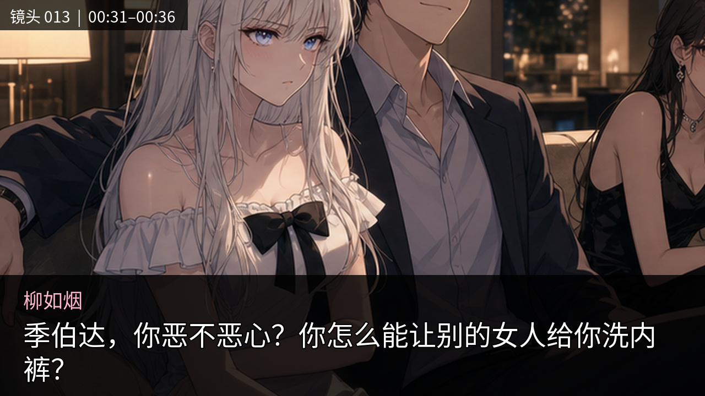](jpg/shot_013.jpg)
- **角色参考：**[柳如烟](../liuruyan.jpg)；[伊藤诚](../version1/screenplay/character_portraits/yitengcheng_user_reference.jpg)；[季伯达](../jiboda.jpg)；[闺蜜甲](../version1/screenplay/character_portraits/guimi1_v1.jpg)；[闺蜜乙](../version1/screenplay/character_portraits/guimi2_v1.jpg)；[闺蜜丙](../version1/screenplay/character_portraits/guimi3_v1.jpg)；[角色总参考表](references/character-reference-sheet.jpg)
- **场景/连续性参考：**[KTV continuity sheet](references/ktv-continuity-sheet.jpg)（当前素材中没有独立的 KTV 空景参考；此连续性表是可用场景依据，不以其他地点图片替代。）
- **柳如烟：**季伯达，你恶不恶心？你怎么能让别的女人给你洗内裤？
- **目的/景别：**Advance the dialogue beat while preserving the existing social geography and escalating the double-standard argument without adding story events. Tight medium close-up on 柳如烟, 伊藤诚 partly visible beside her.
- **可见角色与精确调度：**Visible: 柳如烟 seated at frame left with 伊藤诚 immediately to her right; one or more sofa friends may remain soft in the background exactly as in the source JPG. 柳如烟 does not stand or cross the room.
- **场景/灯光：**Modern high-rise KTV/lounge at night: warm amber practical lamps and ceiling light, cool blue city windows, dark curtains, neutral sofa, low dark coffee table with bottles and glasses. Preserve source-JPG object placement and warm/cool contrast; do not invent a new location.
- **表演/神态/动作：**柳如烟 recoils slightly, anger and disgust rising; she turns sharply toward 季伯达 and emphasizes the accusation.
- **摄影机：**Controlled 3% push-in as anger rises.
- **Seedance I2V prompt (EN)：**Animate the supplied storyboard JPG as a restrained cinematic 2D anime dialogue shot. Tight medium close-up on 柳如烟, 伊藤诚 partly visible beside her. Visible: 柳如烟 seated at frame left with 伊藤诚 immediately to her right; one or more sofa friends may remain soft in the background exactly as in the source JPG. 柳如烟 does not stand or cross the room. Modern high-rise KTV/lounge at night: warm amber practical lamps and ceiling light, cool blue city windows, dark curtains, neutral sofa, low dark coffee table with bottles and glasses. Preserve source-JPG object placement and warm/cool contrast; do not invent a new location. Performance: 柳如烟 recoils slightly, anger and disgust rising; she turns sharply toward 季伯达 and emphasizes the accusation. Camera: Controlled 3% push-in as anger rises. Preserve the exact source composition, character designs, wardrobe, seating, props, and night lighting. Natural breathing, blinks, subtle hair and fabric response only; coherent facial animation and stable hands. No rendered words in the generated video. Spoken Mandarin dialogue, exact wording: “季伯达，你恶不恶心？你怎么能让别的女人给你洗内裤？” Perform natural, restrained lip sync precisely to this line. The spoken wording must not be paraphrased, shortened, expanded, or replaced. Do not render the dialogue as on-screen text; add exact subtitles only in post-production. Timed dialogue and character action plan: 0.0–0.5s: hold the established composition; 柳如烟 takes a subtle breath and acquires the established eyeline while listeners remain attentive. 0.5–4.6s: 柳如烟 speaks the exact Mandarin line “季伯达，你恶不恶心？你怎么能让别的女人给你洗内裤？” once, with natural restrained lip sync and the shot-specific performance: 柳如烟 recoils slightly, anger and disgust rising; she turns sharply toward 季伯达 and emphasizes the accusation. 4.6–5.0s: the speaker closes the mouth and resolves the gesture; listeners give only the restrained reaction described by the shot, then everyone holds their positions for the cut. Do not overlap, repeat, paraphrase, shorten, or extend the line. Supporting motion detail: {'start_sec': 0, 'end_sec': 1, 'beat': '柳如烟 acquires the established eyeline, inhales subtly, and begins the exact Mandarin line; 柳如烟 recoils slightly, anger and disgust rising; she turns sharply toward 季伯达 and emphasizes the accusation.'} {'start_sec': 1, 'end_sec': 2, 'beat': '柳如烟 continues the line with coherent restrained lip sync; the primary expression/gesture develops without changing seat or props.'} {'start_sec': 2, 'end_sec': 3, 'beat': '柳如烟 sustains the next phrase at natural pace; gesture resolves incrementally while listeners respond only with blinks, breath, and micro-expressions.'} {'start_sec': 3, 'end_sec': 4, 'beat': '柳如烟 sustains the next phrase at natural pace; gesture resolves incrementally while listeners respond only with blinks, breath, and micro-expressions.'} {'start_sec': 4, 'end_sec': 5, 'beat': '柳如烟 completes the exact line and final shot-specific gesture; listeners register a restrained reaction, then hold for the cut.'}
- **Negative prompt / constraints：**No new characters, no identity/wardrobe changes, no seat swaps, no duplicated or missing limbs, no warped hands/faces, no lip-sync gibberish, no sudden standing, walking, touching, drinking spill, prop teleportation, background morphing, camera shake, zoom pumping, cuts, transitions, added text, captions, logos, watermarks, or UI.
- **逐秒运动节拍：**0–1s 柳如烟 acquires the established eyeline, inhales subtly, and begins the exact Mandarin line; 柳如烟 recoils slightly, anger and disgust rising; she turns sharply toward 季伯达 and emphasizes the accusation.；1–2s 柳如烟 continues the line with coherent restrained lip sync; the primary expression/gesture develops without changing seat or props.；2–3s 柳如烟 sustains the next phrase at natural pace; gesture resolves incrementally while listeners respond only with blinks, breath, and micro-expressions.；3–4s 柳如烟 sustains the next phrase at natural pace; gesture resolves incrementally while listeners respond only with blinks, breath, and micro-expressions.；4–5s 柳如烟 completes the exact line and final shot-specific gesture; listeners register a restrained reaction, then hold for the cut.
- **对白与角色动作时间轴：**0.0–0.5s: hold the established composition; 柳如烟 takes a subtle breath and acquires the established eyeline while listeners remain attentive. 0.5–4.6s: 柳如烟 speaks the exact Mandarin line “季伯达，你恶不恶心？你怎么能让别的女人给你洗内裤？” once, with natural restrained lip sync and the shot-specific performance: 柳如烟 recoils slightly, anger and disgust rising; she turns sharply toward 季伯达 and emphasizes the accusation. 4.6–5.0s: the speaker closes the mouth and resolves the gesture; listeners give only the restrained reaction described by the shot, then everyone holds their positions for the cut. Do not overlap, repeat, paraphrase, shorten, or extend the line. Supporting motion detail: {'start_sec': 0, 'end_sec': 1, 'beat': '柳如烟 acquires the established eyeline, inhales subtly, and begins the exact Mandarin line; 柳如烟 recoils slightly, anger and disgust rising; she turns sharply toward 季伯达 and emphasizes the accusation.'} {'start_sec': 1, 'end_sec': 2, 'beat': '柳如烟 continues the line with coherent restrained lip sync; the primary expression/gesture develops without changing seat or props.'} {'start_sec': 2, 'end_sec': 3, 'beat': '柳如烟 sustains the next phrase at natural pace; gesture resolves incrementally while listeners respond only with blinks, breath, and micro-expressions.'} {'start_sec': 3, 'end_sec': 4, 'beat': '柳如烟 sustains the next phrase at natural pace; gesture resolves incrementally while listeners respond only with blinks, breath, and micro-expressions.'} {'start_sec': 4, 'end_sec': 5, 'beat': '柳如烟 completes the exact line and final shot-specific gesture; listeners register a restrained reaction, then hold for the cut.'}
- **连续性锁定：**Use this shot’s JPG as the first-frame identity/composition reference.；Lock character faces, hair, wardrobe, body proportions, seating side, eyelines, table/bottle/glass positions, city-night background, and warm/cool lighting to the source JPG and adjacent shots.；Do not animate storyboard labels or subtitles: remove/crop/clean all labels and caption bands before image-to-video; composite exact Chinese dialogue or final card afterward in editing.
- **声音/对白指导：**Use clean Mandarin dialogue by 柳如烟; preserve the exact line and natural phrasing. Keep KTV room tone low, avoid music masking consonants, and use post-recorded dialogue/lip sync rather than generated text.
- **推荐生成设置：**motion `low-medium`；`16:9`；`24 fps`；`1080p`；生成 `5s`，精确裁切为 `5s`；首帧使用去除全部文字/字幕后的对应 JPG。

## 镜头 014｜00:36–00:38
- **文件：**`jpg/shot_014.jpg`
- **Staging/start image：**[Staging start image](jpg/shot_014.jpg)  
  [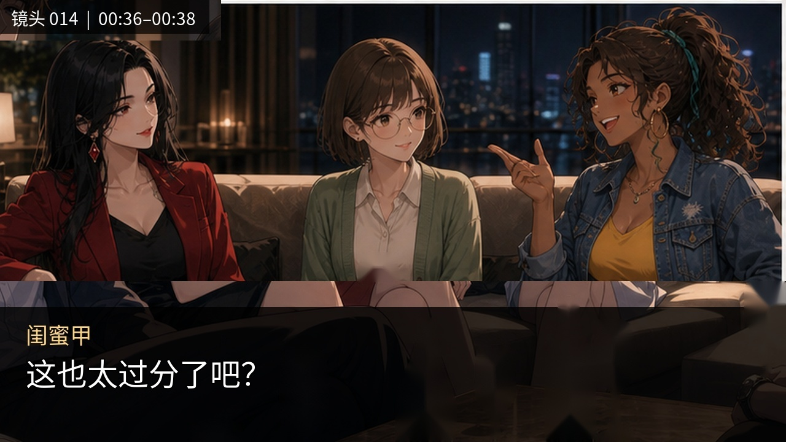](jpg/shot_014.jpg)
- **角色参考：**[柳如烟](../liuruyan.jpg)；[伊藤诚](../version1/screenplay/character_portraits/yitengcheng_user_reference.jpg)；[季伯达](../jiboda.jpg)；[闺蜜甲](../version1/screenplay/character_portraits/guimi1_v1.jpg)；[闺蜜乙](../version1/screenplay/character_portraits/guimi2_v1.jpg)；[闺蜜丙](../version1/screenplay/character_portraits/guimi3_v1.jpg)；[角色总参考表](references/character-reference-sheet.jpg)
- **场景/连续性参考：**[KTV continuity sheet](references/ktv-continuity-sheet.jpg)（当前素材中没有独立的 KTV 空景参考；此连续性表是可用场景依据，不以其他地点图片替代。）
- **闺蜜甲：**这也太过分了吧？
- **目的/景别：**Advance the dialogue beat while preserving the existing social geography and escalating the double-standard argument without adding story events. Medium three-shot of the girlfriends, favoring 闺蜜甲 at left.
- **可见角色与精确调度：**Visible: 闺蜜甲 on sofa left, 闺蜜乙 center, 闺蜜丙 right. They remain seated behind the coffee table, shoulders angled toward 季伯达 off-camera/right; no seat swaps.
- **场景/灯光：**Modern high-rise KTV/lounge at night: warm amber practical lamps and ceiling light, cool blue city windows, dark curtains, neutral sofa, low dark coffee table with bottles and glasses. Preserve source-JPG object placement and warm/cool contrast; do not invent a new location.
- **表演/神态/动作：**闺蜜甲 leans forward with a frown and challenges him; 闺蜜乙 watches his reaction; 闺蜜丙 raises one brow.
- **摄影机：**Gentle 2% push toward 闺蜜甲.
- **Seedance I2V prompt (EN)：**Animate the supplied storyboard JPG as a restrained cinematic 2D anime dialogue shot. Medium three-shot of the girlfriends, favoring 闺蜜甲 at left. Visible: 闺蜜甲 on sofa left, 闺蜜乙 center, 闺蜜丙 right. They remain seated behind the coffee table, shoulders angled toward 季伯达 off-camera/right; no seat swaps. Modern high-rise KTV/lounge at night: warm amber practical lamps and ceiling light, cool blue city windows, dark curtains, neutral sofa, low dark coffee table with bottles and glasses. Preserve source-JPG object placement and warm/cool contrast; do not invent a new location. Performance: 闺蜜甲 leans forward with a frown and challenges him; 闺蜜乙 watches his reaction; 闺蜜丙 raises one brow. Camera: Gentle 2% push toward 闺蜜甲. Preserve the exact source composition, character designs, wardrobe, seating, props, and night lighting. Natural breathing, blinks, subtle hair and fabric response only; coherent facial animation and stable hands. No rendered words in the generated video. Spoken Mandarin dialogue, exact wording: “这也太过分了吧？” Perform natural, restrained lip sync precisely to this line. The spoken wording must not be paraphrased, shortened, expanded, or replaced. Do not render the dialogue as on-screen text; add exact subtitles only in post-production. Timed dialogue and character action plan: 0.0–0.2s: hold the established composition; 闺蜜甲 takes a subtle breath and acquires the established eyeline while listeners remain attentive. 0.2–1.8s: 闺蜜甲 speaks the exact Mandarin line “这也太过分了吧？” once, with natural restrained lip sync and the shot-specific performance: 闺蜜甲 leans forward with a frown and challenges him; 闺蜜乙 watches his reaction; 闺蜜丙 raises one brow. 1.8–2.0s: the speaker closes the mouth and resolves the gesture; listeners give only the restrained reaction described by the shot, then everyone holds their positions for the cut. Do not overlap, repeat, paraphrase, shorten, or extend the line. Supporting motion detail: {'start_sec': 0, 'end_sec': 1, 'beat': '闺蜜甲 acquires the established eyeline, inhales subtly, and begins the exact Mandarin line; 闺蜜甲 leans forward with a frown and challenges him; 闺蜜乙 watches his reaction; 闺蜜丙 raises one brow.'} {'start_sec': 1, 'end_sec': 2, 'beat': '闺蜜甲 completes the exact line and final shot-specific gesture; listeners register a restrained reaction, then hold for the cut.'}
- **Negative prompt / constraints：**No new characters, no identity/wardrobe changes, no seat swaps, no duplicated or missing limbs, no warped hands/faces, no lip-sync gibberish, no sudden standing, walking, touching, drinking spill, prop teleportation, background morphing, camera shake, zoom pumping, cuts, transitions, added text, captions, logos, watermarks, or UI.
- **逐秒运动节拍：**0–1s 闺蜜甲 acquires the established eyeline, inhales subtly, and begins the exact Mandarin line; 闺蜜甲 leans forward with a frown and challenges him; 闺蜜乙 watches his reaction; 闺蜜丙 raises one brow.；1–2s 闺蜜甲 completes the exact line and final shot-specific gesture; listeners register a restrained reaction, then hold for the cut.
- **对白与角色动作时间轴：**0.0–0.2s: hold the established composition; 闺蜜甲 takes a subtle breath and acquires the established eyeline while listeners remain attentive. 0.2–1.8s: 闺蜜甲 speaks the exact Mandarin line “这也太过分了吧？” once, with natural restrained lip sync and the shot-specific performance: 闺蜜甲 leans forward with a frown and challenges him; 闺蜜乙 watches his reaction; 闺蜜丙 raises one brow. 1.8–2.0s: the speaker closes the mouth and resolves the gesture; listeners give only the restrained reaction described by the shot, then everyone holds their positions for the cut. Do not overlap, repeat, paraphrase, shorten, or extend the line. Supporting motion detail: {'start_sec': 0, 'end_sec': 1, 'beat': '闺蜜甲 acquires the established eyeline, inhales subtly, and begins the exact Mandarin line; 闺蜜甲 leans forward with a frown and challenges him; 闺蜜乙 watches his reaction; 闺蜜丙 raises one brow.'} {'start_sec': 1, 'end_sec': 2, 'beat': '闺蜜甲 completes the exact line and final shot-specific gesture; listeners register a restrained reaction, then hold for the cut.'}
- **连续性锁定：**Use this shot’s JPG as the first-frame identity/composition reference.；Lock character faces, hair, wardrobe, body proportions, seating side, eyelines, table/bottle/glass positions, city-night background, and warm/cool lighting to the source JPG and adjacent shots.；Do not animate storyboard labels or subtitles: remove/crop/clean all labels and caption bands before image-to-video; composite exact Chinese dialogue or final card afterward in editing.
- **声音/对白指导：**Use clean Mandarin dialogue by 闺蜜甲; preserve the exact line and natural phrasing. Keep KTV room tone low, avoid music masking consonants, and use post-recorded dialogue/lip sync rather than generated text.
- **推荐生成设置：**motion `low`；`16:9`；`24 fps`；`1080p`；生成 `2s`，精确裁切为 `2s`；首帧使用去除全部文字/字幕后的对应 JPG。

## 镜头 015｜00:38–00:41
- **文件：**`jpg/shot_015.jpg`
- **Staging/start image：**[Staging start image](jpg/shot_015.jpg)  
  [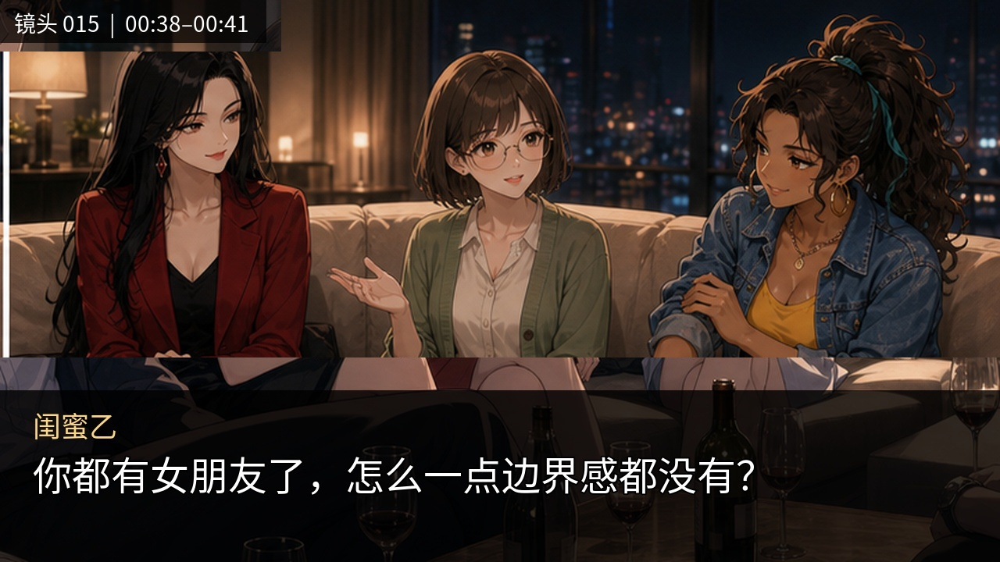](jpg/shot_015.jpg)
- **角色参考：**[柳如烟](../liuruyan.jpg)；[伊藤诚](../version1/screenplay/character_portraits/yitengcheng_user_reference.jpg)；[季伯达](../jiboda.jpg)；[闺蜜甲](../version1/screenplay/character_portraits/guimi1_v1.jpg)；[闺蜜乙](../version1/screenplay/character_portraits/guimi2_v1.jpg)；[闺蜜丙](../version1/screenplay/character_portraits/guimi3_v1.jpg)；[角色总参考表](references/character-reference-sheet.jpg)
- **场景/连续性参考：**[KTV continuity sheet](references/ktv-continuity-sheet.jpg)（当前素材中没有独立的 KTV 空景参考；此连续性表是可用场景依据，不以其他地点图片替代。）
- **闺蜜乙：**你都有女朋友了，怎么一点边界感都没有？
- **目的/景别：**Advance the dialogue beat while preserving the existing social geography and escalating the double-standard argument without adding story events. Medium three-shot of the girlfriends, favoring 闺蜜乙 at center.
- **可见角色与精确调度：**Visible: 闺蜜甲 on sofa left, 闺蜜乙 center, 闺蜜丙 right. They remain seated behind the coffee table, shoulders angled toward 季伯达 off-camera/right; no seat swaps.
- **场景/灯光：**Modern high-rise KTV/lounge at night: warm amber practical lamps and ceiling light, cool blue city windows, dark curtains, neutral sofa, low dark coffee table with bottles and glasses. Preserve source-JPG object placement and warm/cool contrast; do not invent a new location.
- **表演/神态/动作：**闺蜜乙 sits upright and stresses “边界感”; 闺蜜甲 nods once; 闺蜜丙 shows agreement.
- **摄影机：**Slow 3% push toward 闺蜜乙.
- **Seedance I2V prompt (EN)：**Animate the supplied storyboard JPG as a restrained cinematic 2D anime dialogue shot. Medium three-shot of the girlfriends, favoring 闺蜜乙 at center. Visible: 闺蜜甲 on sofa left, 闺蜜乙 center, 闺蜜丙 right. They remain seated behind the coffee table, shoulders angled toward 季伯达 off-camera/right; no seat swaps. Modern high-rise KTV/lounge at night: warm amber practical lamps and ceiling light, cool blue city windows, dark curtains, neutral sofa, low dark coffee table with bottles and glasses. Preserve source-JPG object placement and warm/cool contrast; do not invent a new location. Performance: 闺蜜乙 sits upright and stresses “边界感”; 闺蜜甲 nods once; 闺蜜丙 shows agreement. Camera: Slow 3% push toward 闺蜜乙. Preserve the exact source composition, character designs, wardrobe, seating, props, and night lighting. Natural breathing, blinks, subtle hair and fabric response only; coherent facial animation and stable hands. No rendered words in the generated video. Spoken Mandarin dialogue, exact wording: “你都有女朋友了，怎么一点边界感都没有？” Perform natural, restrained lip sync precisely to this line. The spoken wording must not be paraphrased, shortened, expanded, or replaced. Do not render the dialogue as on-screen text; add exact subtitles only in post-production. Timed dialogue and character action plan: 0.0–0.4s: hold the established composition; 闺蜜乙 takes a subtle breath and acquires the established eyeline while listeners remain attentive. 0.4–2.7s: 闺蜜乙 speaks the exact Mandarin line “你都有女朋友了，怎么一点边界感都没有？” once, with natural restrained lip sync and the shot-specific performance: 闺蜜乙 sits upright and stresses “边界感”; 闺蜜甲 nods once; 闺蜜丙 shows agreement. 2.7–3.0s: the speaker closes the mouth and resolves the gesture; listeners give only the restrained reaction described by the shot, then everyone holds their positions for the cut. Do not overlap, repeat, paraphrase, shorten, or extend the line. Supporting motion detail: {'start_sec': 0, 'end_sec': 1, 'beat': '闺蜜乙 acquires the established eyeline, inhales subtly, and begins the exact Mandarin line; 闺蜜乙 sits upright and stresses “边界感”; 闺蜜甲 nods once; 闺蜜丙 shows agreement.'} {'start_sec': 1, 'end_sec': 2, 'beat': '闺蜜乙 continues the line with coherent restrained lip sync; the primary expression/gesture develops without changing seat or props.'} {'start_sec': 2, 'end_sec': 3, 'beat': '闺蜜乙 completes the exact line and final shot-specific gesture; listeners register a restrained reaction, then hold for the cut.'}
- **Negative prompt / constraints：**No new characters, no identity/wardrobe changes, no seat swaps, no duplicated or missing limbs, no warped hands/faces, no lip-sync gibberish, no sudden standing, walking, touching, drinking spill, prop teleportation, background morphing, camera shake, zoom pumping, cuts, transitions, added text, captions, logos, watermarks, or UI.
- **逐秒运动节拍：**0–1s 闺蜜乙 acquires the established eyeline, inhales subtly, and begins the exact Mandarin line; 闺蜜乙 sits upright and stresses “边界感”; 闺蜜甲 nods once; 闺蜜丙 shows agreement.；1–2s 闺蜜乙 continues the line with coherent restrained lip sync; the primary expression/gesture develops without changing seat or props.；2–3s 闺蜜乙 completes the exact line and final shot-specific gesture; listeners register a restrained reaction, then hold for the cut.
- **对白与角色动作时间轴：**0.0–0.4s: hold the established composition; 闺蜜乙 takes a subtle breath and acquires the established eyeline while listeners remain attentive. 0.4–2.7s: 闺蜜乙 speaks the exact Mandarin line “你都有女朋友了，怎么一点边界感都没有？” once, with natural restrained lip sync and the shot-specific performance: 闺蜜乙 sits upright and stresses “边界感”; 闺蜜甲 nods once; 闺蜜丙 shows agreement. 2.7–3.0s: the speaker closes the mouth and resolves the gesture; listeners give only the restrained reaction described by the shot, then everyone holds their positions for the cut. Do not overlap, repeat, paraphrase, shorten, or extend the line. Supporting motion detail: {'start_sec': 0, 'end_sec': 1, 'beat': '闺蜜乙 acquires the established eyeline, inhales subtly, and begins the exact Mandarin line; 闺蜜乙 sits upright and stresses “边界感”; 闺蜜甲 nods once; 闺蜜丙 shows agreement.'} {'start_sec': 1, 'end_sec': 2, 'beat': '闺蜜乙 continues the line with coherent restrained lip sync; the primary expression/gesture develops without changing seat or props.'} {'start_sec': 2, 'end_sec': 3, 'beat': '闺蜜乙 completes the exact line and final shot-specific gesture; listeners register a restrained reaction, then hold for the cut.'}
- **连续性锁定：**Use this shot’s JPG as the first-frame identity/composition reference.；Lock character faces, hair, wardrobe, body proportions, seating side, eyelines, table/bottle/glass positions, city-night background, and warm/cool lighting to the source JPG and adjacent shots.；Do not animate storyboard labels or subtitles: remove/crop/clean all labels and caption bands before image-to-video; composite exact Chinese dialogue or final card afterward in editing.
- **声音/对白指导：**Use clean Mandarin dialogue by 闺蜜乙; preserve the exact line and natural phrasing. Keep KTV room tone low, avoid music masking consonants, and use post-recorded dialogue/lip sync rather than generated text.
- **推荐生成设置：**motion `low-medium`；`16:9`；`24 fps`；`1080p`；生成 `3s`，精确裁切为 `3s`；首帧使用去除全部文字/字幕后的对应 JPG。

## 镜头 016｜00:41–00:44
- **文件：**`jpg/shot_016.jpg`
- **Staging/start image：**[Staging start image](jpg/shot_016.jpg)  
  [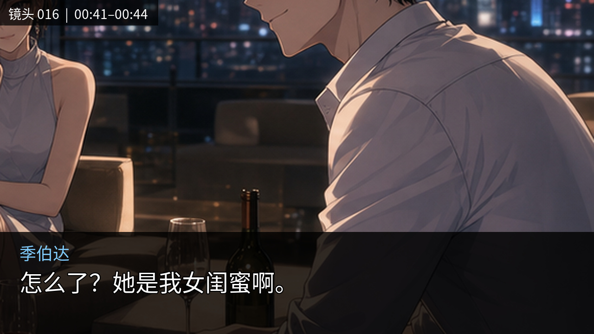](jpg/shot_016.jpg)
- **角色参考：**[柳如烟](../liuruyan.jpg)；[伊藤诚](../version1/screenplay/character_portraits/yitengcheng_user_reference.jpg)；[季伯达](../jiboda.jpg)；[闺蜜甲](../version1/screenplay/character_portraits/guimi1_v1.jpg)；[闺蜜乙](../version1/screenplay/character_portraits/guimi2_v1.jpg)；[闺蜜丙](../version1/screenplay/character_portraits/guimi3_v1.jpg)；[角色总参考表](references/character-reference-sheet.jpg)
- **场景/连续性参考：**[KTV continuity sheet](references/ktv-continuity-sheet.jpg)（当前素材中没有独立的 KTV 空景参考；此连续性表是可用场景依据，不以其他地点图片替代。）
- **季伯达：**怎么了？她是我女闺蜜啊。
- **目的/景别：**Advance the dialogue beat while preserving the existing social geography and escalating the double-standard argument without adding story events. Matching medium close-up on 季伯达 at right foreground.
- **可见角色与精确调度：**Visible: 季伯达 occupies the right foreground in a white shirt, torso turned left toward 柳如烟/伊藤诚 and the opposite sofa; a seated friend may remain soft behind him. He remains seated and does not change sides.
- **场景/灯光：**Modern high-rise KTV/lounge at night: warm amber practical lamps and ceiling light, cool blue city windows, dark curtains, neutral sofa, low dark coffee table with bottles and glasses. Preserve source-JPG object placement and warm/cool contrast; do not invent a new location.
- **表演/神态/动作：**季伯达 gives a mild shrug and repeats their premise without losing composure.
- **摄影机：**Near-locked shot, tiny 2% pull-back after the shrug.
- **Seedance I2V prompt (EN)：**Animate the supplied storyboard JPG as a restrained cinematic 2D anime dialogue shot. Matching medium close-up on 季伯达 at right foreground. Visible: 季伯达 occupies the right foreground in a white shirt, torso turned left toward 柳如烟/伊藤诚 and the opposite sofa; a seated friend may remain soft behind him. He remains seated and does not change sides. Modern high-rise KTV/lounge at night: warm amber practical lamps and ceiling light, cool blue city windows, dark curtains, neutral sofa, low dark coffee table with bottles and glasses. Preserve source-JPG object placement and warm/cool contrast; do not invent a new location. Performance: 季伯达 gives a mild shrug and repeats their premise without losing composure. Camera: Near-locked shot, tiny 2% pull-back after the shrug. Preserve the exact source composition, character designs, wardrobe, seating, props, and night lighting. Natural breathing, blinks, subtle hair and fabric response only; coherent facial animation and stable hands. No rendered words in the generated video. Spoken Mandarin dialogue, exact wording: “怎么了？她是我女闺蜜啊。” Perform natural, restrained lip sync precisely to this line. The spoken wording must not be paraphrased, shortened, expanded, or replaced. Do not render the dialogue as on-screen text; add exact subtitles only in post-production. Timed dialogue and character action plan: 0.0–0.4s: hold the established composition; 季伯达 takes a subtle breath and acquires the established eyeline while listeners remain attentive. 0.4–2.7s: 季伯达 speaks the exact Mandarin line “怎么了？她是我女闺蜜啊。” once, with natural restrained lip sync and the shot-specific performance: 季伯达 gives a mild shrug and repeats their premise without losing composure. 2.7–3.0s: the speaker closes the mouth and resolves the gesture; listeners give only the restrained reaction described by the shot, then everyone holds their positions for the cut. Do not overlap, repeat, paraphrase, shorten, or extend the line. Supporting motion detail: {'start_sec': 0, 'end_sec': 1, 'beat': '季伯达 acquires the established eyeline, inhales subtly, and begins the exact Mandarin line; 季伯达 gives a mild shrug and repeats their premise without losing composure.'} {'start_sec': 1, 'end_sec': 2, 'beat': '季伯达 continues the line with coherent restrained lip sync; the primary expression/gesture develops without changing seat or props.'} {'start_sec': 2, 'end_sec': 3, 'beat': '季伯达 completes the exact line and final shot-specific gesture; listeners register a restrained reaction, then hold for the cut.'}
- **Negative prompt / constraints：**No new characters, no identity/wardrobe changes, no seat swaps, no duplicated or missing limbs, no warped hands/faces, no lip-sync gibberish, no sudden standing, walking, touching, drinking spill, prop teleportation, background morphing, camera shake, zoom pumping, cuts, transitions, added text, captions, logos, watermarks, or UI.
- **逐秒运动节拍：**0–1s 季伯达 acquires the established eyeline, inhales subtly, and begins the exact Mandarin line; 季伯达 gives a mild shrug and repeats their premise without losing composure.；1–2s 季伯达 continues the line with coherent restrained lip sync; the primary expression/gesture develops without changing seat or props.；2–3s 季伯达 completes the exact line and final shot-specific gesture; listeners register a restrained reaction, then hold for the cut.
- **对白与角色动作时间轴：**0.0–0.4s: hold the established composition; 季伯达 takes a subtle breath and acquires the established eyeline while listeners remain attentive. 0.4–2.7s: 季伯达 speaks the exact Mandarin line “怎么了？她是我女闺蜜啊。” once, with natural restrained lip sync and the shot-specific performance: 季伯达 gives a mild shrug and repeats their premise without losing composure. 2.7–3.0s: the speaker closes the mouth and resolves the gesture; listeners give only the restrained reaction described by the shot, then everyone holds their positions for the cut. Do not overlap, repeat, paraphrase, shorten, or extend the line. Supporting motion detail: {'start_sec': 0, 'end_sec': 1, 'beat': '季伯达 acquires the established eyeline, inhales subtly, and begins the exact Mandarin line; 季伯达 gives a mild shrug and repeats their premise without losing composure.'} {'start_sec': 1, 'end_sec': 2, 'beat': '季伯达 continues the line with coherent restrained lip sync; the primary expression/gesture develops without changing seat or props.'} {'start_sec': 2, 'end_sec': 3, 'beat': '季伯达 completes the exact line and final shot-specific gesture; listeners register a restrained reaction, then hold for the cut.'}
- **连续性锁定：**Use this shot’s JPG as the first-frame identity/composition reference.；Lock character faces, hair, wardrobe, body proportions, seating side, eyelines, table/bottle/glass positions, city-night background, and warm/cool lighting to the source JPG and adjacent shots.；Do not animate storyboard labels or subtitles: remove/crop/clean all labels and caption bands before image-to-video; composite exact Chinese dialogue or final card afterward in editing.
- **声音/对白指导：**Use clean Mandarin dialogue by 季伯达; preserve the exact line and natural phrasing. Keep KTV room tone low, avoid music masking consonants, and use post-recorded dialogue/lip sync rather than generated text.
- **推荐生成设置：**motion `low-medium`；`16:9`；`24 fps`；`1080p`；生成 `3s`，精确裁切为 `3s`；首帧使用去除全部文字/字幕后的对应 JPG。

## 镜头 017｜00:44–00:47
- **文件：**`jpg/shot_017.jpg`
- **Staging/start image：**[Staging start image](jpg/shot_017.jpg)  
  [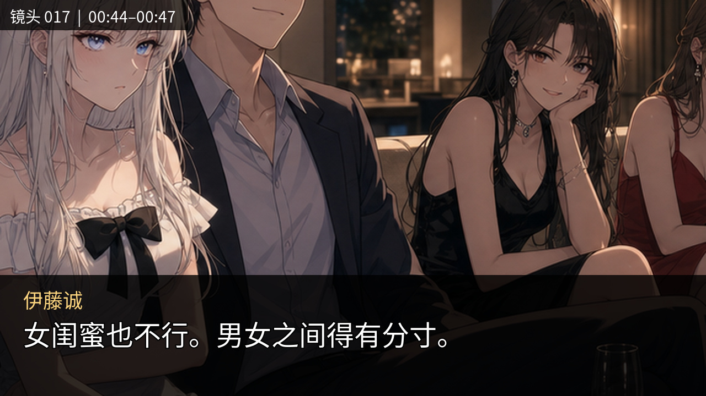](jpg/shot_017.jpg)
- **角色参考：**[柳如烟](../liuruyan.jpg)；[伊藤诚](../version1/screenplay/character_portraits/yitengcheng_user_reference.jpg)；[季伯达](../jiboda.jpg)；[闺蜜甲](../version1/screenplay/character_portraits/guimi1_v1.jpg)；[闺蜜乙](../version1/screenplay/character_portraits/guimi2_v1.jpg)；[闺蜜丙](../version1/screenplay/character_portraits/guimi3_v1.jpg)；[角色总参考表](references/character-reference-sheet.jpg)
- **场景/连续性参考：**[KTV continuity sheet](references/ktv-continuity-sheet.jpg)（当前素材中没有独立的 KTV 空景参考；此连续性表是可用场景依据，不以其他地点图片替代。）
- **伊藤诚：**女闺蜜也不行。男女之间得有分寸。
- **目的/景别：**Advance the dialogue beat while preserving the existing social geography and escalating the double-standard argument without adding story events. Tight two-shot favoring 伊藤诚 beside 柳如烟.
- **可见角色与精确调度：**Visible: 伊藤诚 seated immediately right of 柳如烟; 柳如烟 remains at frame left and a sofa friend may appear behind. Preserve their close seated spacing without adding contact.
- **场景/灯光：**Modern high-rise KTV/lounge at night: warm amber practical lamps and ceiling light, cool blue city windows, dark curtains, neutral sofa, low dark coffee table with bottles and glasses. Preserve source-JPG object placement and warm/cool contrast; do not invent a new location.
- **表演/神态/动作：**伊藤诚 turns serious, gives a small head shake, and lectures about boundaries; 柳如烟 watches.
- **摄影机：**Slow 2% push-in toward 伊藤诚.
- **Seedance I2V prompt (EN)：**Animate the supplied storyboard JPG as a restrained cinematic 2D anime dialogue shot. Tight two-shot favoring 伊藤诚 beside 柳如烟. Visible: 伊藤诚 seated immediately right of 柳如烟; 柳如烟 remains at frame left and a sofa friend may appear behind. Preserve their close seated spacing without adding contact. Modern high-rise KTV/lounge at night: warm amber practical lamps and ceiling light, cool blue city windows, dark curtains, neutral sofa, low dark coffee table with bottles and glasses. Preserve source-JPG object placement and warm/cool contrast; do not invent a new location. Performance: 伊藤诚 turns serious, gives a small head shake, and lectures about boundaries; 柳如烟 watches. Camera: Slow 2% push-in toward 伊藤诚. Preserve the exact source composition, character designs, wardrobe, seating, props, and night lighting. Natural breathing, blinks, subtle hair and fabric response only; coherent facial animation and stable hands. No rendered words in the generated video. Spoken Mandarin dialogue, exact wording: “女闺蜜也不行。男女之间得有分寸。” Perform natural, restrained lip sync precisely to this line. The spoken wording must not be paraphrased, shortened, expanded, or replaced. Do not render the dialogue as on-screen text; add exact subtitles only in post-production. Timed dialogue and character action plan: 0.0–0.4s: hold the established composition; 伊藤诚 takes a subtle breath and acquires the established eyeline while listeners remain attentive. 0.4–2.7s: 伊藤诚 speaks the exact Mandarin line “女闺蜜也不行。男女之间得有分寸。” once, with natural restrained lip sync and the shot-specific performance: 伊藤诚 turns serious, gives a small head shake, and lectures about boundaries; 柳如烟 watches. 2.7–3.0s: the speaker closes the mouth and resolves the gesture; listeners give only the restrained reaction described by the shot, then everyone holds their positions for the cut. Do not overlap, repeat, paraphrase, shorten, or extend the line. Supporting motion detail: {'start_sec': 0, 'end_sec': 1, 'beat': '伊藤诚 acquires the established eyeline, inhales subtly, and begins the exact Mandarin line; 伊藤诚 turns serious, gives a small head shake, and lectures about boundaries; 柳如烟 watches.'} {'start_sec': 1, 'end_sec': 2, 'beat': '伊藤诚 continues the line with coherent restrained lip sync; the primary expression/gesture develops without changing seat or props.'} {'start_sec': 2, 'end_sec': 3, 'beat': '伊藤诚 completes the exact line and final shot-specific gesture; listeners register a restrained reaction, then hold for the cut.'}
- **Negative prompt / constraints：**No new characters, no identity/wardrobe changes, no seat swaps, no duplicated or missing limbs, no warped hands/faces, no lip-sync gibberish, no sudden standing, walking, touching, drinking spill, prop teleportation, background morphing, camera shake, zoom pumping, cuts, transitions, added text, captions, logos, watermarks, or UI.
- **逐秒运动节拍：**0–1s 伊藤诚 acquires the established eyeline, inhales subtly, and begins the exact Mandarin line; 伊藤诚 turns serious, gives a small head shake, and lectures about boundaries; 柳如烟 watches.；1–2s 伊藤诚 continues the line with coherent restrained lip sync; the primary expression/gesture develops without changing seat or props.；2–3s 伊藤诚 completes the exact line and final shot-specific gesture; listeners register a restrained reaction, then hold for the cut.
- **对白与角色动作时间轴：**0.0–0.4s: hold the established composition; 伊藤诚 takes a subtle breath and acquires the established eyeline while listeners remain attentive. 0.4–2.7s: 伊藤诚 speaks the exact Mandarin line “女闺蜜也不行。男女之间得有分寸。” once, with natural restrained lip sync and the shot-specific performance: 伊藤诚 turns serious, gives a small head shake, and lectures about boundaries; 柳如烟 watches. 2.7–3.0s: the speaker closes the mouth and resolves the gesture; listeners give only the restrained reaction described by the shot, then everyone holds their positions for the cut. Do not overlap, repeat, paraphrase, shorten, or extend the line. Supporting motion detail: {'start_sec': 0, 'end_sec': 1, 'beat': '伊藤诚 acquires the established eyeline, inhales subtly, and begins the exact Mandarin line; 伊藤诚 turns serious, gives a small head shake, and lectures about boundaries; 柳如烟 watches.'} {'start_sec': 1, 'end_sec': 2, 'beat': '伊藤诚 continues the line with coherent restrained lip sync; the primary expression/gesture develops without changing seat or props.'} {'start_sec': 2, 'end_sec': 3, 'beat': '伊藤诚 completes the exact line and final shot-specific gesture; listeners register a restrained reaction, then hold for the cut.'}
- **连续性锁定：**Use this shot’s JPG as the first-frame identity/composition reference.；Lock character faces, hair, wardrobe, body proportions, seating side, eyelines, table/bottle/glass positions, city-night background, and warm/cool lighting to the source JPG and adjacent shots.；Do not animate storyboard labels or subtitles: remove/crop/clean all labels and caption bands before image-to-video; composite exact Chinese dialogue or final card afterward in editing.
- **声音/对白指导：**Use clean Mandarin dialogue by 伊藤诚; preserve the exact line and natural phrasing. Keep KTV room tone low, avoid music masking consonants, and use post-recorded dialogue/lip sync rather than generated text.
- **推荐生成设置：**motion `low-medium`；`16:9`；`24 fps`；`1080p`；生成 `3s`，精确裁切为 `3s`；首帧使用去除全部文字/字幕后的对应 JPG。

## 镜头 018｜00:47–00:53
- **文件：**`jpg/shot_018.jpg`
- **Staging/start image：**[Staging start image](jpg/shot_018.jpg)  
  [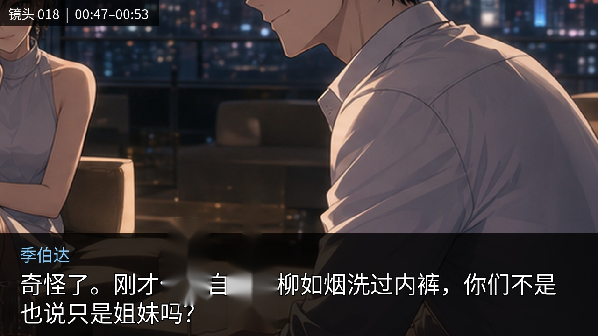](jpg/shot_018.jpg)
- **角色参考：**[柳如烟](../liuruyan.jpg)；[伊藤诚](../version1/screenplay/character_portraits/yitengcheng_user_reference.jpg)；[季伯达](../jiboda.jpg)；[闺蜜甲](../version1/screenplay/character_portraits/guimi1_v1.jpg)；[闺蜜乙](../version1/screenplay/character_portraits/guimi2_v1.jpg)；[闺蜜丙](../version1/screenplay/character_portraits/guimi3_v1.jpg)；[角色总参考表](references/character-reference-sheet.jpg)
- **场景/连续性参考：**[KTV continuity sheet](references/ktv-continuity-sheet.jpg)（当前素材中没有独立的 KTV 空景参考；此连续性表是可用场景依据，不以其他地点图片替代。）
- **季伯达：**奇怪了。刚才你说自己替柳如烟洗过内裤，你们不是也说只是姐妹吗？
- **目的/景别：**Advance the dialogue beat while preserving the existing social geography and escalating the double-standard argument without adding story events. Medium close-up on 季伯达, same right-side axis.
- **可见角色与精确调度：**Visible: 季伯达 occupies the right foreground in a white shirt, torso turned left toward 柳如烟/伊藤诚 and the opposite sofa; a seated friend may remain soft behind him. He remains seated and does not change sides.
- **场景/灯光：**Modern high-rise KTV/lounge at night: warm amber practical lamps and ceiling light, cool blue city windows, dark curtains, neutral sofa, low dark coffee table with bottles and glasses. Preserve source-JPG object placement and warm/cool contrast; do not invent a new location.
- **表演/神态/动作：**季伯达 calmly reconstructs the contradiction, gaze moving from 伊藤诚 to the group; gestures stay economical.
- **摄影机：**Sustained 4% push-in over the full line.
- **Seedance I2V prompt (EN)：**Animate the supplied storyboard JPG as a restrained cinematic 2D anime dialogue shot. Medium close-up on 季伯达, same right-side axis. Visible: 季伯达 occupies the right foreground in a white shirt, torso turned left toward 柳如烟/伊藤诚 and the opposite sofa; a seated friend may remain soft behind him. He remains seated and does not change sides. Modern high-rise KTV/lounge at night: warm amber practical lamps and ceiling light, cool blue city windows, dark curtains, neutral sofa, low dark coffee table with bottles and glasses. Preserve source-JPG object placement and warm/cool contrast; do not invent a new location. Performance: 季伯达 calmly reconstructs the contradiction, gaze moving from 伊藤诚 to the group; gestures stay economical. Camera: Sustained 4% push-in over the full line. Preserve the exact source composition, character designs, wardrobe, seating, props, and night lighting. Natural breathing, blinks, subtle hair and fabric response only; coherent facial animation and stable hands. No rendered words in the generated video. Spoken Mandarin dialogue, exact wording: “奇怪了。刚才你说自己替柳如烟洗过内裤，你们不是也说只是姐妹吗？” Perform natural, restrained lip sync precisely to this line. The spoken wording must not be paraphrased, shortened, expanded, or replaced. Do not render the dialogue as on-screen text; add exact subtitles only in post-production. Timed dialogue and character action plan: 0.0–0.5s: hold the established composition; 季伯达 takes a subtle breath and acquires the established eyeline while listeners remain attentive. 0.5–5.6s: 季伯达 speaks the exact Mandarin line “奇怪了。刚才你说自己替柳如烟洗过内裤，你们不是也说只是姐妹吗？” once, with natural restrained lip sync and the shot-specific performance: 季伯达 calmly reconstructs the contradiction, gaze moving from 伊藤诚 to the group; gestures stay economical. 5.6–6.0s: the speaker closes the mouth and resolves the gesture; listeners give only the restrained reaction described by the shot, then everyone holds their positions for the cut. Do not overlap, repeat, paraphrase, shorten, or extend the line. Supporting motion detail: {'start_sec': 0, 'end_sec': 1, 'beat': '季伯达 acquires the established eyeline, inhales subtly, and begins the exact Mandarin line; 季伯达 calmly reconstructs the contradiction, gaze moving from 伊藤诚 to the group; gestures stay economical.'} {'start_sec': 1, 'end_sec': 2, 'beat': '季伯达 continues the line with coherent restrained lip sync; the primary expression/gesture develops without changing seat or props.'} {'start_sec': 2, 'end_sec': 3, 'beat': '季伯达 sustains the next phrase at natural pace; gesture resolves incrementally while listeners respond only with blinks, breath, and micro-expressions.'} {'start_sec': 3, 'end_sec': 4, 'beat': '季伯达 sustains the next phrase at natural pace; gesture resolves incrementally while listeners respond only with blinks, breath, and micro-expressions.'} {'start_sec': 4, 'end_sec': 5, 'beat': '季伯达 sustains the next phrase at natural pace; gesture resolves incrementally while listeners respond only with blinks, breath, and micro-expressions.'} {'start_sec': 5, 'end_sec': 6, 'beat': '季伯达 completes the exact line and final shot-specific gesture; listeners register a restrained reaction, then hold for the cut.'}
- **Negative prompt / constraints：**No new characters, no identity/wardrobe changes, no seat swaps, no duplicated or missing limbs, no warped hands/faces, no lip-sync gibberish, no sudden standing, walking, touching, drinking spill, prop teleportation, background morphing, camera shake, zoom pumping, cuts, transitions, added text, captions, logos, watermarks, or UI.
- **逐秒运动节拍：**0–1s 季伯达 acquires the established eyeline, inhales subtly, and begins the exact Mandarin line; 季伯达 calmly reconstructs the contradiction, gaze moving from 伊藤诚 to the group; gestures stay economical.；1–2s 季伯达 continues the line with coherent restrained lip sync; the primary expression/gesture develops without changing seat or props.；2–3s 季伯达 sustains the next phrase at natural pace; gesture resolves incrementally while listeners respond only with blinks, breath, and micro-expressions.；3–4s 季伯达 sustains the next phrase at natural pace; gesture resolves incrementally while listeners respond only with blinks, breath, and micro-expressions.；4–5s 季伯达 sustains the next phrase at natural pace; gesture resolves incrementally while listeners respond only with blinks, breath, and micro-expressions.；5–6s 季伯达 completes the exact line and final shot-specific gesture; listeners register a restrained reaction, then hold for the cut.
- **对白与角色动作时间轴：**0.0–0.5s: hold the established composition; 季伯达 takes a subtle breath and acquires the established eyeline while listeners remain attentive. 0.5–5.6s: 季伯达 speaks the exact Mandarin line “奇怪了。刚才你说自己替柳如烟洗过内裤，你们不是也说只是姐妹吗？” once, with natural restrained lip sync and the shot-specific performance: 季伯达 calmly reconstructs the contradiction, gaze moving from 伊藤诚 to the group; gestures stay economical. 5.6–6.0s: the speaker closes the mouth and resolves the gesture; listeners give only the restrained reaction described by the shot, then everyone holds their positions for the cut. Do not overlap, repeat, paraphrase, shorten, or extend the line. Supporting motion detail: {'start_sec': 0, 'end_sec': 1, 'beat': '季伯达 acquires the established eyeline, inhales subtly, and begins the exact Mandarin line; 季伯达 calmly reconstructs the contradiction, gaze moving from 伊藤诚 to the group; gestures stay economical.'} {'start_sec': 1, 'end_sec': 2, 'beat': '季伯达 continues the line with coherent restrained lip sync; the primary expression/gesture develops without changing seat or props.'} {'start_sec': 2, 'end_sec': 3, 'beat': '季伯达 sustains the next phrase at natural pace; gesture resolves incrementally while listeners respond only with blinks, breath, and micro-expressions.'} {'start_sec': 3, 'end_sec': 4, 'beat': '季伯达 sustains the next phrase at natural pace; gesture resolves incrementally while listeners respond only with blinks, breath, and micro-expressions.'} {'start_sec': 4, 'end_sec': 5, 'beat': '季伯达 sustains the next phrase at natural pace; gesture resolves incrementally while listeners respond only with blinks, breath, and micro-expressions.'} {'start_sec': 5, 'end_sec': 6, 'beat': '季伯达 completes the exact line and final shot-specific gesture; listeners register a restrained reaction, then hold for the cut.'}
- **连续性锁定：**Use this shot’s JPG as the first-frame identity/composition reference.；Lock character faces, hair, wardrobe, body proportions, seating side, eyelines, table/bottle/glass positions, city-night background, and warm/cool lighting to the source JPG and adjacent shots.；Do not animate storyboard labels or subtitles: remove/crop/clean all labels and caption bands before image-to-video; composite exact Chinese dialogue or final card afterward in editing.
- **声音/对白指导：**Use clean Mandarin dialogue by 季伯达; preserve the exact line and natural phrasing. Keep KTV room tone low, avoid music masking consonants, and use post-recorded dialogue/lip sync rather than generated text.
- **推荐生成设置：**motion `low-medium`；`16:9`；`24 fps`；`1080p`；生成 `6s`，精确裁切为 `6s`；首帧使用去除全部文字/字幕后的对应 JPG。

## 镜头 019｜00:53–00:55
- **文件：**`jpg/shot_019.jpg`
- **Staging/start image：**[Staging start image](jpg/shot_019.jpg)  
  [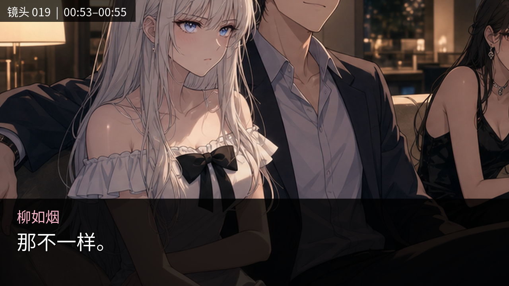](jpg/shot_019.jpg)
- **角色参考：**[柳如烟](../liuruyan.jpg)；[伊藤诚](../version1/screenplay/character_portraits/yitengcheng_user_reference.jpg)；[季伯达](../jiboda.jpg)；[闺蜜甲](../version1/screenplay/character_portraits/guimi1_v1.jpg)；[闺蜜乙](../version1/screenplay/character_portraits/guimi2_v1.jpg)；[闺蜜丙](../version1/screenplay/character_portraits/guimi3_v1.jpg)；[角色总参考表](references/character-reference-sheet.jpg)
- **场景/连续性参考：**[KTV continuity sheet](references/ktv-continuity-sheet.jpg)（当前素材中没有独立的 KTV 空景参考；此连续性表是可用场景依据，不以其他地点图片替代。）
- **柳如烟：**那不一样。
- **目的/景别：**Advance the dialogue beat while preserving the existing social geography and escalating the double-standard argument without adding story events. Tight reaction close-up on 柳如烟.
- **可见角色与精确调度：**Visible: 柳如烟 seated at frame left with 伊藤诚 immediately to her right; one or more sofa friends may remain soft in the background exactly as in the source JPG. 柳如烟 does not stand or cross the room.
- **场景/灯光：**Modern high-rise KTV/lounge at night: warm amber practical lamps and ceiling light, cool blue city windows, dark curtains, neutral sofa, low dark coffee table with bottles and glasses. Preserve source-JPG object placement and warm/cool contrast; do not invent a new location.
- **表演/神态/动作：**柳如烟 answers defensively, lips tightening and eyes briefly averting.
- **摄影机：**Near-locked shot with a 2% push-in.
- **Seedance I2V prompt (EN)：**Animate the supplied storyboard JPG as a restrained cinematic 2D anime dialogue shot. Tight reaction close-up on 柳如烟. Visible: 柳如烟 seated at frame left with 伊藤诚 immediately to her right; one or more sofa friends may remain soft in the background exactly as in the source JPG. 柳如烟 does not stand or cross the room. Modern high-rise KTV/lounge at night: warm amber practical lamps and ceiling light, cool blue city windows, dark curtains, neutral sofa, low dark coffee table with bottles and glasses. Preserve source-JPG object placement and warm/cool contrast; do not invent a new location. Performance: 柳如烟 answers defensively, lips tightening and eyes briefly averting. Camera: Near-locked shot with a 2% push-in. Preserve the exact source composition, character designs, wardrobe, seating, props, and night lighting. Natural breathing, blinks, subtle hair and fabric response only; coherent facial animation and stable hands. No rendered words in the generated video. Spoken Mandarin dialogue, exact wording: “那不一样。” Perform natural, restrained lip sync precisely to this line. The spoken wording must not be paraphrased, shortened, expanded, or replaced. Do not render the dialogue as on-screen text; add exact subtitles only in post-production. Timed dialogue and character action plan: 0.0–0.2s: hold the established composition; 柳如烟 takes a subtle breath and acquires the established eyeline while listeners remain attentive. 0.2–1.8s: 柳如烟 speaks the exact Mandarin line “那不一样。” once, with natural restrained lip sync and the shot-specific performance: 柳如烟 answers defensively, lips tightening and eyes briefly averting. 1.8–2.0s: the speaker closes the mouth and resolves the gesture; listeners give only the restrained reaction described by the shot, then everyone holds their positions for the cut. Do not overlap, repeat, paraphrase, shorten, or extend the line. Supporting motion detail: {'start_sec': 0, 'end_sec': 1, 'beat': '柳如烟 acquires the established eyeline, inhales subtly, and begins the exact Mandarin line; 柳如烟 answers defensively, lips tightening and eyes briefly averting.'} {'start_sec': 1, 'end_sec': 2, 'beat': '柳如烟 completes the exact line and final shot-specific gesture; listeners register a restrained reaction, then hold for the cut.'}
- **Negative prompt / constraints：**No new characters, no identity/wardrobe changes, no seat swaps, no duplicated or missing limbs, no warped hands/faces, no lip-sync gibberish, no sudden standing, walking, touching, drinking spill, prop teleportation, background morphing, camera shake, zoom pumping, cuts, transitions, added text, captions, logos, watermarks, or UI.
- **逐秒运动节拍：**0–1s 柳如烟 acquires the established eyeline, inhales subtly, and begins the exact Mandarin line; 柳如烟 answers defensively, lips tightening and eyes briefly averting.；1–2s 柳如烟 completes the exact line and final shot-specific gesture; listeners register a restrained reaction, then hold for the cut.
- **对白与角色动作时间轴：**0.0–0.2s: hold the established composition; 柳如烟 takes a subtle breath and acquires the established eyeline while listeners remain attentive. 0.2–1.8s: 柳如烟 speaks the exact Mandarin line “那不一样。” once, with natural restrained lip sync and the shot-specific performance: 柳如烟 answers defensively, lips tightening and eyes briefly averting. 1.8–2.0s: the speaker closes the mouth and resolves the gesture; listeners give only the restrained reaction described by the shot, then everyone holds their positions for the cut. Do not overlap, repeat, paraphrase, shorten, or extend the line. Supporting motion detail: {'start_sec': 0, 'end_sec': 1, 'beat': '柳如烟 acquires the established eyeline, inhales subtly, and begins the exact Mandarin line; 柳如烟 answers defensively, lips tightening and eyes briefly averting.'} {'start_sec': 1, 'end_sec': 2, 'beat': '柳如烟 completes the exact line and final shot-specific gesture; listeners register a restrained reaction, then hold for the cut.'}
- **连续性锁定：**Use this shot’s JPG as the first-frame identity/composition reference.；Lock character faces, hair, wardrobe, body proportions, seating side, eyelines, table/bottle/glass positions, city-night background, and warm/cool lighting to the source JPG and adjacent shots.；Do not animate storyboard labels or subtitles: remove/crop/clean all labels and caption bands before image-to-video; composite exact Chinese dialogue or final card afterward in editing.
- **声音/对白指导：**Use clean Mandarin dialogue by 柳如烟; preserve the exact line and natural phrasing. Keep KTV room tone low, avoid music masking consonants, and use post-recorded dialogue/lip sync rather than generated text.
- **推荐生成设置：**motion `low`；`16:9`；`24 fps`；`1080p`；生成 `2s`，精确裁切为 `2s`；首帧使用去除全部文字/字幕后的对应 JPG。

## 镜头 020｜00:55–00:57
- **文件：**`jpg/shot_020.jpg`
- **Staging/start image：**[Staging start image](jpg/shot_020.jpg)  
  [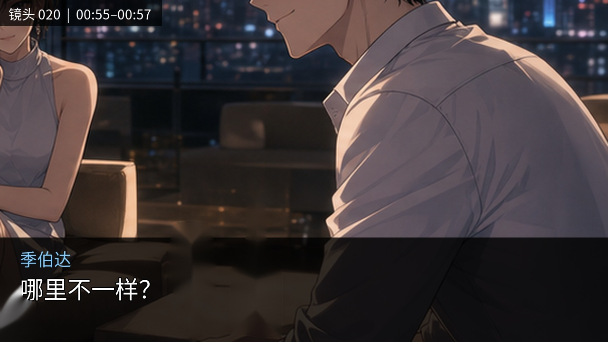](jpg/shot_020.jpg)
- **角色参考：**[柳如烟](../liuruyan.jpg)；[伊藤诚](../version1/screenplay/character_portraits/yitengcheng_user_reference.jpg)；[季伯达](../jiboda.jpg)；[闺蜜甲](../version1/screenplay/character_portraits/guimi1_v1.jpg)；[闺蜜乙](../version1/screenplay/character_portraits/guimi2_v1.jpg)；[闺蜜丙](../version1/screenplay/character_portraits/guimi3_v1.jpg)；[角色总参考表](references/character-reference-sheet.jpg)
- **场景/连续性参考：**[KTV continuity sheet](references/ktv-continuity-sheet.jpg)（当前素材中没有独立的 KTV 空景参考；此连续性表是可用场景依据，不以其他地点图片替代。）
- **季伯达：**哪里不一样？
- **目的/景别：**Advance the dialogue beat while preserving the existing social geography and escalating the double-standard argument without adding story events. Tight medium close-up on 季伯达.
- **可见角色与精确调度：**Visible: 季伯达 occupies the right foreground in a white shirt, torso turned left toward 柳如烟/伊藤诚 and the opposite sofa; a seated friend may remain soft behind him. He remains seated and does not change sides.
- **场景/灯光：**Modern high-rise KTV/lounge at night: warm amber practical lamps and ceiling light, cool blue city windows, dark curtains, neutral sofa, low dark coffee table with bottles and glasses. Preserve source-JPG object placement and warm/cool contrast; do not invent a new location.
- **表演/神态/动作：**季伯达 asks a clean follow-up, slight head tilt, then holds eye contact.
- **摄影机：**Tiny 2% push-in, then hold.
- **Seedance I2V prompt (EN)：**Animate the supplied storyboard JPG as a restrained cinematic 2D anime dialogue shot. Tight medium close-up on 季伯达. Visible: 季伯达 occupies the right foreground in a white shirt, torso turned left toward 柳如烟/伊藤诚 and the opposite sofa; a seated friend may remain soft behind him. He remains seated and does not change sides. Modern high-rise KTV/lounge at night: warm amber practical lamps and ceiling light, cool blue city windows, dark curtains, neutral sofa, low dark coffee table with bottles and glasses. Preserve source-JPG object placement and warm/cool contrast; do not invent a new location. Performance: 季伯达 asks a clean follow-up, slight head tilt, then holds eye contact. Camera: Tiny 2% push-in, then hold. Preserve the exact source composition, character designs, wardrobe, seating, props, and night lighting. Natural breathing, blinks, subtle hair and fabric response only; coherent facial animation and stable hands. No rendered words in the generated video. Spoken Mandarin dialogue, exact wording: “哪里不一样？” Perform natural, restrained lip sync precisely to this line. The spoken wording must not be paraphrased, shortened, expanded, or replaced. Do not render the dialogue as on-screen text; add exact subtitles only in post-production. Timed dialogue and character action plan: 0.0–0.2s: hold the established composition; 季伯达 takes a subtle breath and acquires the established eyeline while listeners remain attentive. 0.2–1.8s: 季伯达 speaks the exact Mandarin line “哪里不一样？” once, with natural restrained lip sync and the shot-specific performance: 季伯达 asks a clean follow-up, slight head tilt, then holds eye contact. 1.8–2.0s: the speaker closes the mouth and resolves the gesture; listeners give only the restrained reaction described by the shot, then everyone holds their positions for the cut. Do not overlap, repeat, paraphrase, shorten, or extend the line. Supporting motion detail: {'start_sec': 0, 'end_sec': 1, 'beat': '季伯达 acquires the established eyeline, inhales subtly, and begins the exact Mandarin line; 季伯达 asks a clean follow-up, slight head tilt, then holds eye contact.'} {'start_sec': 1, 'end_sec': 2, 'beat': '季伯达 completes the exact line and final shot-specific gesture; listeners register a restrained reaction, then hold for the cut.'}
- **Negative prompt / constraints：**No new characters, no identity/wardrobe changes, no seat swaps, no duplicated or missing limbs, no warped hands/faces, no lip-sync gibberish, no sudden standing, walking, touching, drinking spill, prop teleportation, background morphing, camera shake, zoom pumping, cuts, transitions, added text, captions, logos, watermarks, or UI.
- **逐秒运动节拍：**0–1s 季伯达 acquires the established eyeline, inhales subtly, and begins the exact Mandarin line; 季伯达 asks a clean follow-up, slight head tilt, then holds eye contact.；1–2s 季伯达 completes the exact line and final shot-specific gesture; listeners register a restrained reaction, then hold for the cut.
- **对白与角色动作时间轴：**0.0–0.2s: hold the established composition; 季伯达 takes a subtle breath and acquires the established eyeline while listeners remain attentive. 0.2–1.8s: 季伯达 speaks the exact Mandarin line “哪里不一样？” once, with natural restrained lip sync and the shot-specific performance: 季伯达 asks a clean follow-up, slight head tilt, then holds eye contact. 1.8–2.0s: the speaker closes the mouth and resolves the gesture; listeners give only the restrained reaction described by the shot, then everyone holds their positions for the cut. Do not overlap, repeat, paraphrase, shorten, or extend the line. Supporting motion detail: {'start_sec': 0, 'end_sec': 1, 'beat': '季伯达 acquires the established eyeline, inhales subtly, and begins the exact Mandarin line; 季伯达 asks a clean follow-up, slight head tilt, then holds eye contact.'} {'start_sec': 1, 'end_sec': 2, 'beat': '季伯达 completes the exact line and final shot-specific gesture; listeners register a restrained reaction, then hold for the cut.'}
- **连续性锁定：**Use this shot’s JPG as the first-frame identity/composition reference.；Lock character faces, hair, wardrobe, body proportions, seating side, eyelines, table/bottle/glass positions, city-night background, and warm/cool lighting to the source JPG and adjacent shots.；Do not animate storyboard labels or subtitles: remove/crop/clean all labels and caption bands before image-to-video; composite exact Chinese dialogue or final card afterward in editing.
- **声音/对白指导：**Use clean Mandarin dialogue by 季伯达; preserve the exact line and natural phrasing. Keep KTV room tone low, avoid music masking consonants, and use post-recorded dialogue/lip sync rather than generated text.
- **推荐生成设置：**motion `low`；`16:9`；`24 fps`；`1080p`；生成 `2s`，精确裁切为 `2s`；首帧使用去除全部文字/字幕后的对应 JPG。

## 镜头 021｜00:57–01:02
- **文件：**`jpg/shot_021.jpg`
- **Staging/start image：**[Staging start image](jpg/shot_021.jpg)  
  [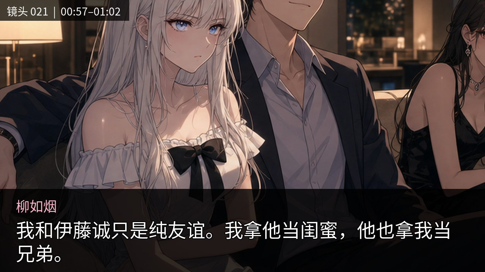](jpg/shot_021.jpg)
- **角色参考：**[柳如烟](../liuruyan.jpg)；[伊藤诚](../version1/screenplay/character_portraits/yitengcheng_user_reference.jpg)；[季伯达](../jiboda.jpg)；[闺蜜甲](../version1/screenplay/character_portraits/guimi1_v1.jpg)；[闺蜜乙](../version1/screenplay/character_portraits/guimi2_v1.jpg)；[闺蜜丙](../version1/screenplay/character_portraits/guimi3_v1.jpg)；[角色总参考表](references/character-reference-sheet.jpg)
- **场景/连续性参考：**[KTV continuity sheet](references/ktv-continuity-sheet.jpg)（当前素材中没有独立的 KTV 空景参考；此连续性表是可用场景依据，不以其他地点图片替代。）
- **柳如烟：**我和伊藤诚只是纯友谊。我拿他当闺蜜，他也拿我当兄弟。
- **目的/景别：**Advance the dialogue beat while preserving the existing social geography and escalating the double-standard argument without adding story events. Tight two-shot favoring 柳如烟 with 伊藤诚 beside her.
- **可见角色与精确调度：**Visible: 柳如烟 seated at frame left with 伊藤诚 immediately to her right; one or more sofa friends may remain soft in the background exactly as in the source JPG. 柳如烟 does not stand or cross the room.
- **场景/灯光：**Modern high-rise KTV/lounge at night: warm amber practical lamps and ceiling light, cool blue city windows, dark curtains, neutral sofa, low dark coffee table with bottles and glasses. Preserve source-JPG object placement and warm/cool contrast; do not invent a new location.
- **表演/神态/动作：**柳如烟 explains quickly and defensively, indicating herself then 伊藤诚 without touching him.
- **摄影机：**Slow 3% push-in, no pan.
- **Seedance I2V prompt (EN)：**Animate the supplied storyboard JPG as a restrained cinematic 2D anime dialogue shot. Tight two-shot favoring 柳如烟 with 伊藤诚 beside her. Visible: 柳如烟 seated at frame left with 伊藤诚 immediately to her right; one or more sofa friends may remain soft in the background exactly as in the source JPG. 柳如烟 does not stand or cross the room. Modern high-rise KTV/lounge at night: warm amber practical lamps and ceiling light, cool blue city windows, dark curtains, neutral sofa, low dark coffee table with bottles and glasses. Preserve source-JPG object placement and warm/cool contrast; do not invent a new location. Performance: 柳如烟 explains quickly and defensively, indicating herself then 伊藤诚 without touching him. Camera: Slow 3% push-in, no pan. Preserve the exact source composition, character designs, wardrobe, seating, props, and night lighting. Natural breathing, blinks, subtle hair and fabric response only; coherent facial animation and stable hands. No rendered words in the generated video. Spoken Mandarin dialogue, exact wording: “我和伊藤诚只是纯友谊。我拿他当闺蜜，他也拿我当兄弟。” Perform natural, restrained lip sync precisely to this line. The spoken wording must not be paraphrased, shortened, expanded, or replaced. Do not render the dialogue as on-screen text; add exact subtitles only in post-production. Timed dialogue and character action plan: 0.0–0.5s: hold the established composition; 柳如烟 takes a subtle breath and acquires the established eyeline while listeners remain attentive. 0.5–4.6s: 柳如烟 speaks the exact Mandarin line “我和伊藤诚只是纯友谊。我拿他当闺蜜，他也拿我当兄弟。” once, with natural restrained lip sync and the shot-specific performance: 柳如烟 explains quickly and defensively, indicating herself then 伊藤诚 without touching him. 4.6–5.0s: the speaker closes the mouth and resolves the gesture; listeners give only the restrained reaction described by the shot, then everyone holds their positions for the cut. Do not overlap, repeat, paraphrase, shorten, or extend the line. Supporting motion detail: {'start_sec': 0, 'end_sec': 1, 'beat': '柳如烟 acquires the established eyeline, inhales subtly, and begins the exact Mandarin line; 柳如烟 explains quickly and defensively, indicating herself then 伊藤诚 without touching him.'} {'start_sec': 1, 'end_sec': 2, 'beat': '柳如烟 continues the line with coherent restrained lip sync; the primary expression/gesture develops without changing seat or props.'} {'start_sec': 2, 'end_sec': 3, 'beat': '柳如烟 sustains the next phrase at natural pace; gesture resolves incrementally while listeners respond only with blinks, breath, and micro-expressions.'} {'start_sec': 3, 'end_sec': 4, 'beat': '柳如烟 sustains the next phrase at natural pace; gesture resolves incrementally while listeners respond only with blinks, breath, and micro-expressions.'} {'start_sec': 4, 'end_sec': 5, 'beat': '柳如烟 completes the exact line and final shot-specific gesture; listeners register a restrained reaction, then hold for the cut.'}
- **Negative prompt / constraints：**No new characters, no identity/wardrobe changes, no seat swaps, no duplicated or missing limbs, no warped hands/faces, no lip-sync gibberish, no sudden standing, walking, touching, drinking spill, prop teleportation, background morphing, camera shake, zoom pumping, cuts, transitions, added text, captions, logos, watermarks, or UI.
- **逐秒运动节拍：**0–1s 柳如烟 acquires the established eyeline, inhales subtly, and begins the exact Mandarin line; 柳如烟 explains quickly and defensively, indicating herself then 伊藤诚 without touching him.；1–2s 柳如烟 continues the line with coherent restrained lip sync; the primary expression/gesture develops without changing seat or props.；2–3s 柳如烟 sustains the next phrase at natural pace; gesture resolves incrementally while listeners respond only with blinks, breath, and micro-expressions.；3–4s 柳如烟 sustains the next phrase at natural pace; gesture resolves incrementally while listeners respond only with blinks, breath, and micro-expressions.；4–5s 柳如烟 completes the exact line and final shot-specific gesture; listeners register a restrained reaction, then hold for the cut.
- **对白与角色动作时间轴：**0.0–0.5s: hold the established composition; 柳如烟 takes a subtle breath and acquires the established eyeline while listeners remain attentive. 0.5–4.6s: 柳如烟 speaks the exact Mandarin line “我和伊藤诚只是纯友谊。我拿他当闺蜜，他也拿我当兄弟。” once, with natural restrained lip sync and the shot-specific performance: 柳如烟 explains quickly and defensively, indicating herself then 伊藤诚 without touching him. 4.6–5.0s: the speaker closes the mouth and resolves the gesture; listeners give only the restrained reaction described by the shot, then everyone holds their positions for the cut. Do not overlap, repeat, paraphrase, shorten, or extend the line. Supporting motion detail: {'start_sec': 0, 'end_sec': 1, 'beat': '柳如烟 acquires the established eyeline, inhales subtly, and begins the exact Mandarin line; 柳如烟 explains quickly and defensively, indicating herself then 伊藤诚 without touching him.'} {'start_sec': 1, 'end_sec': 2, 'beat': '柳如烟 continues the line with coherent restrained lip sync; the primary expression/gesture develops without changing seat or props.'} {'start_sec': 2, 'end_sec': 3, 'beat': '柳如烟 sustains the next phrase at natural pace; gesture resolves incrementally while listeners respond only with blinks, breath, and micro-expressions.'} {'start_sec': 3, 'end_sec': 4, 'beat': '柳如烟 sustains the next phrase at natural pace; gesture resolves incrementally while listeners respond only with blinks, breath, and micro-expressions.'} {'start_sec': 4, 'end_sec': 5, 'beat': '柳如烟 completes the exact line and final shot-specific gesture; listeners register a restrained reaction, then hold for the cut.'}
- **连续性锁定：**Use this shot’s JPG as the first-frame identity/composition reference.；Lock character faces, hair, wardrobe, body proportions, seating side, eyelines, table/bottle/glass positions, city-night background, and warm/cool lighting to the source JPG and adjacent shots.；Do not animate storyboard labels or subtitles: remove/crop/clean all labels and caption bands before image-to-video; composite exact Chinese dialogue or final card afterward in editing.
- **声音/对白指导：**Use clean Mandarin dialogue by 柳如烟; preserve the exact line and natural phrasing. Keep KTV room tone low, avoid music masking consonants, and use post-recorded dialogue/lip sync rather than generated text.
- **推荐生成设置：**motion `low-medium`；`16:9`；`24 fps`；`1080p`；生成 `5s`，精确裁切为 `5s`；首帧使用去除全部文字/字幕后的对应 JPG。

## 镜头 022｜01:02–01:05
- **文件：**`jpg/shot_022.jpg`
- **Staging/start image：**[Staging start image](jpg/shot_022.jpg)  
  [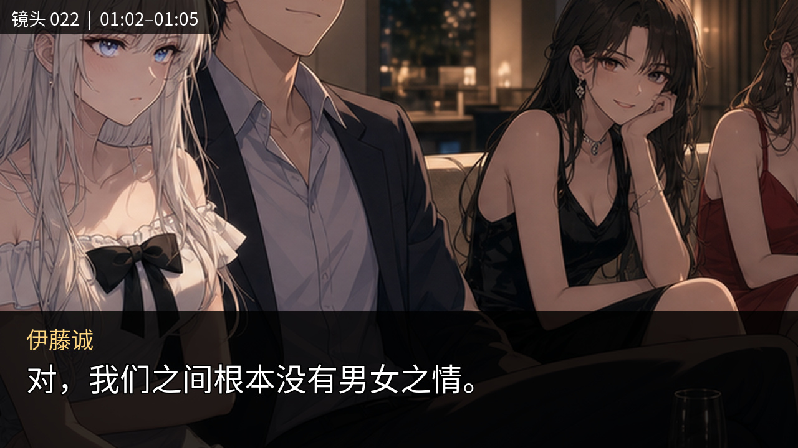](jpg/shot_022.jpg)
- **角色参考：**[柳如烟](../liuruyan.jpg)；[伊藤诚](../version1/screenplay/character_portraits/yitengcheng_user_reference.jpg)；[季伯达](../jiboda.jpg)；[闺蜜甲](../version1/screenplay/character_portraits/guimi1_v1.jpg)；[闺蜜乙](../version1/screenplay/character_portraits/guimi2_v1.jpg)；[闺蜜丙](../version1/screenplay/character_portraits/guimi3_v1.jpg)；[角色总参考表](references/character-reference-sheet.jpg)
- **场景/连续性参考：**[KTV continuity sheet](references/ktv-continuity-sheet.jpg)（当前素材中没有独立的 KTV 空景参考；此连续性表是可用场景依据，不以其他地点图片替代。）
- **伊藤诚：**对，我们之间根本没有男女之情。
- **目的/景别：**Advance the dialogue beat while preserving the existing social geography and escalating the double-standard argument without adding story events. Tight two-shot favoring 伊藤诚 with 柳如烟 beside him.
- **可见角色与精确调度：**Visible: 伊藤诚 seated immediately right of 柳如烟; 柳如烟 remains at frame left and a sofa friend may appear behind. Preserve their close seated spacing without adding contact.
- **场景/灯光：**Modern high-rise KTV/lounge at night: warm amber practical lamps and ceiling light, cool blue city windows, dark curtains, neutral sofa, low dark coffee table with bottles and glasses. Preserve source-JPG object placement and warm/cool contrast; do not invent a new location.
- **表演/神态/动作：**伊藤诚 nods and supports her claim, measured but slightly tense.
- **摄影机：**Slow 2% push toward 伊藤诚.
- **Seedance I2V prompt (EN)：**Animate the supplied storyboard JPG as a restrained cinematic 2D anime dialogue shot. Tight two-shot favoring 伊藤诚 with 柳如烟 beside him. Visible: 伊藤诚 seated immediately right of 柳如烟; 柳如烟 remains at frame left and a sofa friend may appear behind. Preserve their close seated spacing without adding contact. Modern high-rise KTV/lounge at night: warm amber practical lamps and ceiling light, cool blue city windows, dark curtains, neutral sofa, low dark coffee table with bottles and glasses. Preserve source-JPG object placement and warm/cool contrast; do not invent a new location. Performance: 伊藤诚 nods and supports her claim, measured but slightly tense. Camera: Slow 2% push toward 伊藤诚. Preserve the exact source composition, character designs, wardrobe, seating, props, and night lighting. Natural breathing, blinks, subtle hair and fabric response only; coherent facial animation and stable hands. No rendered words in the generated video. Spoken Mandarin dialogue, exact wording: “对，我们之间根本没有男女之情。” Perform natural, restrained lip sync precisely to this line. The spoken wording must not be paraphrased, shortened, expanded, or replaced. Do not render the dialogue as on-screen text; add exact subtitles only in post-production. Timed dialogue and character action plan: 0.0–0.4s: hold the established composition; 伊藤诚 takes a subtle breath and acquires the established eyeline while listeners remain attentive. 0.4–2.7s: 伊藤诚 speaks the exact Mandarin line “对，我们之间根本没有男女之情。” once, with natural restrained lip sync and the shot-specific performance: 伊藤诚 nods and supports her claim, measured but slightly tense. 2.7–3.0s: the speaker closes the mouth and resolves the gesture; listeners give only the restrained reaction described by the shot, then everyone holds their positions for the cut. Do not overlap, repeat, paraphrase, shorten, or extend the line. Supporting motion detail: {'start_sec': 0, 'end_sec': 1, 'beat': '伊藤诚 acquires the established eyeline, inhales subtly, and begins the exact Mandarin line; 伊藤诚 nods and supports her claim, measured but slightly tense.'} {'start_sec': 1, 'end_sec': 2, 'beat': '伊藤诚 continues the line with coherent restrained lip sync; the primary expression/gesture develops without changing seat or props.'} {'start_sec': 2, 'end_sec': 3, 'beat': '伊藤诚 completes the exact line and final shot-specific gesture; listeners register a restrained reaction, then hold for the cut.'}
- **Negative prompt / constraints：**No new characters, no identity/wardrobe changes, no seat swaps, no duplicated or missing limbs, no warped hands/faces, no lip-sync gibberish, no sudden standing, walking, touching, drinking spill, prop teleportation, background morphing, camera shake, zoom pumping, cuts, transitions, added text, captions, logos, watermarks, or UI.
- **逐秒运动节拍：**0–1s 伊藤诚 acquires the established eyeline, inhales subtly, and begins the exact Mandarin line; 伊藤诚 nods and supports her claim, measured but slightly tense.；1–2s 伊藤诚 continues the line with coherent restrained lip sync; the primary expression/gesture develops without changing seat or props.；2–3s 伊藤诚 completes the exact line and final shot-specific gesture; listeners register a restrained reaction, then hold for the cut.
- **对白与角色动作时间轴：**0.0–0.4s: hold the established composition; 伊藤诚 takes a subtle breath and acquires the established eyeline while listeners remain attentive. 0.4–2.7s: 伊藤诚 speaks the exact Mandarin line “对，我们之间根本没有男女之情。” once, with natural restrained lip sync and the shot-specific performance: 伊藤诚 nods and supports her claim, measured but slightly tense. 2.7–3.0s: the speaker closes the mouth and resolves the gesture; listeners give only the restrained reaction described by the shot, then everyone holds their positions for the cut. Do not overlap, repeat, paraphrase, shorten, or extend the line. Supporting motion detail: {'start_sec': 0, 'end_sec': 1, 'beat': '伊藤诚 acquires the established eyeline, inhales subtly, and begins the exact Mandarin line; 伊藤诚 nods and supports her claim, measured but slightly tense.'} {'start_sec': 1, 'end_sec': 2, 'beat': '伊藤诚 continues the line with coherent restrained lip sync; the primary expression/gesture develops without changing seat or props.'} {'start_sec': 2, 'end_sec': 3, 'beat': '伊藤诚 completes the exact line and final shot-specific gesture; listeners register a restrained reaction, then hold for the cut.'}
- **连续性锁定：**Use this shot’s JPG as the first-frame identity/composition reference.；Lock character faces, hair, wardrobe, body proportions, seating side, eyelines, table/bottle/glass positions, city-night background, and warm/cool lighting to the source JPG and adjacent shots.；Do not animate storyboard labels or subtitles: remove/crop/clean all labels and caption bands before image-to-video; composite exact Chinese dialogue or final card afterward in editing.
- **声音/对白指导：**Use clean Mandarin dialogue by 伊藤诚; preserve the exact line and natural phrasing. Keep KTV room tone low, avoid music masking consonants, and use post-recorded dialogue/lip sync rather than generated text.
- **推荐生成设置：**motion `low-medium`；`16:9`；`24 fps`；`1080p`；生成 `3s`，精确裁切为 `3s`；首帧使用去除全部文字/字幕后的对应 JPG。

## 镜头 023｜01:05–01:08
- **文件：**`jpg/shot_023.jpg`
- **Staging/start image：**[Staging start image](jpg/shot_023.jpg)  
  [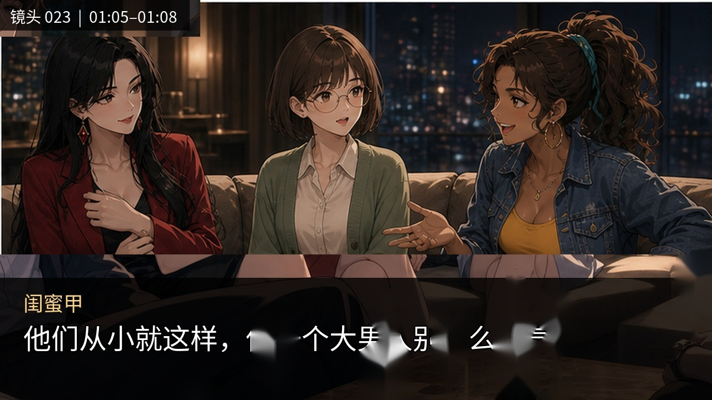](jpg/shot_023.jpg)
- **角色参考：**[柳如烟](../liuruyan.jpg)；[伊藤诚](../version1/screenplay/character_portraits/yitengcheng_user_reference.jpg)；[季伯达](../jiboda.jpg)；[闺蜜甲](../version1/screenplay/character_portraits/guimi1_v1.jpg)；[闺蜜乙](../version1/screenplay/character_portraits/guimi2_v1.jpg)；[闺蜜丙](../version1/screenplay/character_portraits/guimi3_v1.jpg)；[角色总参考表](references/character-reference-sheet.jpg)
- **场景/连续性参考：**[KTV continuity sheet](references/ktv-continuity-sheet.jpg)（当前素材中没有独立的 KTV 空景参考；此连续性表是可用场景依据，不以其他地点图片替代。）
- **闺蜜甲：**他们从小就这样，你一个大男人别这么小气。
- **目的/景别：**Advance the dialogue beat while preserving the existing social geography and escalating the double-standard argument without adding story events. Medium three-shot of girlfriends, favoring 闺蜜甲.
- **可见角色与精确调度：**Visible: 闺蜜甲 on sofa left, 闺蜜乙 center, 闺蜜丙 right. They remain seated behind the coffee table, shoulders angled toward 季伯达 off-camera/right; no seat swaps.
- **场景/灯光：**Modern high-rise KTV/lounge at night: warm amber practical lamps and ceiling light, cool blue city windows, dark curtains, neutral sofa, low dark coffee table with bottles and glasses. Preserve source-JPG object placement and warm/cool contrast; do not invent a new location.
- **表演/神态/动作：**闺蜜甲 opens both hands as if the conclusion is obvious; 闺蜜乙 listens; 闺蜜丙 observes.
- **摄影机：**Gentle 2% push toward 闺蜜甲.
- **Seedance I2V prompt (EN)：**Animate the supplied storyboard JPG as a restrained cinematic 2D anime dialogue shot. Medium three-shot of girlfriends, favoring 闺蜜甲. Visible: 闺蜜甲 on sofa left, 闺蜜乙 center, 闺蜜丙 right. They remain seated behind the coffee table, shoulders angled toward 季伯达 off-camera/right; no seat swaps. Modern high-rise KTV/lounge at night: warm amber practical lamps and ceiling light, cool blue city windows, dark curtains, neutral sofa, low dark coffee table with bottles and glasses. Preserve source-JPG object placement and warm/cool contrast; do not invent a new location. Performance: 闺蜜甲 opens both hands as if the conclusion is obvious; 闺蜜乙 listens; 闺蜜丙 observes. Camera: Gentle 2% push toward 闺蜜甲. Preserve the exact source composition, character designs, wardrobe, seating, props, and night lighting. Natural breathing, blinks, subtle hair and fabric response only; coherent facial animation and stable hands. No rendered words in the generated video. Spoken Mandarin dialogue, exact wording: “他们从小就这样，你一个大男人别这么小气。” Perform natural, restrained lip sync precisely to this line. The spoken wording must not be paraphrased, shortened, expanded, or replaced. Do not render the dialogue as on-screen text; add exact subtitles only in post-production. Timed dialogue and character action plan: 0.0–0.4s: hold the established composition; 闺蜜甲 takes a subtle breath and acquires the established eyeline while listeners remain attentive. 0.4–2.7s: 闺蜜甲 speaks the exact Mandarin line “他们从小就这样，你一个大男人别这么小气。” once, with natural restrained lip sync and the shot-specific performance: 闺蜜甲 opens both hands as if the conclusion is obvious; 闺蜜乙 listens; 闺蜜丙 observes. 2.7–3.0s: the speaker closes the mouth and resolves the gesture; listeners give only the restrained reaction described by the shot, then everyone holds their positions for the cut. Do not overlap, repeat, paraphrase, shorten, or extend the line. Supporting motion detail: {'start_sec': 0, 'end_sec': 1, 'beat': '闺蜜甲 acquires the established eyeline, inhales subtly, and begins the exact Mandarin line; 闺蜜甲 opens both hands as if the conclusion is obvious; 闺蜜乙 listens; 闺蜜丙 observes.'} {'start_sec': 1, 'end_sec': 2, 'beat': '闺蜜甲 continues the line with coherent restrained lip sync; the primary expression/gesture develops without changing seat or props.'} {'start_sec': 2, 'end_sec': 3, 'beat': '闺蜜甲 completes the exact line and final shot-specific gesture; listeners register a restrained reaction, then hold for the cut.'}
- **Negative prompt / constraints：**No new characters, no identity/wardrobe changes, no seat swaps, no duplicated or missing limbs, no warped hands/faces, no lip-sync gibberish, no sudden standing, walking, touching, drinking spill, prop teleportation, background morphing, camera shake, zoom pumping, cuts, transitions, added text, captions, logos, watermarks, or UI.
- **逐秒运动节拍：**0–1s 闺蜜甲 acquires the established eyeline, inhales subtly, and begins the exact Mandarin line; 闺蜜甲 opens both hands as if the conclusion is obvious; 闺蜜乙 listens; 闺蜜丙 observes.；1–2s 闺蜜甲 continues the line with coherent restrained lip sync; the primary expression/gesture develops without changing seat or props.；2–3s 闺蜜甲 completes the exact line and final shot-specific gesture; listeners register a restrained reaction, then hold for the cut.
- **对白与角色动作时间轴：**0.0–0.4s: hold the established composition; 闺蜜甲 takes a subtle breath and acquires the established eyeline while listeners remain attentive. 0.4–2.7s: 闺蜜甲 speaks the exact Mandarin line “他们从小就这样，你一个大男人别这么小气。” once, with natural restrained lip sync and the shot-specific performance: 闺蜜甲 opens both hands as if the conclusion is obvious; 闺蜜乙 listens; 闺蜜丙 observes. 2.7–3.0s: the speaker closes the mouth and resolves the gesture; listeners give only the restrained reaction described by the shot, then everyone holds their positions for the cut. Do not overlap, repeat, paraphrase, shorten, or extend the line. Supporting motion detail: {'start_sec': 0, 'end_sec': 1, 'beat': '闺蜜甲 acquires the established eyeline, inhales subtly, and begins the exact Mandarin line; 闺蜜甲 opens both hands as if the conclusion is obvious; 闺蜜乙 listens; 闺蜜丙 observes.'} {'start_sec': 1, 'end_sec': 2, 'beat': '闺蜜甲 continues the line with coherent restrained lip sync; the primary expression/gesture develops without changing seat or props.'} {'start_sec': 2, 'end_sec': 3, 'beat': '闺蜜甲 completes the exact line and final shot-specific gesture; listeners register a restrained reaction, then hold for the cut.'}
- **连续性锁定：**Use this shot’s JPG as the first-frame identity/composition reference.；Lock character faces, hair, wardrobe, body proportions, seating side, eyelines, table/bottle/glass positions, city-night background, and warm/cool lighting to the source JPG and adjacent shots.；Do not animate storyboard labels or subtitles: remove/crop/clean all labels and caption bands before image-to-video; composite exact Chinese dialogue or final card afterward in editing.
- **声音/对白指导：**Use clean Mandarin dialogue by 闺蜜甲; preserve the exact line and natural phrasing. Keep KTV room tone low, avoid music masking consonants, and use post-recorded dialogue/lip sync rather than generated text.
- **推荐生成设置：**motion `low-medium`；`16:9`；`24 fps`；`1080p`；生成 `3s`，精确裁切为 `3s`；首帧使用去除全部文字/字幕后的对应 JPG。

## 镜头 024｜01:08–01:11
- **文件：**`jpg/shot_024.jpg`
- **Staging/start image：**[Staging start image](jpg/shot_024.jpg)  
  [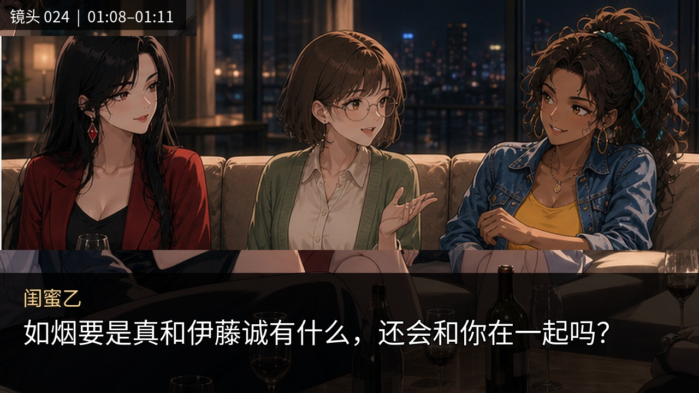](jpg/shot_024.jpg)
- **角色参考：**[柳如烟](../liuruyan.jpg)；[伊藤诚](../version1/screenplay/character_portraits/yitengcheng_user_reference.jpg)；[季伯达](../jiboda.jpg)；[闺蜜甲](../version1/screenplay/character_portraits/guimi1_v1.jpg)；[闺蜜乙](../version1/screenplay/character_portraits/guimi2_v1.jpg)；[闺蜜丙](../version1/screenplay/character_portraits/guimi3_v1.jpg)；[角色总参考表](references/character-reference-sheet.jpg)
- **场景/连续性参考：**[KTV continuity sheet](references/ktv-continuity-sheet.jpg)（当前素材中没有独立的 KTV 空景参考；此连续性表是可用场景依据，不以其他地点图片替代。）
- **闺蜜乙：**如烟要是真和伊藤诚有什么，还会和你在一起吗？
- **目的/景别：**Advance the dialogue beat while preserving the existing social geography and escalating the double-standard argument without adding story events. Medium three-shot of girlfriends, favoring 闺蜜乙.
- **可见角色与精确调度：**Visible: 闺蜜甲 on sofa left, 闺蜜乙 center, 闺蜜丙 right. They remain seated behind the coffee table, shoulders angled toward 季伯达 off-camera/right; no seat swaps.
- **场景/灯光：**Modern high-rise KTV/lounge at night: warm amber practical lamps and ceiling light, cool blue city windows, dark curtains, neutral sofa, low dark coffee table with bottles and glasses. Preserve source-JPG object placement and warm/cool contrast; do not invent a new location.
- **表演/神态/动作：**闺蜜乙 leans in and challenges 季伯达 rhetorically; the other two track her.
- **摄影机：**Gentle 3% push toward 闺蜜乙.
- **Seedance I2V prompt (EN)：**Animate the supplied storyboard JPG as a restrained cinematic 2D anime dialogue shot. Medium three-shot of girlfriends, favoring 闺蜜乙. Visible: 闺蜜甲 on sofa left, 闺蜜乙 center, 闺蜜丙 right. They remain seated behind the coffee table, shoulders angled toward 季伯达 off-camera/right; no seat swaps. Modern high-rise KTV/lounge at night: warm amber practical lamps and ceiling light, cool blue city windows, dark curtains, neutral sofa, low dark coffee table with bottles and glasses. Preserve source-JPG object placement and warm/cool contrast; do not invent a new location. Performance: 闺蜜乙 leans in and challenges 季伯达 rhetorically; the other two track her. Camera: Gentle 3% push toward 闺蜜乙. Preserve the exact source composition, character designs, wardrobe, seating, props, and night lighting. Natural breathing, blinks, subtle hair and fabric response only; coherent facial animation and stable hands. No rendered words in the generated video. Spoken Mandarin dialogue, exact wording: “如烟要是真和伊藤诚有什么，还会和你在一起吗？” Perform natural, restrained lip sync precisely to this line. The spoken wording must not be paraphrased, shortened, expanded, or replaced. Do not render the dialogue as on-screen text; add exact subtitles only in post-production. Timed dialogue and character action plan: 0.0–0.4s: hold the established composition; 闺蜜乙 takes a subtle breath and acquires the established eyeline while listeners remain attentive. 0.4–2.7s: 闺蜜乙 speaks the exact Mandarin line “如烟要是真和伊藤诚有什么，还会和你在一起吗？” once, with natural restrained lip sync and the shot-specific performance: 闺蜜乙 leans in and challenges 季伯达 rhetorically; the other two track her. 2.7–3.0s: the speaker closes the mouth and resolves the gesture; listeners give only the restrained reaction described by the shot, then everyone holds their positions for the cut. Do not overlap, repeat, paraphrase, shorten, or extend the line. Supporting motion detail: {'start_sec': 0, 'end_sec': 1, 'beat': '闺蜜乙 acquires the established eyeline, inhales subtly, and begins the exact Mandarin line; 闺蜜乙 leans in and challenges 季伯达 rhetorically; the other two track her.'} {'start_sec': 1, 'end_sec': 2, 'beat': '闺蜜乙 continues the line with coherent restrained lip sync; the primary expression/gesture develops without changing seat or props.'} {'start_sec': 2, 'end_sec': 3, 'beat': '闺蜜乙 completes the exact line and final shot-specific gesture; listeners register a restrained reaction, then hold for the cut.'}
- **Negative prompt / constraints：**No new characters, no identity/wardrobe changes, no seat swaps, no duplicated or missing limbs, no warped hands/faces, no lip-sync gibberish, no sudden standing, walking, touching, drinking spill, prop teleportation, background morphing, camera shake, zoom pumping, cuts, transitions, added text, captions, logos, watermarks, or UI.
- **逐秒运动节拍：**0–1s 闺蜜乙 acquires the established eyeline, inhales subtly, and begins the exact Mandarin line; 闺蜜乙 leans in and challenges 季伯达 rhetorically; the other two track her.；1–2s 闺蜜乙 continues the line with coherent restrained lip sync; the primary expression/gesture develops without changing seat or props.；2–3s 闺蜜乙 completes the exact line and final shot-specific gesture; listeners register a restrained reaction, then hold for the cut.
- **对白与角色动作时间轴：**0.0–0.4s: hold the established composition; 闺蜜乙 takes a subtle breath and acquires the established eyeline while listeners remain attentive. 0.4–2.7s: 闺蜜乙 speaks the exact Mandarin line “如烟要是真和伊藤诚有什么，还会和你在一起吗？” once, with natural restrained lip sync and the shot-specific performance: 闺蜜乙 leans in and challenges 季伯达 rhetorically; the other two track her. 2.7–3.0s: the speaker closes the mouth and resolves the gesture; listeners give only the restrained reaction described by the shot, then everyone holds their positions for the cut. Do not overlap, repeat, paraphrase, shorten, or extend the line. Supporting motion detail: {'start_sec': 0, 'end_sec': 1, 'beat': '闺蜜乙 acquires the established eyeline, inhales subtly, and begins the exact Mandarin line; 闺蜜乙 leans in and challenges 季伯达 rhetorically; the other two track her.'} {'start_sec': 1, 'end_sec': 2, 'beat': '闺蜜乙 continues the line with coherent restrained lip sync; the primary expression/gesture develops without changing seat or props.'} {'start_sec': 2, 'end_sec': 3, 'beat': '闺蜜乙 completes the exact line and final shot-specific gesture; listeners register a restrained reaction, then hold for the cut.'}
- **连续性锁定：**Use this shot’s JPG as the first-frame identity/composition reference.；Lock character faces, hair, wardrobe, body proportions, seating side, eyelines, table/bottle/glass positions, city-night background, and warm/cool lighting to the source JPG and adjacent shots.；Do not animate storyboard labels or subtitles: remove/crop/clean all labels and caption bands before image-to-video; composite exact Chinese dialogue or final card afterward in editing.
- **声音/对白指导：**Use clean Mandarin dialogue by 闺蜜乙; preserve the exact line and natural phrasing. Keep KTV room tone low, avoid music masking consonants, and use post-recorded dialogue/lip sync rather than generated text.
- **推荐生成设置：**motion `low-medium`；`16:9`；`24 fps`；`1080p`；生成 `3s`，精确裁切为 `3s`；首帧使用去除全部文字/字幕后的对应 JPG。

## 镜头 025｜01:11–01:14
- **文件：**`jpg/shot_025.jpg`
- **Staging/start image：**[Staging start image](jpg/shot_025.jpg)  
  [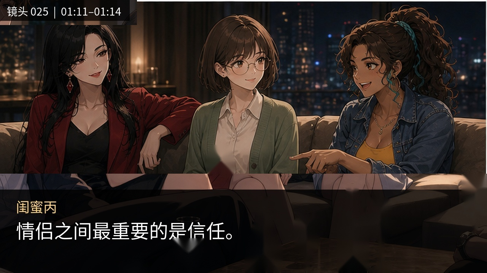](jpg/shot_025.jpg)
- **角色参考：**[柳如烟](../liuruyan.jpg)；[伊藤诚](../version1/screenplay/character_portraits/yitengcheng_user_reference.jpg)；[季伯达](../jiboda.jpg)；[闺蜜甲](../version1/screenplay/character_portraits/guimi1_v1.jpg)；[闺蜜乙](../version1/screenplay/character_portraits/guimi2_v1.jpg)；[闺蜜丙](../version1/screenplay/character_portraits/guimi3_v1.jpg)；[角色总参考表](references/character-reference-sheet.jpg)
- **场景/连续性参考：**[KTV continuity sheet](references/ktv-continuity-sheet.jpg)（当前素材中没有独立的 KTV 空景参考；此连续性表是可用场景依据，不以其他地点图片替代。）
- **闺蜜丙：**情侣之间最重要的是信任。
- **目的/景别：**Advance the dialogue beat while preserving the existing social geography and escalating the double-standard argument without adding story events. Medium three-shot of girlfriends, favoring 闺蜜丙.
- **可见角色与精确调度：**Visible: 闺蜜甲 on sofa left, 闺蜜乙 center, 闺蜜丙 right. They remain seated behind the coffee table, shoulders angled toward 季伯达 off-camera/right; no seat swaps.
- **场景/灯光：**Modern high-rise KTV/lounge at night: warm amber practical lamps and ceiling light, cool blue city windows, dark curtains, neutral sofa, low dark coffee table with bottles and glasses. Preserve source-JPG object placement and warm/cool contrast; do not invent a new location.
- **表演/神态/动作：**闺蜜丙 sits straighter and delivers a summarizing maxim; the others go still to listen.
- **摄影机：**Slow 2% push toward 闺蜜丙.
- **Seedance I2V prompt (EN)：**Animate the supplied storyboard JPG as a restrained cinematic 2D anime dialogue shot. Medium three-shot of girlfriends, favoring 闺蜜丙. Visible: 闺蜜甲 on sofa left, 闺蜜乙 center, 闺蜜丙 right. They remain seated behind the coffee table, shoulders angled toward 季伯达 off-camera/right; no seat swaps. Modern high-rise KTV/lounge at night: warm amber practical lamps and ceiling light, cool blue city windows, dark curtains, neutral sofa, low dark coffee table with bottles and glasses. Preserve source-JPG object placement and warm/cool contrast; do not invent a new location. Performance: 闺蜜丙 sits straighter and delivers a summarizing maxim; the others go still to listen. Camera: Slow 2% push toward 闺蜜丙. Preserve the exact source composition, character designs, wardrobe, seating, props, and night lighting. Natural breathing, blinks, subtle hair and fabric response only; coherent facial animation and stable hands. No rendered words in the generated video. Spoken Mandarin dialogue, exact wording: “情侣之间最重要的是信任。” Perform natural, restrained lip sync precisely to this line. The spoken wording must not be paraphrased, shortened, expanded, or replaced. Do not render the dialogue as on-screen text; add exact subtitles only in post-production. Timed dialogue and character action plan: 0.0–0.4s: hold the established composition; 闺蜜丙 takes a subtle breath and acquires the established eyeline while listeners remain attentive. 0.4–2.7s: 闺蜜丙 speaks the exact Mandarin line “情侣之间最重要的是信任。” once, with natural restrained lip sync and the shot-specific performance: 闺蜜丙 sits straighter and delivers a summarizing maxim; the others go still to listen. 2.7–3.0s: the speaker closes the mouth and resolves the gesture; listeners give only the restrained reaction described by the shot, then everyone holds their positions for the cut. Do not overlap, repeat, paraphrase, shorten, or extend the line. Supporting motion detail: {'start_sec': 0, 'end_sec': 1, 'beat': '闺蜜丙 acquires the established eyeline, inhales subtly, and begins the exact Mandarin line; 闺蜜丙 sits straighter and delivers a summarizing maxim; the others go still to listen.'} {'start_sec': 1, 'end_sec': 2, 'beat': '闺蜜丙 continues the line with coherent restrained lip sync; the primary expression/gesture develops without changing seat or props.'} {'start_sec': 2, 'end_sec': 3, 'beat': '闺蜜丙 completes the exact line and final shot-specific gesture; listeners register a restrained reaction, then hold for the cut.'}
- **Negative prompt / constraints：**No new characters, no identity/wardrobe changes, no seat swaps, no duplicated or missing limbs, no warped hands/faces, no lip-sync gibberish, no sudden standing, walking, touching, drinking spill, prop teleportation, background morphing, camera shake, zoom pumping, cuts, transitions, added text, captions, logos, watermarks, or UI.
- **逐秒运动节拍：**0–1s 闺蜜丙 acquires the established eyeline, inhales subtly, and begins the exact Mandarin line; 闺蜜丙 sits straighter and delivers a summarizing maxim; the others go still to listen.；1–2s 闺蜜丙 continues the line with coherent restrained lip sync; the primary expression/gesture develops without changing seat or props.；2–3s 闺蜜丙 completes the exact line and final shot-specific gesture; listeners register a restrained reaction, then hold for the cut.
- **对白与角色动作时间轴：**0.0–0.4s: hold the established composition; 闺蜜丙 takes a subtle breath and acquires the established eyeline while listeners remain attentive. 0.4–2.7s: 闺蜜丙 speaks the exact Mandarin line “情侣之间最重要的是信任。” once, with natural restrained lip sync and the shot-specific performance: 闺蜜丙 sits straighter and delivers a summarizing maxim; the others go still to listen. 2.7–3.0s: the speaker closes the mouth and resolves the gesture; listeners give only the restrained reaction described by the shot, then everyone holds their positions for the cut. Do not overlap, repeat, paraphrase, shorten, or extend the line. Supporting motion detail: {'start_sec': 0, 'end_sec': 1, 'beat': '闺蜜丙 acquires the established eyeline, inhales subtly, and begins the exact Mandarin line; 闺蜜丙 sits straighter and delivers a summarizing maxim; the others go still to listen.'} {'start_sec': 1, 'end_sec': 2, 'beat': '闺蜜丙 continues the line with coherent restrained lip sync; the primary expression/gesture develops without changing seat or props.'} {'start_sec': 2, 'end_sec': 3, 'beat': '闺蜜丙 completes the exact line and final shot-specific gesture; listeners register a restrained reaction, then hold for the cut.'}
- **连续性锁定：**Use this shot’s JPG as the first-frame identity/composition reference.；Lock character faces, hair, wardrobe, body proportions, seating side, eyelines, table/bottle/glass positions, city-night background, and warm/cool lighting to the source JPG and adjacent shots.；Do not animate storyboard labels or subtitles: remove/crop/clean all labels and caption bands before image-to-video; composite exact Chinese dialogue or final card afterward in editing.
- **声音/对白指导：**Use clean Mandarin dialogue by 闺蜜丙; preserve the exact line and natural phrasing. Keep KTV room tone low, avoid music masking consonants, and use post-recorded dialogue/lip sync rather than generated text.
- **推荐生成设置：**motion `low-medium`；`16:9`；`24 fps`；`1080p`；生成 `3s`，精确裁切为 `3s`；首帧使用去除全部文字/字幕后的对应 JPG。

## 镜头 026｜01:14–01:20
- **文件：**`jpg/shot_026.jpg`
- **Staging/start image：**[Staging start image](jpg/shot_026.jpg)  
  [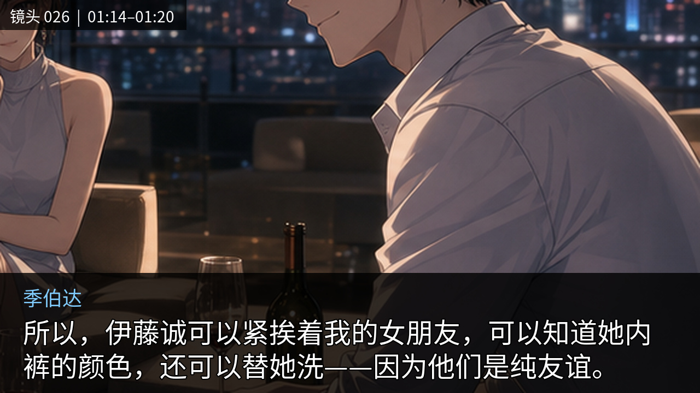](jpg/shot_026.jpg)
- **角色参考：**[柳如烟](../liuruyan.jpg)；[伊藤诚](../version1/screenplay/character_portraits/yitengcheng_user_reference.jpg)；[季伯达](../jiboda.jpg)；[闺蜜甲](../version1/screenplay/character_portraits/guimi1_v1.jpg)；[闺蜜乙](../version1/screenplay/character_portraits/guimi2_v1.jpg)；[闺蜜丙](../version1/screenplay/character_portraits/guimi3_v1.jpg)；[角色总参考表](references/character-reference-sheet.jpg)
- **场景/连续性参考：**[KTV continuity sheet](references/ktv-continuity-sheet.jpg)（当前素材中没有独立的 KTV 空景参考；此连续性表是可用场景依据，不以其他地点图片替代。）
- **季伯达：**所以，伊藤诚可以紧挨着我的女朋友，可以知道她内裤的颜色，还可以替她洗——因为他们是纯友谊。
- **目的/景别：**Advance the dialogue beat while preserving the existing social geography and escalating the double-standard argument without adding story events. Sustained medium close-up on 季伯达, right foreground, addressing the sofa group.
- **可见角色与精确调度：**Visible: 季伯达 occupies the right foreground in a white shirt, torso turned left toward 柳如烟/伊藤诚 and the opposite sofa; a seated friend may remain soft behind him. He remains seated and does not change sides.
- **场景/灯光：**Modern high-rise KTV/lounge at night: warm amber practical lamps and ceiling light, cool blue city windows, dark curtains, neutral sofa, low dark coffee table with bottles and glasses. Preserve source-JPG object placement and warm/cool contrast; do not invent a new location.
- **表演/神态/动作：**季伯达 enumerates each allowance with controlled hand beats and increasing precision, not shouting.
- **摄影机：**Sustained 4% push-in, no cuts or axis change.
- **Seedance I2V prompt (EN)：**Animate the supplied storyboard JPG as a restrained cinematic 2D anime dialogue shot. Sustained medium close-up on 季伯达, right foreground, addressing the sofa group. Visible: 季伯达 occupies the right foreground in a white shirt, torso turned left toward 柳如烟/伊藤诚 and the opposite sofa; a seated friend may remain soft behind him. He remains seated and does not change sides. Modern high-rise KTV/lounge at night: warm amber practical lamps and ceiling light, cool blue city windows, dark curtains, neutral sofa, low dark coffee table with bottles and glasses. Preserve source-JPG object placement and warm/cool contrast; do not invent a new location. Performance: 季伯达 enumerates each allowance with controlled hand beats and increasing precision, not shouting. Camera: Sustained 4% push-in, no cuts or axis change. Preserve the exact source composition, character designs, wardrobe, seating, props, and night lighting. Natural breathing, blinks, subtle hair and fabric response only; coherent facial animation and stable hands. No rendered words in the generated video. Spoken Mandarin dialogue, exact wording: “所以，伊藤诚可以紧挨着我的女朋友，可以知道她内裤的颜色，还可以替她洗——因为他们是纯友谊。” Perform natural, restrained lip sync precisely to this line. The spoken wording must not be paraphrased, shortened, expanded, or replaced. Do not render the dialogue as on-screen text; add exact subtitles only in post-production. Timed dialogue and character action plan: 0.0–0.5s: hold the established composition; 季伯达 takes a subtle breath and acquires the established eyeline while listeners remain attentive. 0.5–5.6s: 季伯达 speaks the exact Mandarin line “所以，伊藤诚可以紧挨着我的女朋友，可以知道她内裤的颜色，还可以替她洗——因为他们是纯友谊。” once, with natural restrained lip sync and the shot-specific performance: 季伯达 enumerates each allowance with controlled hand beats and increasing precision, not shouting. 5.6–6.0s: the speaker closes the mouth and resolves the gesture; listeners give only the restrained reaction described by the shot, then everyone holds their positions for the cut. Do not overlap, repeat, paraphrase, shorten, or extend the line. Supporting motion detail: {'start_sec': 0, 'end_sec': 1, 'beat': '季伯达 acquires the established eyeline, inhales subtly, and begins the exact Mandarin line; 季伯达 enumerates each allowance with controlled hand beats and increasing precision, not shouting.'} {'start_sec': 1, 'end_sec': 2, 'beat': '季伯达 continues the line with coherent restrained lip sync; the primary expression/gesture develops without changing seat or props.'} {'start_sec': 2, 'end_sec': 3, 'beat': '季伯达 sustains the next phrase at natural pace; gesture resolves incrementally while listeners respond only with blinks, breath, and micro-expressions.'} {'start_sec': 3, 'end_sec': 4, 'beat': '季伯达 sustains the next phrase at natural pace; gesture resolves incrementally while listeners respond only with blinks, breath, and micro-expressions.'} {'start_sec': 4, 'end_sec': 5, 'beat': '季伯达 sustains the next phrase at natural pace; gesture resolves incrementally while listeners respond only with blinks, breath, and micro-expressions.'} {'start_sec': 5, 'end_sec': 6, 'beat': '季伯达 completes the exact line and final shot-specific gesture; listeners register a restrained reaction, then hold for the cut.'}
- **Negative prompt / constraints：**No new characters, no identity/wardrobe changes, no seat swaps, no duplicated or missing limbs, no warped hands/faces, no lip-sync gibberish, no sudden standing, walking, touching, drinking spill, prop teleportation, background morphing, camera shake, zoom pumping, cuts, transitions, added text, captions, logos, watermarks, or UI.
- **逐秒运动节拍：**0–1s 季伯达 acquires the established eyeline, inhales subtly, and begins the exact Mandarin line; 季伯达 enumerates each allowance with controlled hand beats and increasing precision, not shouting.；1–2s 季伯达 continues the line with coherent restrained lip sync; the primary expression/gesture develops without changing seat or props.；2–3s 季伯达 sustains the next phrase at natural pace; gesture resolves incrementally while listeners respond only with blinks, breath, and micro-expressions.；3–4s 季伯达 sustains the next phrase at natural pace; gesture resolves incrementally while listeners respond only with blinks, breath, and micro-expressions.；4–5s 季伯达 sustains the next phrase at natural pace; gesture resolves incrementally while listeners respond only with blinks, breath, and micro-expressions.；5–6s 季伯达 completes the exact line and final shot-specific gesture; listeners register a restrained reaction, then hold for the cut.
- **对白与角色动作时间轴：**0.0–0.5s: hold the established composition; 季伯达 takes a subtle breath and acquires the established eyeline while listeners remain attentive. 0.5–5.6s: 季伯达 speaks the exact Mandarin line “所以，伊藤诚可以紧挨着我的女朋友，可以知道她内裤的颜色，还可以替她洗——因为他们是纯友谊。” once, with natural restrained lip sync and the shot-specific performance: 季伯达 enumerates each allowance with controlled hand beats and increasing precision, not shouting. 5.6–6.0s: the speaker closes the mouth and resolves the gesture; listeners give only the restrained reaction described by the shot, then everyone holds their positions for the cut. Do not overlap, repeat, paraphrase, shorten, or extend the line. Supporting motion detail: {'start_sec': 0, 'end_sec': 1, 'beat': '季伯达 acquires the established eyeline, inhales subtly, and begins the exact Mandarin line; 季伯达 enumerates each allowance with controlled hand beats and increasing precision, not shouting.'} {'start_sec': 1, 'end_sec': 2, 'beat': '季伯达 continues the line with coherent restrained lip sync; the primary expression/gesture develops without changing seat or props.'} {'start_sec': 2, 'end_sec': 3, 'beat': '季伯达 sustains the next phrase at natural pace; gesture resolves incrementally while listeners respond only with blinks, breath, and micro-expressions.'} {'start_sec': 3, 'end_sec': 4, 'beat': '季伯达 sustains the next phrase at natural pace; gesture resolves incrementally while listeners respond only with blinks, breath, and micro-expressions.'} {'start_sec': 4, 'end_sec': 5, 'beat': '季伯达 sustains the next phrase at natural pace; gesture resolves incrementally while listeners respond only with blinks, breath, and micro-expressions.'} {'start_sec': 5, 'end_sec': 6, 'beat': '季伯达 completes the exact line and final shot-specific gesture; listeners register a restrained reaction, then hold for the cut.'}
- **连续性锁定：**Use this shot’s JPG as the first-frame identity/composition reference.；Lock character faces, hair, wardrobe, body proportions, seating side, eyelines, table/bottle/glass positions, city-night background, and warm/cool lighting to the source JPG and adjacent shots.；Do not animate storyboard labels or subtitles: remove/crop/clean all labels and caption bands before image-to-video; composite exact Chinese dialogue or final card afterward in editing.
- **声音/对白指导：**Use clean Mandarin dialogue by 季伯达; preserve the exact line and natural phrasing. Keep KTV room tone low, avoid music masking consonants, and use post-recorded dialogue/lip sync rather than generated text.
- **推荐生成设置：**motion `low-medium`；`16:9`；`24 fps`；`1080p`；生成 `6s`，精确裁切为 `6s`；首帧使用去除全部文字/字幕后的对应 JPG。

## 镜头 027｜01:20–01:24
- **文件：**`jpg/shot_027.jpg`
- **Staging/start image：**[Staging start image](jpg/shot_027.jpg)  
  [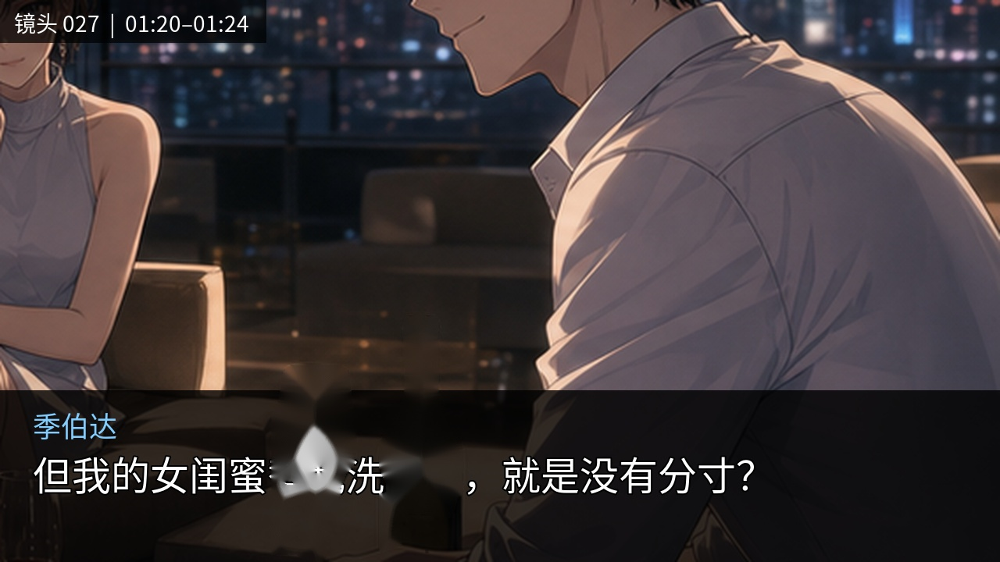](jpg/shot_027.jpg)
- **角色参考：**[柳如烟](../liuruyan.jpg)；[伊藤诚](../version1/screenplay/character_portraits/yitengcheng_user_reference.jpg)；[季伯达](../jiboda.jpg)；[闺蜜甲](../version1/screenplay/character_portraits/guimi1_v1.jpg)；[闺蜜乙](../version1/screenplay/character_portraits/guimi2_v1.jpg)；[闺蜜丙](../version1/screenplay/character_portraits/guimi3_v1.jpg)；[角色总参考表](references/character-reference-sheet.jpg)
- **场景/连续性参考：**[KTV continuity sheet](references/ktv-continuity-sheet.jpg)（当前素材中没有独立的 KTV 空景参考；此连续性表是可用场景依据，不以其他地点图片替代。）
- **季伯达：**但我的女闺蜜替我洗内裤，就是没有分寸？
- **目的/景别：**Advance the dialogue beat while preserving the existing social geography and escalating the double-standard argument without adding story events. Matching medium close-up on 季伯达; hold the rhetorical challenge.
- **可见角色与精确调度：**Visible: 季伯达 occupies the right foreground in a white shirt, torso turned left toward 柳如烟/伊藤诚 and the opposite sofa; a seated friend may remain soft behind him. He remains seated and does not change sides.
- **场景/灯光：**Modern high-rise KTV/lounge at night: warm amber practical lamps and ceiling light, cool blue city windows, dark curtains, neutral sofa, low dark coffee table with bottles and glasses. Preserve source-JPG object placement and warm/cool contrast; do not invent a new location.
- **表演/神态/动作：**季伯达 lands the contrast, palm open in a restrained “then why?” gesture, holding the group’s gaze.
- **摄影机：**Slow 3% push-in that stops on the final question.
- **Seedance I2V prompt (EN)：**Animate the supplied storyboard JPG as a restrained cinematic 2D anime dialogue shot. Matching medium close-up on 季伯达; hold the rhetorical challenge. Visible: 季伯达 occupies the right foreground in a white shirt, torso turned left toward 柳如烟/伊藤诚 and the opposite sofa; a seated friend may remain soft behind him. He remains seated and does not change sides. Modern high-rise KTV/lounge at night: warm amber practical lamps and ceiling light, cool blue city windows, dark curtains, neutral sofa, low dark coffee table with bottles and glasses. Preserve source-JPG object placement and warm/cool contrast; do not invent a new location. Performance: 季伯达 lands the contrast, palm open in a restrained “then why?” gesture, holding the group’s gaze. Camera: Slow 3% push-in that stops on the final question. Preserve the exact source composition, character designs, wardrobe, seating, props, and night lighting. Natural breathing, blinks, subtle hair and fabric response only; coherent facial animation and stable hands. No rendered words in the generated video. Spoken Mandarin dialogue, exact wording: “但我的女闺蜜替我洗内裤，就是没有分寸？” Perform natural, restrained lip sync precisely to this line. The spoken wording must not be paraphrased, shortened, expanded, or replaced. Do not render the dialogue as on-screen text; add exact subtitles only in post-production. Timed dialogue and character action plan: 0.0–0.5s: hold the established composition; 季伯达 takes a subtle breath and acquires the established eyeline while listeners remain attentive. 0.5–3.6s: 季伯达 speaks the exact Mandarin line “但我的女闺蜜替我洗内裤，就是没有分寸？” once, with natural restrained lip sync and the shot-specific performance: 季伯达 lands the contrast, palm open in a restrained “then why?” gesture, holding the group’s gaze. 3.6–4.0s: the speaker closes the mouth and resolves the gesture; listeners give only the restrained reaction described by the shot, then everyone holds their positions for the cut. Do not overlap, repeat, paraphrase, shorten, or extend the line. Supporting motion detail: {'start_sec': 0, 'end_sec': 1, 'beat': '季伯达 acquires the established eyeline, inhales subtly, and begins the exact Mandarin line; 季伯达 lands the contrast, palm open in a restrained “then why?” gesture, holding the group’s gaze.'} {'start_sec': 1, 'end_sec': 2, 'beat': '季伯达 continues the line with coherent restrained lip sync; the primary expression/gesture develops without changing seat or props.'} {'start_sec': 2, 'end_sec': 3, 'beat': '季伯达 sustains the next phrase at natural pace; gesture resolves incrementally while listeners respond only with blinks, breath, and micro-expressions.'} {'start_sec': 3, 'end_sec': 4, 'beat': '季伯达 completes the exact line and final shot-specific gesture; listeners register a restrained reaction, then hold for the cut.'}
- **Negative prompt / constraints：**No new characters, no identity/wardrobe changes, no seat swaps, no duplicated or missing limbs, no warped hands/faces, no lip-sync gibberish, no sudden standing, walking, touching, drinking spill, prop teleportation, background morphing, camera shake, zoom pumping, cuts, transitions, added text, captions, logos, watermarks, or UI.
- **逐秒运动节拍：**0–1s 季伯达 acquires the established eyeline, inhales subtly, and begins the exact Mandarin line; 季伯达 lands the contrast, palm open in a restrained “then why?” gesture, holding the group’s gaze.；1–2s 季伯达 continues the line with coherent restrained lip sync; the primary expression/gesture develops without changing seat or props.；2–3s 季伯达 sustains the next phrase at natural pace; gesture resolves incrementally while listeners respond only with blinks, breath, and micro-expressions.；3–4s 季伯达 completes the exact line and final shot-specific gesture; listeners register a restrained reaction, then hold for the cut.
- **对白与角色动作时间轴：**0.0–0.5s: hold the established composition; 季伯达 takes a subtle breath and acquires the established eyeline while listeners remain attentive. 0.5–3.6s: 季伯达 speaks the exact Mandarin line “但我的女闺蜜替我洗内裤，就是没有分寸？” once, with natural restrained lip sync and the shot-specific performance: 季伯达 lands the contrast, palm open in a restrained “then why?” gesture, holding the group’s gaze. 3.6–4.0s: the speaker closes the mouth and resolves the gesture; listeners give only the restrained reaction described by the shot, then everyone holds their positions for the cut. Do not overlap, repeat, paraphrase, shorten, or extend the line. Supporting motion detail: {'start_sec': 0, 'end_sec': 1, 'beat': '季伯达 acquires the established eyeline, inhales subtly, and begins the exact Mandarin line; 季伯达 lands the contrast, palm open in a restrained “then why?” gesture, holding the group’s gaze.'} {'start_sec': 1, 'end_sec': 2, 'beat': '季伯达 continues the line with coherent restrained lip sync; the primary expression/gesture develops without changing seat or props.'} {'start_sec': 2, 'end_sec': 3, 'beat': '季伯达 sustains the next phrase at natural pace; gesture resolves incrementally while listeners respond only with blinks, breath, and micro-expressions.'} {'start_sec': 3, 'end_sec': 4, 'beat': '季伯达 completes the exact line and final shot-specific gesture; listeners register a restrained reaction, then hold for the cut.'}
- **连续性锁定：**Use this shot’s JPG as the first-frame identity/composition reference.；Lock character faces, hair, wardrobe, body proportions, seating side, eyelines, table/bottle/glass positions, city-night background, and warm/cool lighting to the source JPG and adjacent shots.；Do not animate storyboard labels or subtitles: remove/crop/clean all labels and caption bands before image-to-video; composite exact Chinese dialogue or final card afterward in editing.
- **声音/对白指导：**Use clean Mandarin dialogue by 季伯达; preserve the exact line and natural phrasing. Keep KTV room tone low, avoid music masking consonants, and use post-recorded dialogue/lip sync rather than generated text.
- **推荐生成设置：**motion `low-medium`；`16:9`；`24 fps`；`1080p`；生成 `4s`，精确裁切为 `4s`；首帧使用去除全部文字/字幕后的对应 JPG。

## 镜头 028｜01:24–01:27
- **文件：**`jpg/shot_028.jpg`
- **Staging/start image：**[Staging start image](jpg/shot_028.jpg)  
  [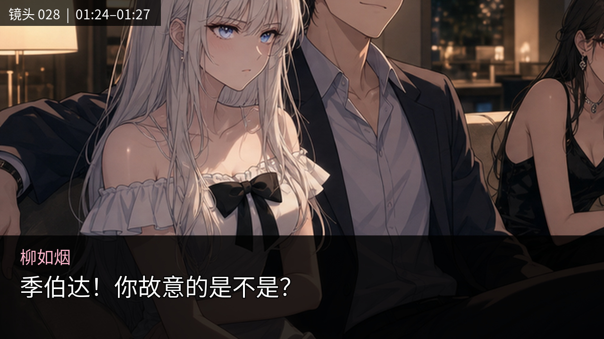](jpg/shot_028.jpg)
- **角色参考：**[柳如烟](../liuruyan.jpg)；[伊藤诚](../version1/screenplay/character_portraits/yitengcheng_user_reference.jpg)；[季伯达](../jiboda.jpg)；[闺蜜甲](../version1/screenplay/character_portraits/guimi1_v1.jpg)；[闺蜜乙](../version1/screenplay/character_portraits/guimi2_v1.jpg)；[闺蜜丙](../version1/screenplay/character_portraits/guimi3_v1.jpg)；[角色总参考表](references/character-reference-sheet.jpg)
- **场景/连续性参考：**[KTV continuity sheet](references/ktv-continuity-sheet.jpg)（当前素材中没有独立的 KTV 空景参考；此连续性表是可用场景依据，不以其他地点图片替代。）
- **柳如烟：**季伯达！你故意的是不是？
- **目的/景别：**Advance the dialogue beat while preserving the existing social geography and escalating the double-standard argument without adding story events. Tight medium close-up on 柳如烟; 伊藤诚 remains partly visible.
- **可见角色与精确调度：**Visible: 柳如烟 seated at frame left with 伊藤诚 immediately to her right; one or more sofa friends may remain soft in the background exactly as in the source JPG. 柳如烟 does not stand or cross the room.
- **场景/灯光：**Modern high-rise KTV/lounge at night: warm amber practical lamps and ceiling light, cool blue city windows, dark curtains, neutral sofa, low dark coffee table with bottles and glasses. Preserve source-JPG object placement and warm/cool contrast; do not invent a new location.
- **表演/神态/动作：**柳如烟 erupts, leans forward and glares toward 季伯达; anger replaces embarrassment.
- **摄影机：**Sharper but still smooth 4% push-in.
- **Seedance I2V prompt (EN)：**Animate the supplied storyboard JPG as a restrained cinematic 2D anime dialogue shot. Tight medium close-up on 柳如烟; 伊藤诚 remains partly visible. Visible: 柳如烟 seated at frame left with 伊藤诚 immediately to her right; one or more sofa friends may remain soft in the background exactly as in the source JPG. 柳如烟 does not stand or cross the room. Modern high-rise KTV/lounge at night: warm amber practical lamps and ceiling light, cool blue city windows, dark curtains, neutral sofa, low dark coffee table with bottles and glasses. Preserve source-JPG object placement and warm/cool contrast; do not invent a new location. Performance: 柳如烟 erupts, leans forward and glares toward 季伯达; anger replaces embarrassment. Camera: Sharper but still smooth 4% push-in. Preserve the exact source composition, character designs, wardrobe, seating, props, and night lighting. Natural breathing, blinks, subtle hair and fabric response only; coherent facial animation and stable hands. No rendered words in the generated video. Spoken Mandarin dialogue, exact wording: “季伯达！你故意的是不是？” Perform natural, restrained lip sync precisely to this line. The spoken wording must not be paraphrased, shortened, expanded, or replaced. Do not render the dialogue as on-screen text; add exact subtitles only in post-production. Timed dialogue and character action plan: 0.0–0.4s: hold the established composition; 柳如烟 takes a subtle breath and acquires the established eyeline while listeners remain attentive. 0.4–2.7s: 柳如烟 speaks the exact Mandarin line “季伯达！你故意的是不是？” once, with natural restrained lip sync and the shot-specific performance: 柳如烟 erupts, leans forward and glares toward 季伯达; anger replaces embarrassment. 2.7–3.0s: the speaker closes the mouth and resolves the gesture; listeners give only the restrained reaction described by the shot, then everyone holds their positions for the cut. Do not overlap, repeat, paraphrase, shorten, or extend the line. Supporting motion detail: {'start_sec': 0, 'end_sec': 1, 'beat': '柳如烟 acquires the established eyeline, inhales subtly, and begins the exact Mandarin line; 柳如烟 erupts, leans forward and glares toward 季伯达; anger replaces embarrassment.'} {'start_sec': 1, 'end_sec': 2, 'beat': '柳如烟 continues the line with coherent restrained lip sync; the primary expression/gesture develops without changing seat or props.'} {'start_sec': 2, 'end_sec': 3, 'beat': '柳如烟 completes the exact line and final shot-specific gesture; listeners register a restrained reaction, then hold for the cut.'}
- **Negative prompt / constraints：**No new characters, no identity/wardrobe changes, no seat swaps, no duplicated or missing limbs, no warped hands/faces, no lip-sync gibberish, no sudden standing, walking, touching, drinking spill, prop teleportation, background morphing, camera shake, zoom pumping, cuts, transitions, added text, captions, logos, watermarks, or UI.
- **逐秒运动节拍：**0–1s 柳如烟 acquires the established eyeline, inhales subtly, and begins the exact Mandarin line; 柳如烟 erupts, leans forward and glares toward 季伯达; anger replaces embarrassment.；1–2s 柳如烟 continues the line with coherent restrained lip sync; the primary expression/gesture develops without changing seat or props.；2–3s 柳如烟 completes the exact line and final shot-specific gesture; listeners register a restrained reaction, then hold for the cut.
- **对白与角色动作时间轴：**0.0–0.4s: hold the established composition; 柳如烟 takes a subtle breath and acquires the established eyeline while listeners remain attentive. 0.4–2.7s: 柳如烟 speaks the exact Mandarin line “季伯达！你故意的是不是？” once, with natural restrained lip sync and the shot-specific performance: 柳如烟 erupts, leans forward and glares toward 季伯达; anger replaces embarrassment. 2.7–3.0s: the speaker closes the mouth and resolves the gesture; listeners give only the restrained reaction described by the shot, then everyone holds their positions for the cut. Do not overlap, repeat, paraphrase, shorten, or extend the line. Supporting motion detail: {'start_sec': 0, 'end_sec': 1, 'beat': '柳如烟 acquires the established eyeline, inhales subtly, and begins the exact Mandarin line; 柳如烟 erupts, leans forward and glares toward 季伯达; anger replaces embarrassment.'} {'start_sec': 1, 'end_sec': 2, 'beat': '柳如烟 continues the line with coherent restrained lip sync; the primary expression/gesture develops without changing seat or props.'} {'start_sec': 2, 'end_sec': 3, 'beat': '柳如烟 completes the exact line and final shot-specific gesture; listeners register a restrained reaction, then hold for the cut.'}
- **连续性锁定：**Use this shot’s JPG as the first-frame identity/composition reference.；Lock character faces, hair, wardrobe, body proportions, seating side, eyelines, table/bottle/glass positions, city-night background, and warm/cool lighting to the source JPG and adjacent shots.；Do not animate storyboard labels or subtitles: remove/crop/clean all labels and caption bands before image-to-video; composite exact Chinese dialogue or final card afterward in editing.
- **声音/对白指导：**Use clean Mandarin dialogue by 柳如烟; preserve the exact line and natural phrasing. Keep KTV room tone low, avoid music masking consonants, and use post-recorded dialogue/lip sync rather than generated text.
- **推荐生成设置：**motion `low-medium`；`16:9`；`24 fps`；`1080p`；生成 `3s`，精确裁切为 `3s`；首帧使用去除全部文字/字幕后的对应 JPG。

## 镜头 029｜01:27–01:29
- **文件：**`jpg/shot_029.jpg`
- **Staging/start image：**[Staging start image](jpg/shot_029.jpg)  
  [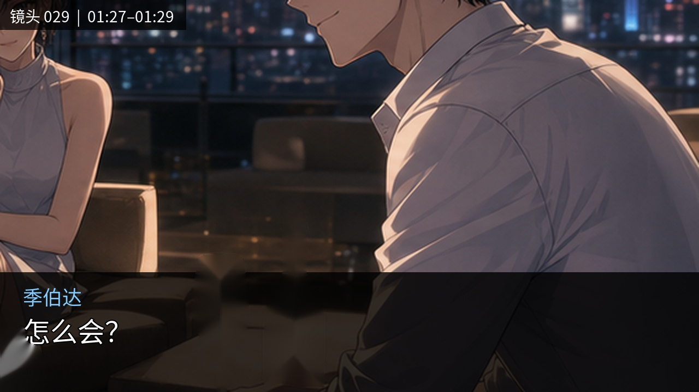](jpg/shot_029.jpg)
- **角色参考：**[柳如烟](../liuruyan.jpg)；[伊藤诚](../version1/screenplay/character_portraits/yitengcheng_user_reference.jpg)；[季伯达](../jiboda.jpg)；[闺蜜甲](../version1/screenplay/character_portraits/guimi1_v1.jpg)；[闺蜜乙](../version1/screenplay/character_portraits/guimi2_v1.jpg)；[闺蜜丙](../version1/screenplay/character_portraits/guimi3_v1.jpg)；[角色总参考表](references/character-reference-sheet.jpg)
- **场景/连续性参考：**[KTV continuity sheet](references/ktv-continuity-sheet.jpg)（当前素材中没有独立的 KTV 空景参考；此连续性表是可用场景依据，不以其他地点图片替代。）
- **季伯达：**怎么会？
- **目的/景别：**Advance the dialogue beat while preserving the existing social geography and escalating the double-standard argument without adding story events. Tight medium close-up on 季伯达.
- **可见角色与精确调度：**Visible: 季伯达 occupies the right foreground in a white shirt, torso turned left toward 柳如烟/伊藤诚 and the opposite sofa; a seated friend may remain soft behind him. He remains seated and does not change sides.
- **场景/灯光：**Modern high-rise KTV/lounge at night: warm amber practical lamps and ceiling light, cool blue city windows, dark curtains, neutral sofa, low dark coffee table with bottles and glasses. Preserve source-JPG object placement and warm/cool contrast; do not invent a new location.
- **表演/神态/动作：**季伯达 answers softly with a tiny innocent head tilt, almost dryly amused.
- **摄影机：**Near-locked shot; tiny 1% pull-back for dry irony.
- **Seedance I2V prompt (EN)：**Animate the supplied storyboard JPG as a restrained cinematic 2D anime dialogue shot. Tight medium close-up on 季伯达. Visible: 季伯达 occupies the right foreground in a white shirt, torso turned left toward 柳如烟/伊藤诚 and the opposite sofa; a seated friend may remain soft behind him. He remains seated and does not change sides. Modern high-rise KTV/lounge at night: warm amber practical lamps and ceiling light, cool blue city windows, dark curtains, neutral sofa, low dark coffee table with bottles and glasses. Preserve source-JPG object placement and warm/cool contrast; do not invent a new location. Performance: 季伯达 answers softly with a tiny innocent head tilt, almost dryly amused. Camera: Near-locked shot; tiny 1% pull-back for dry irony. Preserve the exact source composition, character designs, wardrobe, seating, props, and night lighting. Natural breathing, blinks, subtle hair and fabric response only; coherent facial animation and stable hands. No rendered words in the generated video. Spoken Mandarin dialogue, exact wording: “怎么会？” Perform natural, restrained lip sync precisely to this line. The spoken wording must not be paraphrased, shortened, expanded, or replaced. Do not render the dialogue as on-screen text; add exact subtitles only in post-production. Timed dialogue and character action plan: 0.0–0.2s: hold the established composition; 季伯达 takes a subtle breath and acquires the established eyeline while listeners remain attentive. 0.2–1.8s: 季伯达 speaks the exact Mandarin line “怎么会？” once, with natural restrained lip sync and the shot-specific performance: 季伯达 answers softly with a tiny innocent head tilt, almost dryly amused. 1.8–2.0s: the speaker closes the mouth and resolves the gesture; listeners give only the restrained reaction described by the shot, then everyone holds their positions for the cut. Do not overlap, repeat, paraphrase, shorten, or extend the line. Supporting motion detail: {'start_sec': 0, 'end_sec': 1, 'beat': '季伯达 acquires the established eyeline, inhales subtly, and begins the exact Mandarin line; 季伯达 answers softly with a tiny innocent head tilt, almost dryly amused.'} {'start_sec': 1, 'end_sec': 2, 'beat': '季伯达 completes the exact line and final shot-specific gesture; listeners register a restrained reaction, then hold for the cut.'}
- **Negative prompt / constraints：**No new characters, no identity/wardrobe changes, no seat swaps, no duplicated or missing limbs, no warped hands/faces, no lip-sync gibberish, no sudden standing, walking, touching, drinking spill, prop teleportation, background morphing, camera shake, zoom pumping, cuts, transitions, added text, captions, logos, watermarks, or UI.
- **逐秒运动节拍：**0–1s 季伯达 acquires the established eyeline, inhales subtly, and begins the exact Mandarin line; 季伯达 answers softly with a tiny innocent head tilt, almost dryly amused.；1–2s 季伯达 completes the exact line and final shot-specific gesture; listeners register a restrained reaction, then hold for the cut.
- **对白与角色动作时间轴：**0.0–0.2s: hold the established composition; 季伯达 takes a subtle breath and acquires the established eyeline while listeners remain attentive. 0.2–1.8s: 季伯达 speaks the exact Mandarin line “怎么会？” once, with natural restrained lip sync and the shot-specific performance: 季伯达 answers softly with a tiny innocent head tilt, almost dryly amused. 1.8–2.0s: the speaker closes the mouth and resolves the gesture; listeners give only the restrained reaction described by the shot, then everyone holds their positions for the cut. Do not overlap, repeat, paraphrase, shorten, or extend the line. Supporting motion detail: {'start_sec': 0, 'end_sec': 1, 'beat': '季伯达 acquires the established eyeline, inhales subtly, and begins the exact Mandarin line; 季伯达 answers softly with a tiny innocent head tilt, almost dryly amused.'} {'start_sec': 1, 'end_sec': 2, 'beat': '季伯达 completes the exact line and final shot-specific gesture; listeners register a restrained reaction, then hold for the cut.'}
- **连续性锁定：**Use this shot’s JPG as the first-frame identity/composition reference.；Lock character faces, hair, wardrobe, body proportions, seating side, eyelines, table/bottle/glass positions, city-night background, and warm/cool lighting to the source JPG and adjacent shots.；Do not animate storyboard labels or subtitles: remove/crop/clean all labels and caption bands before image-to-video; composite exact Chinese dialogue or final card afterward in editing.
- **声音/对白指导：**Use clean Mandarin dialogue by 季伯达; preserve the exact line and natural phrasing. Keep KTV room tone low, avoid music masking consonants, and use post-recorded dialogue/lip sync rather than generated text.
- **推荐生成设置：**motion `low`；`16:9`；`24 fps`；`1080p`；生成 `2s`，精确裁切为 `2s`；首帧使用去除全部文字/字幕后的对应 JPG。

## 镜头 030｜01:29–01:33
- **文件：**`jpg/shot_030.jpg`
- **Staging/start image：**[Staging start image](jpg/shot_030.jpg)  
  [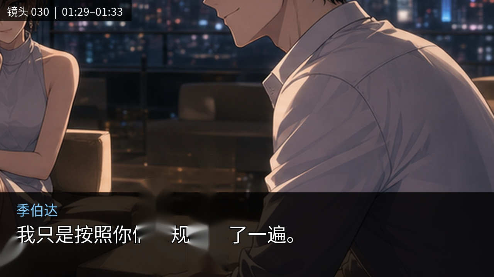](jpg/shot_030.jpg)
- **角色参考：**[柳如烟](../liuruyan.jpg)；[伊藤诚](../version1/screenplay/character_portraits/yitengcheng_user_reference.jpg)；[季伯达](../jiboda.jpg)；[闺蜜甲](../version1/screenplay/character_portraits/guimi1_v1.jpg)；[闺蜜乙](../version1/screenplay/character_portraits/guimi2_v1.jpg)；[闺蜜丙](../version1/screenplay/character_portraits/guimi3_v1.jpg)；[角色总参考表](references/character-reference-sheet.jpg)
- **场景/连续性参考：**[KTV continuity sheet](references/ktv-continuity-sheet.jpg)（当前素材中没有独立的 KTV 空景参考；此连续性表是可用场景依据，不以其他地点图片替代。）
- **季伯达：**我只是按照你们的规矩做了一遍。
- **目的/景别：**Advance the dialogue beat while preserving the existing social geography and escalating the double-standard argument without adding story events. Matching medium close-up on 季伯达, calm and controlled.
- **可见角色与精确调度：**Visible: 季伯达 occupies the right foreground in a white shirt, torso turned left toward 柳如烟/伊藤诚 and the opposite sofa; a seated friend may remain soft behind him. He remains seated and does not change sides.
- **场景/灯光：**Modern high-rise KTV/lounge at night: warm amber practical lamps and ceiling light, cool blue city windows, dark curtains, neutral sofa, low dark coffee table with bottles and glasses. Preserve source-JPG object placement and warm/cool contrast; do not invent a new location.
- **表演/神态/动作：**季伯达 remains composed, one measured hand gesture marking “your rules,” then lets the point sit.
- **摄影机：**Slow 3% push-in.
- **Seedance I2V prompt (EN)：**Animate the supplied storyboard JPG as a restrained cinematic 2D anime dialogue shot. Matching medium close-up on 季伯达, calm and controlled. Visible: 季伯达 occupies the right foreground in a white shirt, torso turned left toward 柳如烟/伊藤诚 and the opposite sofa; a seated friend may remain soft behind him. He remains seated and does not change sides. Modern high-rise KTV/lounge at night: warm amber practical lamps and ceiling light, cool blue city windows, dark curtains, neutral sofa, low dark coffee table with bottles and glasses. Preserve source-JPG object placement and warm/cool contrast; do not invent a new location. Performance: 季伯达 remains composed, one measured hand gesture marking “your rules,” then lets the point sit. Camera: Slow 3% push-in. Preserve the exact source composition, character designs, wardrobe, seating, props, and night lighting. Natural breathing, blinks, subtle hair and fabric response only; coherent facial animation and stable hands. No rendered words in the generated video. Spoken Mandarin dialogue, exact wording: “我只是按照你们的规矩做了一遍。” Perform natural, restrained lip sync precisely to this line. The spoken wording must not be paraphrased, shortened, expanded, or replaced. Do not render the dialogue as on-screen text; add exact subtitles only in post-production. Timed dialogue and character action plan: 0.0–0.5s: hold the established composition; 季伯达 takes a subtle breath and acquires the established eyeline while listeners remain attentive. 0.5–3.6s: 季伯达 speaks the exact Mandarin line “我只是按照你们的规矩做了一遍。” once, with natural restrained lip sync and the shot-specific performance: 季伯达 remains composed, one measured hand gesture marking “your rules,” then lets the point sit. 3.6–4.0s: the speaker closes the mouth and resolves the gesture; listeners give only the restrained reaction described by the shot, then everyone holds their positions for the cut. Do not overlap, repeat, paraphrase, shorten, or extend the line. Supporting motion detail: {'start_sec': 0, 'end_sec': 1, 'beat': '季伯达 acquires the established eyeline, inhales subtly, and begins the exact Mandarin line; 季伯达 remains composed, one measured hand gesture marking “your rules,” then lets the point sit.'} {'start_sec': 1, 'end_sec': 2, 'beat': '季伯达 continues the line with coherent restrained lip sync; the primary expression/gesture develops without changing seat or props.'} {'start_sec': 2, 'end_sec': 3, 'beat': '季伯达 sustains the next phrase at natural pace; gesture resolves incrementally while listeners respond only with blinks, breath, and micro-expressions.'} {'start_sec': 3, 'end_sec': 4, 'beat': '季伯达 completes the exact line and final shot-specific gesture; listeners register a restrained reaction, then hold for the cut.'}
- **Negative prompt / constraints：**No new characters, no identity/wardrobe changes, no seat swaps, no duplicated or missing limbs, no warped hands/faces, no lip-sync gibberish, no sudden standing, walking, touching, drinking spill, prop teleportation, background morphing, camera shake, zoom pumping, cuts, transitions, added text, captions, logos, watermarks, or UI.
- **逐秒运动节拍：**0–1s 季伯达 acquires the established eyeline, inhales subtly, and begins the exact Mandarin line; 季伯达 remains composed, one measured hand gesture marking “your rules,” then lets the point sit.；1–2s 季伯达 continues the line with coherent restrained lip sync; the primary expression/gesture develops without changing seat or props.；2–3s 季伯达 sustains the next phrase at natural pace; gesture resolves incrementally while listeners respond only with blinks, breath, and micro-expressions.；3–4s 季伯达 completes the exact line and final shot-specific gesture; listeners register a restrained reaction, then hold for the cut.
- **对白与角色动作时间轴：**0.0–0.5s: hold the established composition; 季伯达 takes a subtle breath and acquires the established eyeline while listeners remain attentive. 0.5–3.6s: 季伯达 speaks the exact Mandarin line “我只是按照你们的规矩做了一遍。” once, with natural restrained lip sync and the shot-specific performance: 季伯达 remains composed, one measured hand gesture marking “your rules,” then lets the point sit. 3.6–4.0s: the speaker closes the mouth and resolves the gesture; listeners give only the restrained reaction described by the shot, then everyone holds their positions for the cut. Do not overlap, repeat, paraphrase, shorten, or extend the line. Supporting motion detail: {'start_sec': 0, 'end_sec': 1, 'beat': '季伯达 acquires the established eyeline, inhales subtly, and begins the exact Mandarin line; 季伯达 remains composed, one measured hand gesture marking “your rules,” then lets the point sit.'} {'start_sec': 1, 'end_sec': 2, 'beat': '季伯达 continues the line with coherent restrained lip sync; the primary expression/gesture develops without changing seat or props.'} {'start_sec': 2, 'end_sec': 3, 'beat': '季伯达 sustains the next phrase at natural pace; gesture resolves incrementally while listeners respond only with blinks, breath, and micro-expressions.'} {'start_sec': 3, 'end_sec': 4, 'beat': '季伯达 completes the exact line and final shot-specific gesture; listeners register a restrained reaction, then hold for the cut.'}
- **连续性锁定：**Use this shot’s JPG as the first-frame identity/composition reference.；Lock character faces, hair, wardrobe, body proportions, seating side, eyelines, table/bottle/glass positions, city-night background, and warm/cool lighting to the source JPG and adjacent shots.；Do not animate storyboard labels or subtitles: remove/crop/clean all labels and caption bands before image-to-video; composite exact Chinese dialogue or final card afterward in editing.
- **声音/对白指导：**Use clean Mandarin dialogue by 季伯达; preserve the exact line and natural phrasing. Keep KTV room tone low, avoid music masking consonants, and use post-recorded dialogue/lip sync rather than generated text.
- **推荐生成设置：**motion `low-medium`；`16:9`；`24 fps`；`1080p`；生成 `4s`，精确裁切为 `4s`；首帧使用去除全部文字/字幕后的对应 JPG。

## 镜头 031｜01:33–01:37
- **文件：**`jpg/shot_031.jpg`
- **Staging/start image：**[Staging start image](jpg/shot_031.jpg)  
  [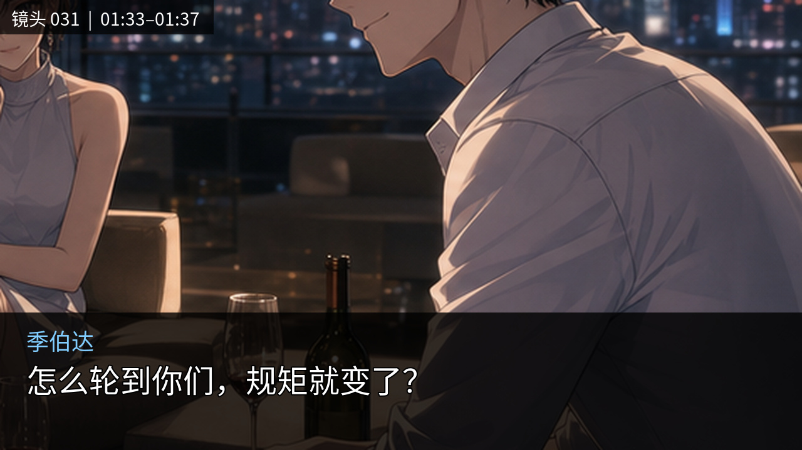](jpg/shot_031.jpg)
- **角色参考：**[柳如烟](../liuruyan.jpg)；[伊藤诚](../version1/screenplay/character_portraits/yitengcheng_user_reference.jpg)；[季伯达](../jiboda.jpg)；[闺蜜甲](../version1/screenplay/character_portraits/guimi1_v1.jpg)；[闺蜜乙](../version1/screenplay/character_portraits/guimi2_v1.jpg)；[闺蜜丙](../version1/screenplay/character_portraits/guimi3_v1.jpg)；[角色总参考表](references/character-reference-sheet.jpg)
- **场景/连续性参考：**[KTV continuity sheet](references/ktv-continuity-sheet.jpg)（当前素材中没有独立的 KTV 空景参考；此连续性表是可用场景依据，不以其他地点图片替代。）
- **季伯达：**怎么轮到你们，规矩就变了？
- **目的/景别：**Advance the dialogue beat while preserving the existing social geography and escalating the double-standard argument without adding story events. Matching medium close-up on 季伯达; strongest direct challenge.
- **可见角色与精确调度：**Visible: 季伯达 occupies the right foreground in a white shirt, torso turned left toward 柳如烟/伊藤诚 and the opposite sofa; a seated friend may remain soft behind him. He remains seated and does not change sides.
- **场景/灯光：**Modern high-rise KTV/lounge at night: warm amber practical lamps and ceiling light, cool blue city windows, dark curtains, neutral sofa, low dark coffee table with bottles and glasses. Preserve source-JPG object placement and warm/cool contrast; do not invent a new location.
- **表演/神态/动作：**季伯达’s expression hardens slightly; he asks the final question directly and holds still afterward.
- **摄影机：**Slow 4% push-in, ending in a firm hold.
- **Seedance I2V prompt (EN)：**Animate the supplied storyboard JPG as a restrained cinematic 2D anime dialogue shot. Matching medium close-up on 季伯达; strongest direct challenge. Visible: 季伯达 occupies the right foreground in a white shirt, torso turned left toward 柳如烟/伊藤诚 and the opposite sofa; a seated friend may remain soft behind him. He remains seated and does not change sides. Modern high-rise KTV/lounge at night: warm amber practical lamps and ceiling light, cool blue city windows, dark curtains, neutral sofa, low dark coffee table with bottles and glasses. Preserve source-JPG object placement and warm/cool contrast; do not invent a new location. Performance: 季伯达’s expression hardens slightly; he asks the final question directly and holds still afterward. Camera: Slow 4% push-in, ending in a firm hold. Preserve the exact source composition, character designs, wardrobe, seating, props, and night lighting. Natural breathing, blinks, subtle hair and fabric response only; coherent facial animation and stable hands. No rendered words in the generated video. Spoken Mandarin dialogue, exact wording: “怎么轮到你们，规矩就变了？” Perform natural, restrained lip sync precisely to this line. The spoken wording must not be paraphrased, shortened, expanded, or replaced. Do not render the dialogue as on-screen text; add exact subtitles only in post-production. Timed dialogue and character action plan: 0.0–0.5s: hold the established composition; 季伯达 takes a subtle breath and acquires the established eyeline while listeners remain attentive. 0.5–3.6s: 季伯达 speaks the exact Mandarin line “怎么轮到你们，规矩就变了？” once, with natural restrained lip sync and the shot-specific performance: 季伯达’s expression hardens slightly; he asks the final question directly and holds still afterward. 3.6–4.0s: the speaker closes the mouth and resolves the gesture; listeners give only the restrained reaction described by the shot, then everyone holds their positions for the cut. Do not overlap, repeat, paraphrase, shorten, or extend the line. Supporting motion detail: {'start_sec': 0, 'end_sec': 1, 'beat': '季伯达 acquires the established eyeline, inhales subtly, and begins the exact Mandarin line; 季伯达’s expression hardens slightly; he asks the final question directly and holds still afterward.'} {'start_sec': 1, 'end_sec': 2, 'beat': '季伯达 continues the line with coherent restrained lip sync; the primary expression/gesture develops without changing seat or props.'} {'start_sec': 2, 'end_sec': 3, 'beat': '季伯达 sustains the next phrase at natural pace; gesture resolves incrementally while listeners respond only with blinks, breath, and micro-expressions.'} {'start_sec': 3, 'end_sec': 4, 'beat': '季伯达 completes the exact line and final shot-specific gesture; listeners register a restrained reaction, then hold for the cut.'}
- **Negative prompt / constraints：**No new characters, no identity/wardrobe changes, no seat swaps, no duplicated or missing limbs, no warped hands/faces, no lip-sync gibberish, no sudden standing, walking, touching, drinking spill, prop teleportation, background morphing, camera shake, zoom pumping, cuts, transitions, added text, captions, logos, watermarks, or UI.
- **逐秒运动节拍：**0–1s 季伯达 acquires the established eyeline, inhales subtly, and begins the exact Mandarin line; 季伯达’s expression hardens slightly; he asks the final question directly and holds still afterward.；1–2s 季伯达 continues the line with coherent restrained lip sync; the primary expression/gesture develops without changing seat or props.；2–3s 季伯达 sustains the next phrase at natural pace; gesture resolves incrementally while listeners respond only with blinks, breath, and micro-expressions.；3–4s 季伯达 completes the exact line and final shot-specific gesture; listeners register a restrained reaction, then hold for the cut.
- **对白与角色动作时间轴：**0.0–0.5s: hold the established composition; 季伯达 takes a subtle breath and acquires the established eyeline while listeners remain attentive. 0.5–3.6s: 季伯达 speaks the exact Mandarin line “怎么轮到你们，规矩就变了？” once, with natural restrained lip sync and the shot-specific performance: 季伯达’s expression hardens slightly; he asks the final question directly and holds still afterward. 3.6–4.0s: the speaker closes the mouth and resolves the gesture; listeners give only the restrained reaction described by the shot, then everyone holds their positions for the cut. Do not overlap, repeat, paraphrase, shorten, or extend the line. Supporting motion detail: {'start_sec': 0, 'end_sec': 1, 'beat': '季伯达 acquires the established eyeline, inhales subtly, and begins the exact Mandarin line; 季伯达’s expression hardens slightly; he asks the final question directly and holds still afterward.'} {'start_sec': 1, 'end_sec': 2, 'beat': '季伯达 continues the line with coherent restrained lip sync; the primary expression/gesture develops without changing seat or props.'} {'start_sec': 2, 'end_sec': 3, 'beat': '季伯达 sustains the next phrase at natural pace; gesture resolves incrementally while listeners respond only with blinks, breath, and micro-expressions.'} {'start_sec': 3, 'end_sec': 4, 'beat': '季伯达 completes the exact line and final shot-specific gesture; listeners register a restrained reaction, then hold for the cut.'}
- **连续性锁定：**Use this shot’s JPG as the first-frame identity/composition reference.；Lock character faces, hair, wardrobe, body proportions, seating side, eyelines, table/bottle/glass positions, city-night background, and warm/cool lighting to the source JPG and adjacent shots.；Do not animate storyboard labels or subtitles: remove/crop/clean all labels and caption bands before image-to-video; composite exact Chinese dialogue or final card afterward in editing.
- **声音/对白指导：**Use clean Mandarin dialogue by 季伯达; preserve the exact line and natural phrasing. Keep KTV room tone low, avoid music masking consonants, and use post-recorded dialogue/lip sync rather than generated text.
- **推荐生成设置：**motion `low-medium`；`16:9`；`24 fps`；`1080p`；生成 `4s`，精确裁切为 `4s`；首帧使用去除全部文字/字幕后的对应 JPG。

## 镜头 032｜01:37–01:40
- **文件：**`jpg/shot_032.jpg`
- **Staging/start image：**[Staging start image](jpg/shot_032.jpg)  
  [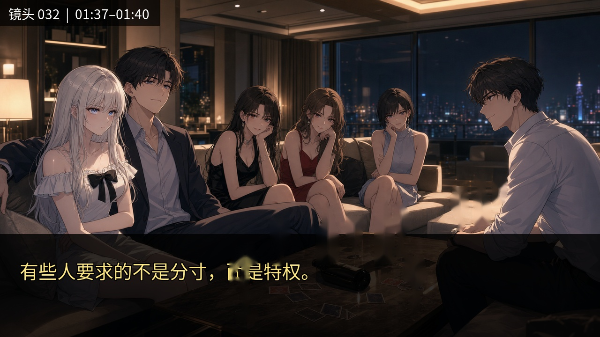](jpg/shot_032.jpg)
- **角色参考：**[柳如烟](../liuruyan.jpg)；[伊藤诚](../version1/screenplay/character_portraits/yitengcheng_user_reference.jpg)；[季伯达](../jiboda.jpg)；[闺蜜甲](../version1/screenplay/character_portraits/guimi1_v1.jpg)；[闺蜜乙](../version1/screenplay/character_portraits/guimi2_v1.jpg)；[闺蜜丙](../version1/screenplay/character_portraits/guimi3_v1.jpg)；[角色总参考表](references/character-reference-sheet.jpg)
- **场景/连续性参考：**[KTV continuity sheet](references/ktv-continuity-sheet.jpg)（当前素材中没有独立的 KTV 空景参考；此连续性表是可用场景依据，不以其他地点图片替代。）
- **画面/字幕：**有些人要求的不是分寸，而是特权。
- **目的/景别：**Close the argument on the group’s silence and deliver the final thematic card in post. Wide ensemble bookend matching shot 001, all positions and table geography preserved.
- **可见角色与精确调度：**Visible: 柳如烟 and 伊藤诚 together on the left seating; 闺蜜甲/乙/丙 across the central sofa; 季伯达 at the right side facing them; background guests stay secondary. Everyone remains around the same low coffee table.
- **场景/灯光：**Modern high-rise KTV/lounge at night: warm amber practical lamps and ceiling light, cool blue city windows, dark curtains, neutral sofa, low dark coffee table with bottles and glasses. Preserve source-JPG object placement and warm/cool contrast; do not invent a new location.
- **表演/神态/动作：**The room falls awkwardly quiet; smiles fade, gazes shift, and no one offers an answer. End on unresolved group tension.
- **摄影机：**Very slow 2% pull-back, echoing the opening while increasing emotional distance.
- **Seedance I2V prompt (EN)：**Animate the supplied storyboard JPG as a restrained cinematic 2D anime dialogue shot. Wide ensemble bookend matching shot 001, all positions and table geography preserved. Visible: 柳如烟 and 伊藤诚 together on the left seating; 闺蜜甲/乙/丙 across the central sofa; 季伯达 at the right side facing them; background guests stay secondary. Everyone remains around the same low coffee table. Modern high-rise KTV/lounge at night: warm amber practical lamps and ceiling light, cool blue city windows, dark curtains, neutral sofa, low dark coffee table with bottles and glasses. Preserve source-JPG object placement and warm/cool contrast; do not invent a new location. Performance: The room falls awkwardly quiet; smiles fade, gazes shift, and no one offers an answer. End on unresolved group tension. Camera: Very slow 2% pull-back, echoing the opening while increasing emotional distance. Preserve the exact source composition, character designs, wardrobe, seating, props, and night lighting. Natural breathing, blinks, subtle hair and fabric response only; coherent facial animation and stable hands. No rendered words in the generated video. No spoken dialogue in this shot. Do not invent speech or lip sync. Do not render any words on screen; add any required card or caption only in post-production. Timed dialogue and character action plan: 0.0–0.4s: hold the established composition and eyelines with natural breathing. 0.4–2.7s: perform the shot-specific silent action: The room falls awkwardly quiet; smiles fade, gazes shift, and no one offers an answer. End on unresolved group tension. 2.7–3.0s: resolve the action and hold a stable final pose for the cut. No character speaks and no lip sync is generated. Supporting motion detail: {'start_sec': 0, 'end_sec': 1, 'beat': 'Match the opening tableau; the group absorbs the contradiction and smiles fade.'} {'start_sec': 1, 'end_sec': 2, 'beat': '柳如烟 and the friends exchange uneasy micro-glances while 季伯达 stays composed.'} {'start_sec': 2, 'end_sec': 3, 'beat': 'Begin the very slow pull-back; gestures stop and the room’s social energy drains.'}
- **Negative prompt / constraints：**No new characters, no identity/wardrobe changes, no seat swaps, no duplicated or missing limbs, no warped hands/faces, no lip-sync gibberish, no sudden standing, walking, touching, drinking spill, prop teleportation, background morphing, camera shake, zoom pumping, cuts, transitions, added text, captions, logos, watermarks, or UI.
- **逐秒运动节拍：**0–1s Match the opening tableau; the group absorbs the contradiction and smiles fade.；1–2s 柳如烟 and the friends exchange uneasy micro-glances while 季伯达 stays composed.；2–3s Begin the very slow pull-back; gestures stop and the room’s social energy drains.
- **对白与角色动作时间轴：**0.0–0.4s: hold the established composition and eyelines with natural breathing. 0.4–2.7s: perform the shot-specific silent action: The room falls awkwardly quiet; smiles fade, gazes shift, and no one offers an answer. End on unresolved group tension. 2.7–3.0s: resolve the action and hold a stable final pose for the cut. No character speaks and no lip sync is generated. Supporting motion detail: {'start_sec': 0, 'end_sec': 1, 'beat': 'Match the opening tableau; the group absorbs the contradiction and smiles fade.'} {'start_sec': 1, 'end_sec': 2, 'beat': '柳如烟 and the friends exchange uneasy micro-glances while 季伯达 stays composed.'} {'start_sec': 2, 'end_sec': 3, 'beat': 'Begin the very slow pull-back; gestures stop and the room’s social energy drains.'}
- **连续性锁定：**Use this shot’s JPG as the first-frame identity/composition reference.；Lock character faces, hair, wardrobe, body proportions, seating side, eyelines, table/bottle/glass positions, city-night background, and warm/cool lighting to the source JPG and adjacent shots.；Do not animate storyboard labels or subtitles: remove/crop/clean all labels and caption bands before image-to-video; composite exact Chinese dialogue or final card afterward in editing.
- **声音/对白指导：**Room tone only: subdued party murmur, glass ambience, no intelligible new dialogue.
- **推荐生成设置：**motion `low-medium`；`16:9`；`24 fps`；`1080p`；生成 `3s`，精确裁切为 `3s`；首帧使用去除全部文字/字幕后的对应 JPG。
